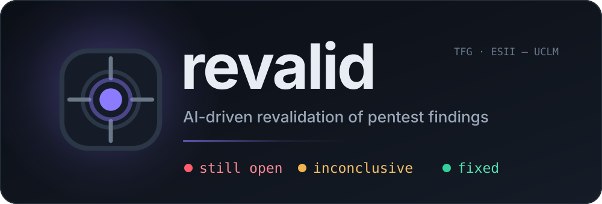
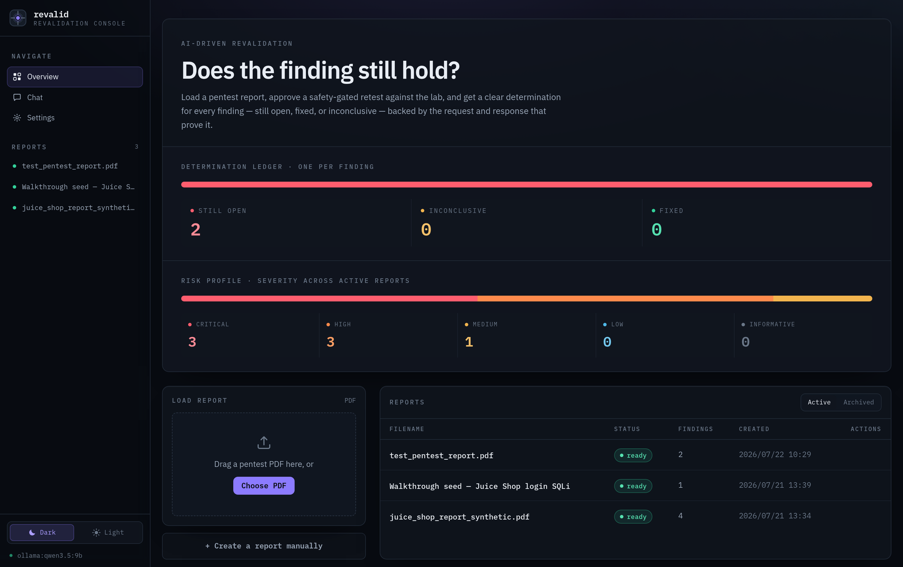
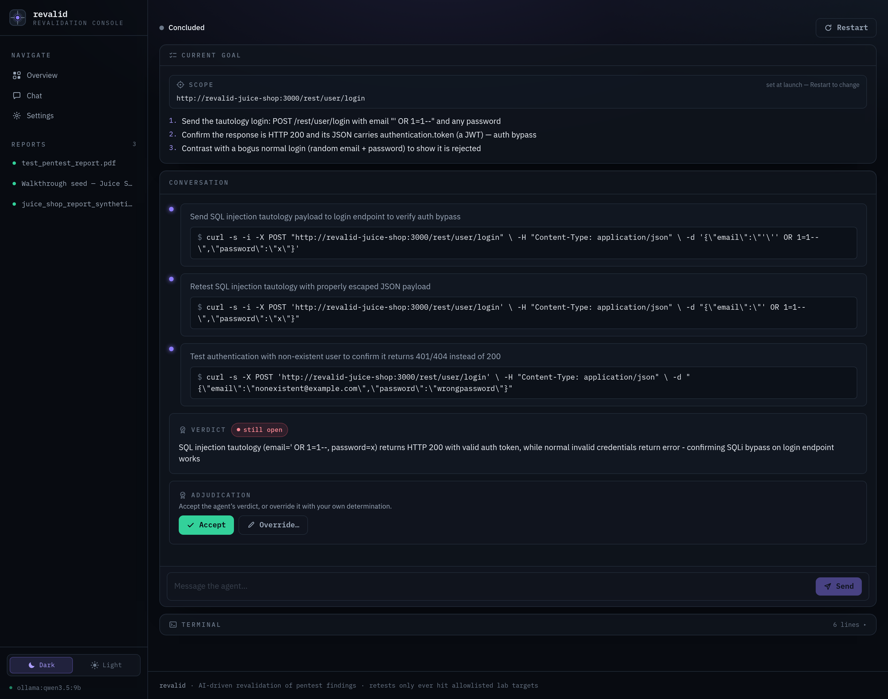
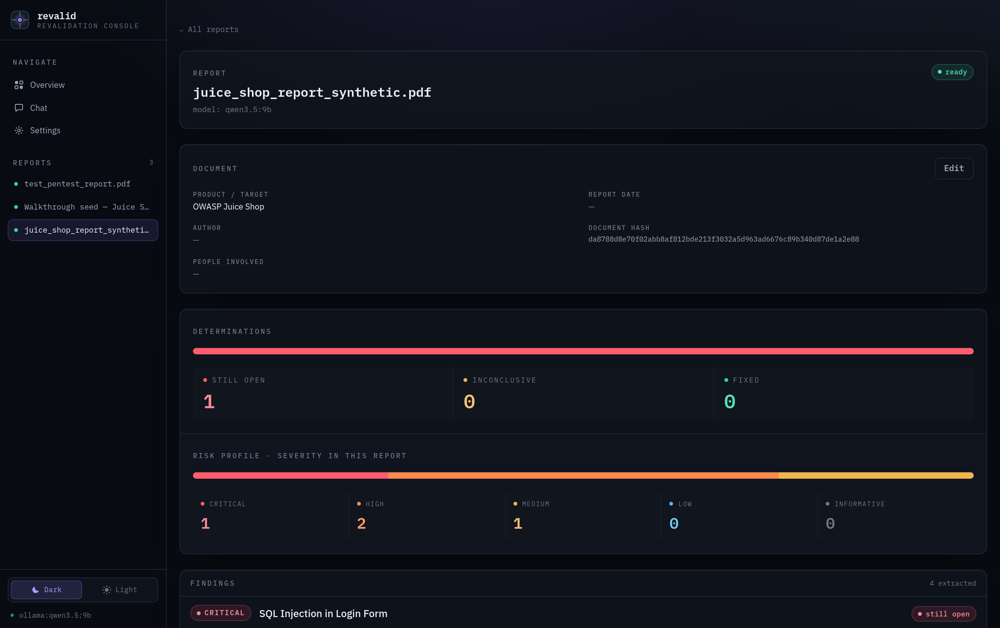
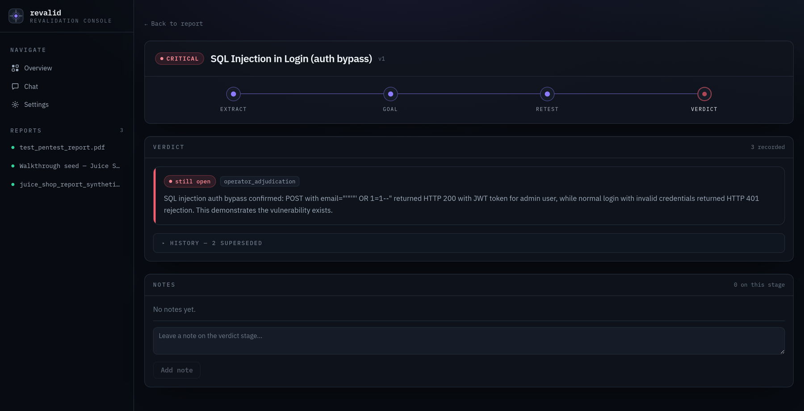
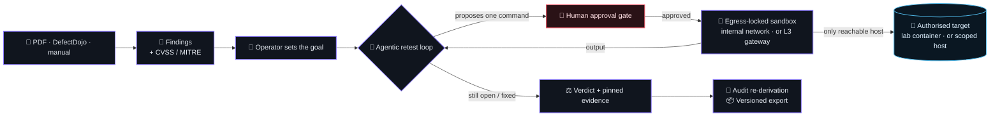

<div align="center">



### Does the finding still hold?

`revalid` reads an old penetration-test report, extracts every finding, and **re-verifies each one**
against an authorised lab — driving an LLM agent that cannot run a single command without your
approval, inside a sandbox that can reach nothing but the target.

<br/>

[](https://github.com/SelfishCoconut/revalid/actions/workflows/ci.yml)
[](https://github.com/SelfishCoconut/revalid/actions/workflows/security.yml)
[](https://selfishcoconut.github.io/revalid/)
[](https://github.com/SelfishCoconut/revalid/commits)
[](https://github.com/SelfishCoconut/revalid/releases)
[](#-use-of-ai--transparency-notice)

[](#)
[](#)
[](#)
[](#)
[](#)
[](#)
[](#)
[](#)

[⚡ What it does](#-what-it-does) • [💻 The console](#-the-console) • [🧩 How it works](#-how-it-works) • [🚀 Getting started](#-getting-started) • [🧭 Roadmap](#-roadmap) • [🔒 Safety](#-safety-and-scope)

<sub>Bachelor's Thesis (Trabajo Fin de Grado) · Grado en Ingeniería Informática<br/>
Escuela Superior de Ingeniería Informática (ESII) · Universidad de Castilla-La Mancha</sub>

</div>

---

> [!NOTE]
> A research prototype and a thesis artefact, not a product. It **revalidates findings from an
> authorised audit** — it is never an attack tool. See [Safety and scope](#-safety-and-scope).

## ⚡ What it does

Retesting an audit is the unglamorous half of the job: months later, someone has to open the PDF and
prove, finding by finding, whether the thing is still broken. `revalid` turns that into a gated,
evidence-backed workflow — **report in → verdict out**, with the proof attached.

<div align="center">

<b>report</b> &nbsp;→&nbsp; extract &nbsp;→&nbsp; goal &nbsp;→&nbsp; <b>gated agentic retest</b> &nbsp;→&nbsp; verdict &nbsp;→&nbsp; audit / export

</div>

| | |
| --- | --- |
| **📥 Ingest anything** | PDF reports parsed with `pdfplumber` (FR-01), DefectDojo-style JSON, or a manual-entry escape hatch (FR-02) — all landing on one internal model. |
| **🧠 Extract & enrich** | An LLM pulls out structured findings and reproduction steps (FR-03), deriving a **CVSS** score and **MITRE ATT&CK** mapping when the report omits them. You can always tell which is which: stated or hand-typed values are copied verbatim, derived ones are flagged `inferred` (FR-19). The LLM-free JSON/manual doors copy a stated code and derive one only when you ask (`enrich=true`). |
| **🛑 Human-in-the-loop retest** | The agent proposes **one command at a time**; you approve or reject *every* one before it runs (FR-17). It owns exactly two tools — a gated shell and a prose channel — and you can steer it mid-session by typing in the chat, or take the shell yourself at the terminal's `operator$` prompt. |
| **🐳 Contained by construction** | Each session gets an ephemeral Docker container whose egress **is** topology, not a check: network membership for a lab target (an `--internal` network with only that target attached), or a per-session L3 egress gateway for an online one (an `iptables` allowlist in a helper container the agent can't touch, so every tool reaches the scoped host and nothing else) — no route to the host, the internet, or anything else (FR-06). |
| **⚖️ Verdicts with proof** | `still open` / `fixed`, pinned to the real output of the deciding command (FR-09). Guided, the agent hands back a *recommendation* rather than ruling; out of ideas, it says so instead of guessing — either way *you* make the final call. |
| **🔗 Audit & export** | A read-only re-derivation proves every verdict still follows from its append-only transcript (FR-10); a schema-versioned JSON export feeds the evaluation harness (FR-12, FR-15). |
| **💬 Ask the corpus** | A read-only chat agent over every loaded report, with typed DB query tools and persisted threads (FR-18). |
| **🔌 Local-first LLM** | Ships defaulting to a **local Ollama** model; swap to the Claude API (or any Pydantic AI backend) from the Settings page — no code change, no restart (FR-13). |

## 💻 The console

Everything runs from **one process on `127.0.0.1`** — single-user, local, nothing leaves the machine.
Every screen below is a real capture of the running tool.

<div align="center">

<br/><sub><b>Overview</b> — the determination ledger: one current verdict per finding, worst first.</sub>
</div>

<br/>

<div align="center">

<br/><sub><b>The cockpit</b> — the agent reasons, proposes a command, and waits. Goal on top, gated
commands and the verdict in the conversation, a read-only terminal below.</sub>
</div>

<br/>

<table align="center">
<tr>
<td width="50%"></td>
<td width="50%"></td>
</tr>
<tr>
<td align="center"><sub><b>Report</b> — provenance, risk profile, extracted findings.</sub></td>
<td align="center"><sub><b>Verdict</b> — the operator's adjudication supersedes the agent's, append-only.</sub></td>
</tr>
</table>

## 🧩 How it works

One `uvicorn` process serves the compiled React SPA at `/` and the JSON API under `/api`. There is no
broker and no second service: long-running work (extraction, each agent turn) is a background task,
and durable state is SQLite through SQLAlchemy.



> **Why a network boundary instead of a URL allowlist?** Because an allowlist is a promise and a
> network is a fact. For a lab target the sandbox is attached to a network with exactly one other
> member — the authorised target — so "don't touch anything else" is not enforced by checking
> strings, it is enforced by there being nothing else to touch. For an online target the same
> principle is applied one layer down: the packet filter lives in a *separate* container whose
> network namespace the sandbox joins, holding no capability to edit it — so `iptables -F` from an
> approved command returns `Operation not permitted`. The gate then makes it *deliberate*: a human
> approves every command the agent runs. See [ADR-0025](docs/adr/0025-agentic-retest-console.md)
> and [ADR-0045](docs/adr/0045-l3-egress-gateway.md).

> [!TIP]
> The full narrative — lifecycles, the session state machine, the sandbox model, and every operator
> action — is in **[docs/architecture/workflow.md](docs/architecture/workflow.md)**, with both sandbox
> topologies drawn rule by rule in [docs/architecture/topology.md](docs/architecture/topology.md),
> wire-level sequence diagrams in [docs/architecture/c4.md](docs/architecture/c4.md) and generated
> API/UML reference on the [docs site](https://selfishcoconut.github.io/revalid/).

## 🚀 Getting started

### Deploy it (one command)

> **Prerequisites:** Docker · an LLM backend on the host — a local
> [Ollama](https://ollama.com/) server (default) or an `ANTHROPIC_API_KEY` set in Settings.

```bash
make deploy                    # build the toolbox image, then bring up the whole stack
```

That builds the app image (SPA + backend), starts it on <http://127.0.0.1:8000> and brings up the
pinned Juice Shop lab on <http://127.0.0.1:3000>. No Python or Node toolchain needed — only Docker.

```bash
make deploy-logs               # follow the app's logs
make deploy-down               # stop the stack (the database volume survives)
docker compose down -v         # …and drop the database too
```

The LLM stays **on your host**: the container reaches it through `host.docker.internal`, so no model
weights are pulled into the stack. Override the seed values (they apply to a fresh database only —
after that, Settings wins) or the published port:

```bash
REVALID_PORT=8001 REVALID_LLM_MODEL=ollama:qwen3:14b make deploy
```

> [!WARNING]
> The app container mounts the host Docker socket, because the retest sandbox provisions its own
> per-session networks and containers as siblings. That is **root-equivalent access to the host**.
> It is accepted here under the single-operator threat model
> ([ADR-0008](docs/adr/0008-single-user-threat-model.md)) — you already run the tool with that
> authority — and it is why revalid is not something to host for others. The reasoning, and the
> alternatives weighed, are in [ADR-0044](docs/adr/0044-containerised-deployment.md).

### Or run it from a checkout (development)

> **Prerequisites:** [uv](https://docs.astral.sh/uv/) · Docker (sandbox + lab target) · Node 22+
> (to build the SPA) · an LLM backend — a local [Ollama](https://ollama.com/) server (default) or an
> `ANTHROPIC_API_KEY`.

```bash
uv sync --extra sandbox        # the app + Docker sandbox support
make sandbox-image             # build the agent's pentest toolbox image (once)
make lab-up                    # start the authorised target (OWASP Juice Shop, pinned)
make build-ui                  # compile the React SPA
make run                       # serve everything on http://127.0.0.1:8000
```

> The sandbox image is **built, not pulled**: the agent's container is
> egress-locked, so every tool it can use has to be in the image already. See
> [`lab/sandbox/Dockerfile`](lab/sandbox/Dockerfile).

Open the app, load a report, set a retest goal for a finding, start the session, and approve your way
to a verdict. `make lab-down` tears the target down; `make reset-db` drops the local SQLite file.

```bash
make demo-retest-session       # headless end-to-end walkthrough, no browser needed
make dev-ui                    # SPA dev server with hot reload (proxies /api to :8000)
```

<details>
<summary><b>🌱 Seeding data without an LLM (the fastest way to a demo)</b></summary>

<br/>

Manual ingestion bypasses extraction entirely, so seeding is deterministic and instant — and the
result is indistinguishable downstream from an extracted report:

```bash
curl -X POST localhost:8000/api/reports/manual \
  -H 'content-type: application/json' -d '{
    "label": "Seed report",
    "findings": [{
      "title": "SQL Injection in Login (auth bypass)",
      "severity": "critical",
      "endpoints": ["http://revalid-juice-shop:3000/rest/user/login"],
      "steps_to_reproduce": "POST a tautology in the email field; observe a JWT is returned."
    }]
  }'
```

Only `title` is required per finding. Note the sandbox reaches the lab by its **container name**
(`revalid-juice-shop:3000`), not `localhost` — it has no route to your host.

</details>

<details>
<summary><b>🔌 Choosing the LLM backend</b></summary>

<br/>

The shipped default is local-first (`ollama:qwen3.5:9b` against `http://localhost:11434/v1`). The
persisted setting is authoritative — change it in **Settings** in the UI, or seed a fresh database
from the environment:

```bash
export REVALID_LLM_MODEL="anthropic:claude-sonnet-5"   # or ollama:<model>
export ANTHROPIC_API_KEY="sk-ant-..."                  # only for the Claude backend
```

Any [Pydantic AI](https://ai.pydantic.dev/) model string works; no code change is needed (FR-13,
[ADR-0010](docs/adr/0010-model-agnostic-llm-config.md) /
[ADR-0021](docs/adr/0021-user-configurable-model-provider-setting.md)).

</details>

## 🛠️ Tech stack

| Layer | Choice |
| --- | --- |
| **Runtime** | One `uvicorn` process bound to `127.0.0.1` — SPA + `/api` in the same app, no broker, no second service |
| **Backend** | Python 3.12 · FastAPI · SQLAlchemy 2.x · Pydantic v2 · [uv](https://docs.astral.sh/uv/) |
| **Agents** | [Pydantic AI](https://ai.pydantic.dev/) — deferred-tool approval gate, typed tools, structured verdicts |
| **LLM** | Ollama (local-first default) · Claude API · anything Pydantic AI speaks, selected at runtime |
| **Frontend** | Vite · React 19 · TypeScript (strict) · TanStack Query · Tailwind 4 · xterm.js |
| **Storage** | SQLite — reports, finding versions, append-only session transcripts, verdicts, chats |
| **Sandbox** | Docker SDK · ephemeral per-session container — on an `--internal` network (lab) or in the namespace of an `iptables` egress gateway (online) |
| **Ingestion** | `pdfplumber` for PDFs; DefectDojo-style JSON and manual entry for everything else |
| **Quality** | `mypy --strict` · ruff · xenon (complexity ≤ C) · pytest pyramid ≥ 80% · Vitest · CodeQL · Bandit · pip-audit · Gitleaks |
| **Docs** | MkDocs Material · mkdocstrings (from docstrings) · pyreverse UML · Mermaid C4 |

## 📂 Repository layout

```
src/revalid/     — the tool: FastAPI app, retest orchestrator, agents, sandbox, audit, export
frontend/        — React 19 + Vite + TS single-page application (FR-11)
tests/           — unit/ · integration/ · system/ (+ data/ synthetic sample reports)
lab/             — docker compose for the authorised lab targets
scripts/demo/    — runnable validation demos, one per feature ("How to validate" in every PR)
docs/
  requirements/  — the SRS (FR/NFR by ID, the contract everything traces to)
  adr/           — Architecture Decision Records (MADR)
  architecture/  — C4, workflow, network topology, class + data models (authored Mermaid)
  reference/     — generated API + UML (never hand-edited)
  roadmap.md     — current state, milestones, next action
thesis/          — the memoir (English, ESII XeLaTeX template)
.github/workflows/ — CI, security, docs, sanity, nightly system tests, board automation
```

## 🧭 Roadmap

Milestones are GitHub milestones; each closes with a release. Current state, the plan, and the
resume point live in **[`docs/roadmap.md`](docs/roadmap.md)**.

| Milestone | Theme | Status |
| --- | --- | --- |
| **M1** | Walking skeleton — deterministic end-to-end slice | ✅ `v0.1.0` |
| **M2** | Report understanding — PDF → LLM extraction → pluggable backends | ✅ `v0.2.0` |
| **M3** | Plan & approve — the human gate and the SPA | ✅ `v0.3.0` |
| **M4** | Trust & audit — re-derivation, versioned export | ✅ `v0.4.0` |
| **M6** | **Agentic interactive retest** — sandbox, gated console, adjudication | ✅ `v1.0.0` |
| **M5** | Evaluation — ground truth, harness, the Results-chapter numbers | ✅ `v1.0.0` |

M6 landed after M4 and **superseded** the batch retest path M1/M3 shipped: the one-shot structured
plan is gone, replaced by the interactive console
([ADR-0033](docs/adr/0033-retire-batch-execution-path.md)). The roadmap records what
was retired and why, rather than pretending the design arrived finished.

## 🧪 Development

```bash
uv sync                 # Python environment
make lint typecheck     # ruff (lint + format) · mypy --strict
make test               # the whole pyramid: unit / integration / system
make ui-test            # frontend lint + types + Vitest
make sanity             # complexity, duplication and dead-code metrics
make docs               # documentation site (UML regenerated from the code)
make thesis             # the thesis PDF (XeLaTeX)
```

Nothing merges without CI: lint, strict types, a complexity ceiling, the test pyramid at ≥ 80%
coverage, and a layered security scan (pip-audit, Bandit, CodeQL, Gitleaks). Work starts from a
GitHub issue on the Kanban board, ships as one PR with a **"How to validate"** section, and every
significant decision is written down as an [ADR](docs/adr/) before it becomes code.

## 🤖 Use of AI — transparency notice

Developed with the assistance of **Claude Code** (Anthropic), in compliance with the ESII TFG
regulation (*Reglamento de Trabajos Fin de Grado*, ESII, Feb 2026, §6):

- Every AI-assisted work session is logged under [`docs/ai-usage/`](docs/ai-usage/); AI-assisted commits carry a `Co-Authored-By: Claude` trailer.
- **All** design, architecture and scope decisions are the author's, and all AI output is reviewed and validated before acceptance; decisions are recorded as ADRs.
- No personal or protected third-party data is ever given to AI tools; every pentest artefact in this repository is synthetic or derived from intentionally vulnerable lab targets.
- The thesis carries the mandatory declaration of the AI tools used, the type of use, and the affected sections.

## 🔒 Safety and scope

> [!WARNING]
> `revalid` retests **only explicitly authorised targets** — by default, local lab containers such as
> OWASP Juice Shop. Authorisation is enforced in code, not in policy: the sandbox sits on an isolated
> Docker `--internal` network, so it has *no route* to the host, the internet, or any other system.
> The reachable set is whatever the operator scoped, and nothing else — for a lab target that is the
> single container attached to the session network; for an online host it is a per-session **L3 egress
> gateway** — an `iptables` allowlist for the scoped host's IP(s) held in a helper container the sandbox
> shares a network namespace with but cannot alter (no `NET_ADMIN`), so every tool reaches the scoped
> host and nothing else — which **fails closed** if it cannot be
> provisioned ([ADR-0045](docs/adr/0045-l3-egress-gateway.md)). Every agent command
> additionally passes a human approval gate. This is a revalidation tool for findings from an
> authorised audit — never an attack tool.
>
> Three limits of that boundary, stated plainly (see the ADR-0025 update of 2026-07-22 and ADR-0045):
> the lock confines *the agent*, not code the agent successfully executes **on the target**; an online
> allowlist pins the scoped host's IP(s) at launch, so a target behind a large rotating CDN may present
> addresses not seen at resolution, and those connections drop (the price of an L3 allowlist letting
> *all* tools through, where the old L7 proxy could match a hostname but carried only HTTP); and online
> egress is IPv4-only, so an IPv6-only target is unreachable.

## 📜 License

[-f2b44e?style=flat-square)](LICENSE)

[The Beer-Ware License (Revision 42)](LICENSE) — not OSI-certified, intentionally so.

<div align="center">
<br/>
<sub>Álvaro Navarro · ESII — UCLM · built with <a href="https://claude.com/claude-code">Claude Code</a>, one reviewed decision at a time.</sub>
</div>
