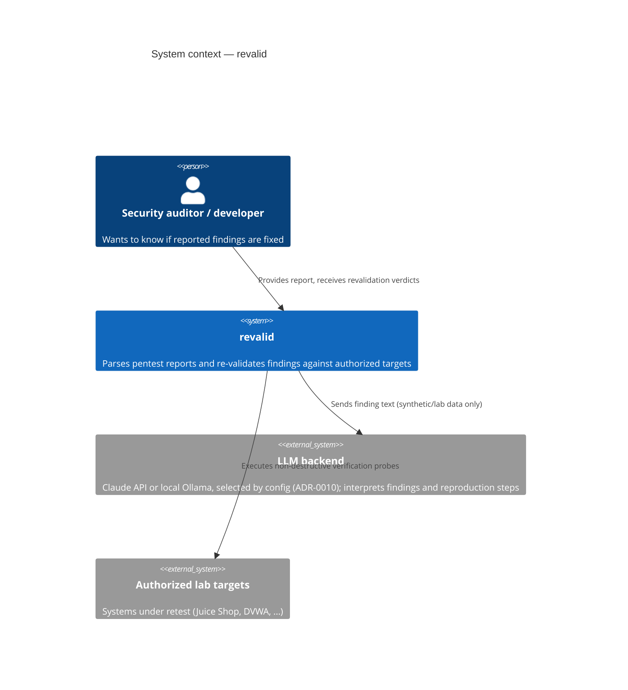
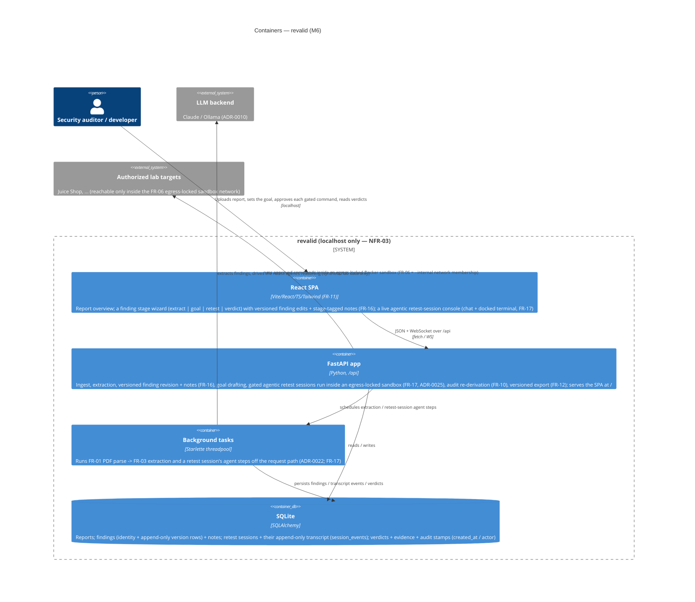
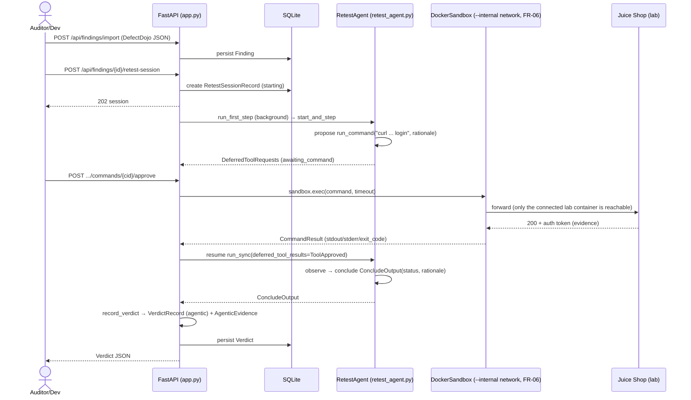
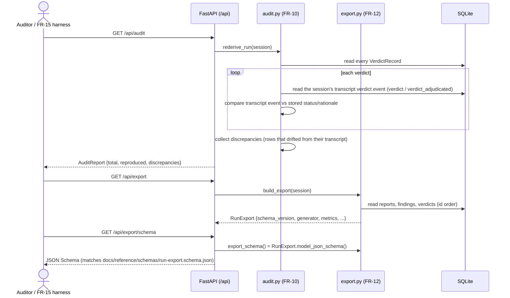

# Architecture — C4 model

> Authored diagrams: these do NOT auto-sync with code. Any PR changing a flow or boundary
> depicted here must update this page (checked by the `doc-curator` agent).

## Level 1 — System context



## Level 2 — Containers

The whole tool runs from one `uvicorn` process bound to `127.0.0.1` (NFR-03):
FastAPI serves the React SPA at `/` and the JSON API under `/api` (ADR-0013).



## Level 3 — Walking-skeleton retest flow (M6, agentic)

M1's walking skeleton (FR-02 → FR-07 → FR-09) shipped a deterministic slice: one
verification-only HTTP probe, executed through a request-level target allowlist,
yielding an evidence-backed verdict. That whole batch path (`plan.py`'s HTTP
executor, the allowlist transport, the FR-08 sanity checker) was retired in
FR-17 Slice 6b-iii (ADR-0033); this diagram now shows its replacement — the
current minimal loop a retest walks (ADR-0025 Slice 0): one gated command,
approved by a human, executed inside an egress-locked sandbox, concluding a
verdict. It is the smallest instance of the [gated sandbox execution](#level-3-fr-06fr-17-gated-sandbox-execution-adr-0025)
loop shown in full further down.



## Level 3 — FR-11 UI ingest → verdict flow (M6, agentic)

The full flow operated from the React SPA alone (FR-11 acceptance): a PDF report
is uploaded, extracted into findings by a background worker the UI polls, then
the operator drafts and edits the retest **goal**, starts an agentic retest
session, and walks the gated command loop to a verdict — every step a UI action
over `/api` (ADR-0013). The gated propose → approve → exec → observe cycle is
shown here as one loop; [FR-06/FR-17 gated sandbox execution](#level-3-fr-06fr-17-gated-sandbox-execution-adr-0025)
below zooms into one iteration of it.

The finding detail is a **stage wizard** (ADR-0024, reshaped for the agentic
flow in FR-17 Slice 6b-iii-b): the operations shown below are reached as four
sub-routes (`/findings/{id}/{stage}`, `stage` ∈ `extract | goal | retest |
verdict`) the operator walks by clicking the pipeline stepper — navigation
only, never a mutation. FR-16 adds two sibling `/api` actions on the finding
itself: `POST /findings/{id}` records a versioned finding edit (append-only,
extraction = v1) and `POST /findings/{id}/notes` appends a stage-tagged note;
both are read back by the wizard.

```mermaid
sequenceDiagram
    actor U as Auditor (browser)
    participant SPA as React SPA
    participant API as FastAPI (/api)
    participant W as Background tasks
    participant DB as SQLite
    participant LLM as LLM backend
    participant Agent as RetestAgent (sandboxed, FR-17)
    participant Lab as Lab target

    U->>SPA: drop PDF report
    SPA->>API: POST /api/reports (multipart)
    API->>DB: insert report (extracting)
    API-->>SPA: 202 report
    API->>W: schedule extraction
    W->>LLM: FR-01 parse → FR-03 extract
    W->>DB: insert findings (report_id); report → ready
    loop poll until ready / failed
        SPA->>API: GET /api/reports/{id}
        API-->>SPA: {status, ...}
    end
    U->>SPA: review finding → draft goal
    SPA->>API: POST /api/findings/{id}/goal/draft
    API->>LLM: generate_goal(finding) — best-effort, no persistence
    API-->>SPA: GoalDraftOut {steps}
    U->>SPA: edit goal (optional) → Start retest session
    SPA->>API: POST /api/findings/{id}/retest-session {initial_goal}
    API->>DB: create RetestSessionRecord (starting)
    API-->>SPA: 202 session
    API->>W: schedule run_first_step
    W->>Agent: start_and_step(goal prompt)
    loop gated command loop (detail below) until verdict / needs-guidance pause
        Agent->>Agent: propose run_command / observe output
        SPA->>API: GET /retest-sessions/{id} or WS /stream
        U->>SPA: approve / reject each command
        SPA->>API: POST .../commands/{cid}/approve|reject
    end
    Agent->>API: ConcludeOutput(status, rationale)
    API->>API: record_verdict → VerdictRecord (agentic) + AgenticEvidence
    API->>DB: persist verdict + transcript
    API-->>SPA: verdict (poll / stream)
    SPA-->>U: verdict, evidence, session transcript
```

## Level 3 — FR-06/FR-17 gated sandbox execution (ADR-0025)

FR-17's agentic console makes the retest chokepoint human-in-the-loop on
**every command**, not just a batch (superseding M4's plan-level sanity check,
ADR-0033). Gating is a Pydantic AI **deferred tool**: `run_command` is declared
`requires_approval=True`, so a proposal literally cannot resolve without a
human `approve`/`reject` — the run pauses and returns a `DeferredToolRequests`,
never executing anything on its own. Once approved, the command runs inside a
`DockerSandbox` on a per-session Docker **`--internal`** network with only the
allowlisted lab container attached — **FR-06 is now network membership**, not
an HTTP-layer check: the sandbox is physically unable to reach anything else.

```mermaid
sequenceDiagram
    actor Dev as Auditor/Dev
    participant API as retest_session.py (orchestrator)
    participant Agent as RetestAgent (Pydantic AI)
    participant DB as session_events (transcript)
    participant SB as DockerSandbox
    participant Lab as Lab target (FR-06 = network membership)

    API->>Agent: run_sync(prompt) / resume(deferred_tool_results)
    Agent->>Agent: reason → propose run_command(command, rationale)
    Agent-->>API: DeferredToolRequests (paused, unresolved)
    API->>DB: append_event(command_proposed); status → awaiting_command
    Dev->>API: POST commands/{cid}/approve | reject
    alt approved
        API->>SB: sandbox.exec(command, timeout)
        SB->>Lab: only the connected lab container is reachable (egress-locked)
        Lab-->>SB: response
        SB-->>API: CommandResult (stdout, stderr, exit_code)
        API->>DB: append_event(command_output)
        API->>Agent: resume run_sync(deferred_tool_results=ToolApproved)
        Agent->>Agent: observe → next command or conclude
    else rejected
        API->>Agent: resume run_sync(deferred_tool_results=ToolDenied(reason))
        Agent->>Agent: reconsider next command
    end
    Note over API,Agent: loop until a real determination; an "exhausted options" hand-back pauses for guidance instead (ADR-0034)
    Agent-->>API: ConcludeOutput(fixed | still_open) — inconclusive pauses (needs_guidance), not a verdict
    API->>API: record_verdict → VerdictRecord (actor=agent) + AgenticEvidence
    API->>DB: append_event(verdict); persist VerdictRecord
```

## Level 3 — FR-10 audit re-derivation & FR-12 export (M6, agentic-only)

Two read-only derivations off the persisted trail, no network. **FR-10**
(ADR-0025/ADR-0033's NFR-02 shift): an agentic verdict is a human-adjudicated
judgment over a whole session, not a pure function of one request's evidence,
so `rederive_run` re-projects the session's authoritative transcript event —
the `verdict` event for the agent's own record, or the latest
`verdict_adjudicated` event for an operator override — and diffs it against
the stored `VerdictRecord`: a clean run proves the row still equals the
transcript it was derived from; any mismatch is a discrepancy. (The old
FR-04/05/07-09 batch evidence-rederivation, ADR-0015, was removed with the
batch path in FR-17 6b-iii, ADR-0033.) **FR-12** (ADR-0016): `build_export`
assembles the whole run into one `SCHEMA_VERSION`-versioned document that
validates against a schema *generated* from the model, so the published
schema can never drift from the document.


