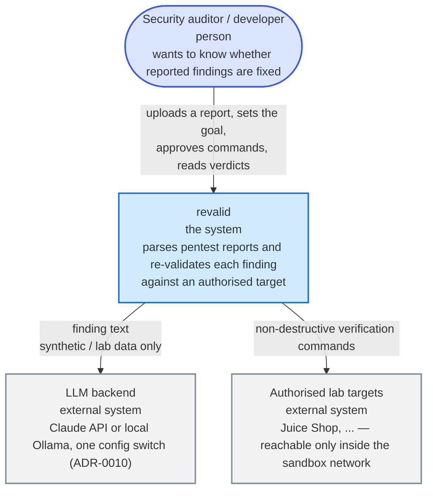
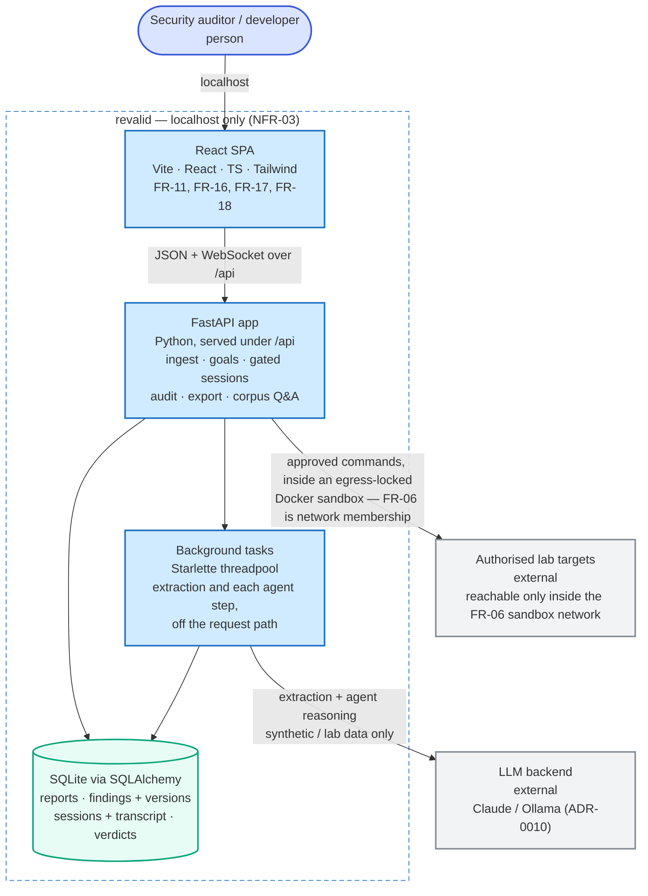
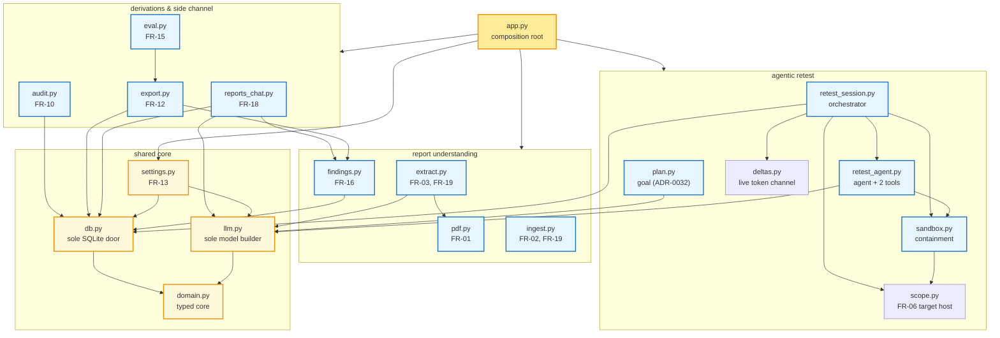
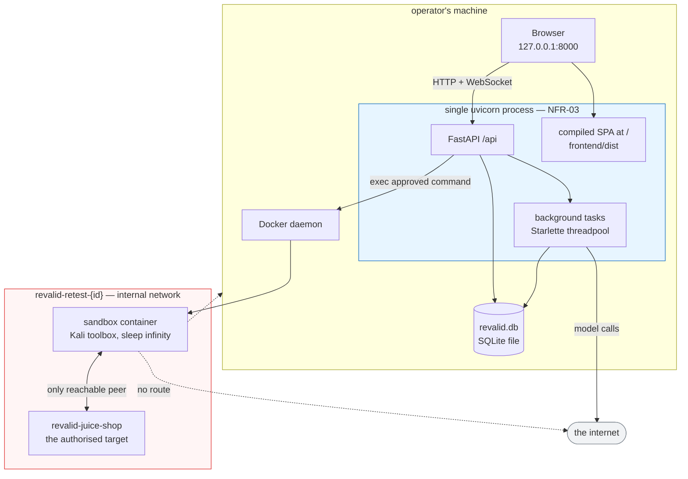
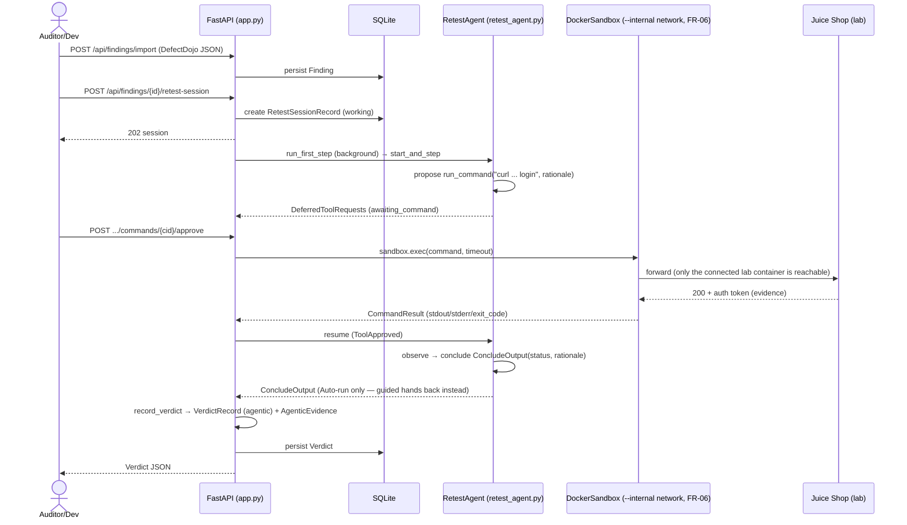
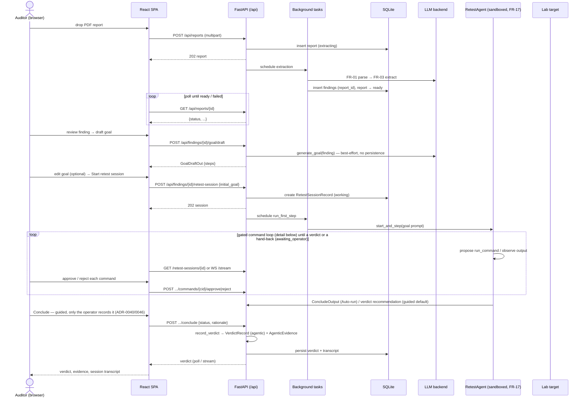
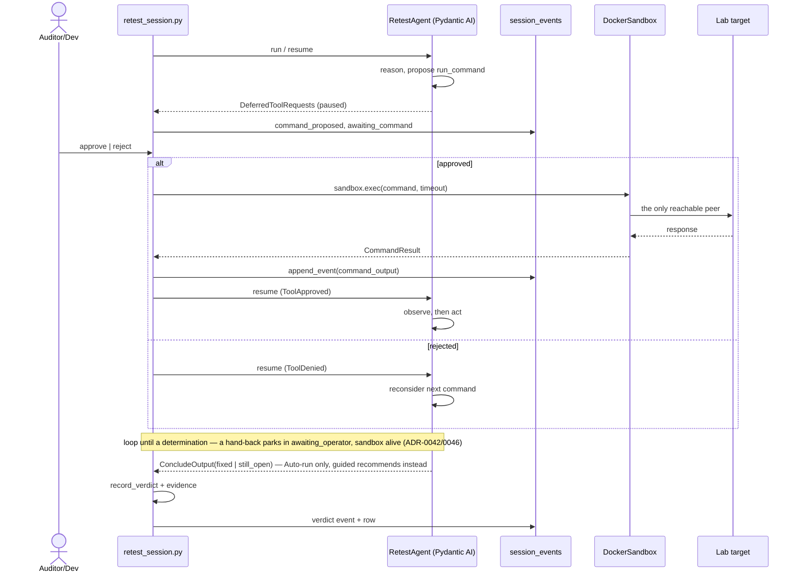
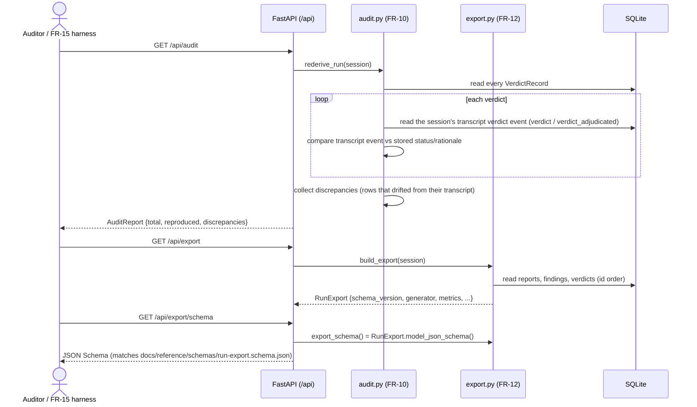

# Architecture — C4 model

> Authored diagrams: these do NOT auto-sync with code. Any PR changing a flow or boundary
> depicted here must update this page (checked by the `doc-curator` agent).

## Level 1 — System context

<!-- thesis-fig: context -->

> Level 1 answers *who uses this and what it touches*. The two external systems
> are the only things revalid talks to, and it reaches the lab **only** through
> the egress-locked sandbox of Level 3.

## Level 2 — Containers

The whole tool runs from one `uvicorn` process bound to `127.0.0.1` (NFR-03):
FastAPI serves the React SPA at `/` and the JSON API under `/api` (ADR-0013).

<!-- thesis-fig: containers -->

What each container owns (kept in prose rather than in the boxes, so the diagram
stays legible when it is rendered into the thesis):

- **React SPA** — report overview with risk profile; the finding stage wizard
  (extract / goal / retest / verdict) with versioned edits and stage-tagged notes
  (FR-16); the agentic retest console (FR-17); read-only corpus chat (FR-18).
- **FastAPI app** — ingest and extraction, with the CVSS/MITRE taxonomy derived
  during extraction and opt-in on the other doors (FR-19);
  finding revision and notes (FR-16); goal drafting; gated agentic sessions in an
  egress-locked sandbox (FR-17); corpus Q&A (FR-18); the FR-10 audit and FR-12
  export; and serving the compiled SPA at `/`.
- **Background tasks** — PDF parse → extraction, and every agent step, off the
  request path.
- **SQLite** — reports; findings as identity plus append-only versions, each
  carrying CVSS and MITRE; notes; retest sessions and their transcript; verdicts
  and evidence; chat threads.

## Level 3 — Components (backend modules)

The decomposition of the FastAPI container. Arrows are real Python imports —
`app.py` is the composition root that wires every component and owns the routes;
`domain.py` is the typed core everything depends on and which depends on
nothing. Persistence (`db.py`) is the only module that talks to SQLite, and
`llm.py` is the only one that constructs a model.

<!-- thesis-fig: components -->

Module responsibilities, in prose so the diagram stays readable at print size:
`pdf.py` turns a PDF into text and finding candidates; `extract.py` turns those
candidates into schema-validated findings and owns the FR-19 taxonomy — both
inside the extraction call and, for the other doors, as the opt-in
`enrich_findings` pass; `ingest.py` covers the two LLM-free doors (DefectDojo
JSON and manual entry) and copies a *stated* CVSS or ATT&CK across without a
model; `findings.py` owns versioned findings and notes, storing whatever
taxonomy those two produced but never deriving one itself. On the retest side, `plan.py` generates the
retest goal, `retest_session.py` is the orchestrator (lifecycle, transcript, the
approval gate, verdicts), `retest_agent.py` holds the agent and its two tools —
the gated `run_command` and the ungated `respond` — and `sandbox.py` provides the
`Sandbox` protocol with its `DockerSandbox` and `FakeSandbox` implementations.
Two small modules complete that side: `scope.py` parses each scope endpoint down
to the host the sandbox is provisioned against (FR-06, ADR-0041/0045), and `deltas.py`
is the deliberately **non-persisted** channel carrying the model's reasoning
tokens to the console while a turn is in flight — a half-finished thought is not
evidence, so it never reaches the transcript.
The derivations are `audit.py` (re-project the transcript, diff the verdicts),
`export.py` (versioned run document plus generated schema), `eval.py` (score an
export against ground truth) and `reports_chat.py` (read-only corpus Q&A).

> Arrows are real Python imports. **Every** component also imports `domain.py`;
> those arrows are omitted so the diagram stays readable. The three invariants
> worth keeping: `domain.py` depends on nothing, `db.py` owns the engine, the schema
> and the mappings — no other module constructs an engine or reaches for `sqlite3`,
> though feature modules do issue their own queries through the session it hands
> them — and `llm.py` is the only one that constructs a model.

## Deployment — runtime and network topology

The whole tool is one process on the loopback interface (NFR-03). The only
non-trivial part is the retest sandbox, and its topology *is* the FR-06 control:
the agent cannot reach an unauthorised host because no route exists, not because
a check rejected it.

That process runs one of two ways, and **the sandbox topology is identical in
both** — which is precisely why containerising the app was safe to do. Either it
runs directly on the host from a checkout (`make run`), or it runs inside the
`revalid-app` container (`make deploy`, ADR-0044) with the host Docker socket
mounted, creating the session network and sandbox as *siblings* rather than
children. The session network is created by the same daemon either way, so the
egress lock is unaffected by where the process asking for it lives. The cost of
the second mode is stated plainly in ADR-0044: mounting the socket is
root-equivalent on the host, accepted only under the single-operator threat model
(ADR-0008).

The topology below is **lab mode** — the default, and the one the evaluation
runs on. Since ADR-0041 the sandbox is provisioned against the *scope host* the
operator set at launch rather than the hardcoded lab, so an online target instead
gets **gateway mode** (ADR-0045): the scoped host is resolved to its IPv4
address(es) and a per-session **egress gateway** container installs an `iptables`
OUTPUT allowlist for those IP(s); the sandbox runs *inside the gateway's network
namespace* with `NET_RAW` but not `NET_ADMIN`, so every tool reaches the scoped
host and nothing else and no command can change the rules. Provisioning fails
closed — any error tears the session down rather than opening egress. (This
replaced ADR-0041's L7 Squid proxy, which carried only HTTP and so left nmap and
raw-socket tools with no route to an online target.)

Both modes are drawn, rule by rule, on the [network topology](topology.md) page,
which also covers per-session resource naming, the teardown order and the limits
of the guarantee. This section stays at deployment altitude: where the process
runs, and what it talks to.

<!-- thesis-fig: deployment -->

> The single uvicorn process runs either directly on the operator's machine or inside
> the `revalid-app` container (ADR-0044); the topology below it is the same either way.
> Dashed lines are connections that **do not exist** — the `--internal` network
> has no gateway, so the sandbox can reach neither the host nor the internet.
> `start()` self-heals resources left behind by a crashed prior session of the
> same id; `stop()` tolerates "already gone" at every step (and works by name, so
> a report deletion reaps even a session the registry forgot after a restart) so a
> partial failure cannot block teardown. In gateway mode (an online scope host,
> ADR-0045) the sandbox instead shares the network namespace of a per-session
> egress-gateway container whose `iptables` allowlist admits only the scoped IP(s)
> — the sandbox holds no `NET_ADMIN`, so it cannot change that; every dashed line
> stays dashed for anything not allowlisted.

## Level 3 — Walking-skeleton retest flow (M6, agentic)

M1's walking skeleton (FR-02 → FR-07 → FR-09) shipped a deterministic slice: one
verification-only HTTP probe, executed through a request-level target allowlist,
yielding an evidence-backed verdict. That whole batch path (`plan.py`'s HTTP
executor, the allowlist transport, the FR-08 sanity checker) was retired in
FR-17 Slice 6b-iii (ADR-0033); this diagram now shows its replacement — the
current minimal loop a retest walks (ADR-0025 Slice 0): one gated command,
approved by a human, executed inside an egress-locked sandbox, concluding a
verdict. It is the smallest instance of the [gated sandbox execution](#level-3-fr-06fr-17-gated-sandbox-execution-adr-0025)
loop shown in full further down.

## Level 3 — FR-11 UI ingest → verdict flow (M6, agentic)

The full flow operated from the React SPA alone (FR-11 acceptance): a PDF report
is uploaded, extracted into findings by a background worker the UI polls, then
the operator drafts and edits the retest **goal**, starts an agentic retest
session, and walks the gated command loop to a verdict — every step a UI action
over `/api` (ADR-0013). The gated propose → approve → exec → observe cycle is
shown here as one loop; [FR-06/FR-17 gated sandbox execution](#level-3-fr-06fr-17-gated-sandbox-execution-adr-0025)
below zooms into one iteration of it.

The finding detail is a **stage wizard** (ADR-0024, reshaped for the agentic
flow in FR-17 Slice 6b-iii-b): the operations shown below are reached as four
sub-routes (`/findings/{id}/{stage}`, `stage` ∈ `extract | goal | retest |
verdict`) the operator walks by clicking the pipeline stepper — navigation
only, never a mutation. FR-16 adds two sibling `/api` actions on the finding
itself: `POST /findings/{id}` records a versioned finding edit (append-only,
extraction = v1) and `POST /findings/{id}/notes` appends a stage-tagged note;
both are read back by the wizard.

## Level 3 — FR-06/FR-17 gated sandbox execution (ADR-0025)

FR-17's agentic console makes the retest chokepoint human-in-the-loop on
**every command**, not just a batch (superseding M4's plan-level sanity check,
ADR-0033). Gating is a Pydantic AI **deferred tool**: `run_command` is declared
`requires_approval=True`, so a proposal literally cannot resolve without a
human `approve`/`reject` — the run pauses and returns a `DeferredToolRequests`,
never executing anything on its own. Once approved, the command runs inside a
`DockerSandbox` on a per-session Docker **`--internal`** network with only the
authorised lab container attached — **FR-06 is now network membership**, not
an HTTP-layer check: no route to anything else exists. (For an online scope host
the same requirement is met by the per-session L3 egress gateway of ADR-0045 —
an `iptables` allowlist for the scoped IP(s), in a helper container the sandbox
cannot alter, letting every tool through to the scoped host and nothing else.)
Three limits of that
boundary are recorded in the ADR-0025 update of 2026-07-22 and stated in the
memoir alongside the guarantee: the lock confines the *agent*, not code the agent
successfully executes on the target (which stays attached to `lab_default`);
`internal` mode blocks routed traffic but not name resolution on hosts with a
loopback DNS stub; and the system test asserting the lock passes on a failed
lookup alone, never probing a bare address.

<!-- thesis-fig: gated-execution -->

## Level 3 — FR-10 audit re-derivation & FR-12 export (M6, agentic-only)

Two read-only derivations off the persisted trail, no network. **FR-10**
(ADR-0025/ADR-0033's NFR-02 shift): an agentic verdict is a human-adjudicated
judgment over a whole session, not a pure function of one request's evidence,
so `rederive_run` re-projects the session's authoritative transcript event —
the `verdict` event for the agent's own record, or the latest
`verdict_adjudicated` event for an operator override — and diffs it against
the stored `VerdictRecord`: a clean run proves the row still equals the
transcript it was derived from; any mismatch is a discrepancy. (The old
FR-04/05/07-09 batch evidence-rederivation, ADR-0015, was removed with the
batch path in FR-17 6b-iii, ADR-0033.) **FR-12** (ADR-0016): `build_export`
assembles the whole run into one `SCHEMA_VERSION`-versioned document that
validates against a schema *generated* from the model, so the published
schema can never drift from the document.

