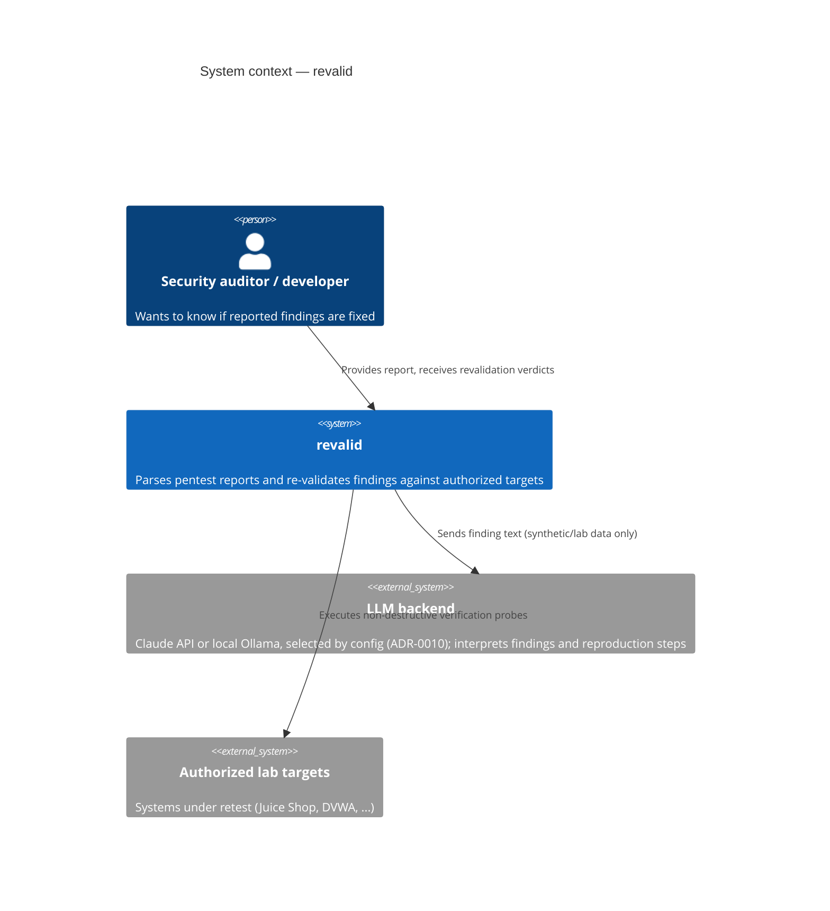
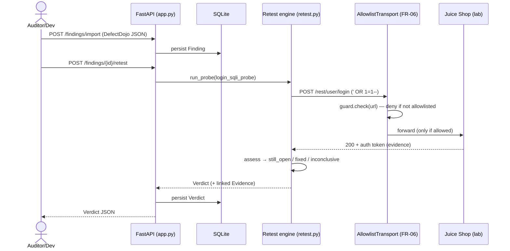

# Architecture — C4 model

> Authored diagrams: these do NOT auto-sync with code. Any PR changing a flow or boundary
> depicted here must update this page (checked by the `doc-curator` agent).

## Level 1 — System context

## Level 2 — Containers

*To be drawn during the design phase (after the SRS).* Planned components: report ingestion, finding extraction, action planner, retest executor, verdict reporter.

## Level 3 — Walking-skeleton retest flow (M1)

The deterministic slice shipped in M1 (FR-02 → FR-07 → FR-09): a finding is
retested by one verification-only probe, executed **only** through the FR-06
allowlist guard, producing an evidence-backed verdict.

