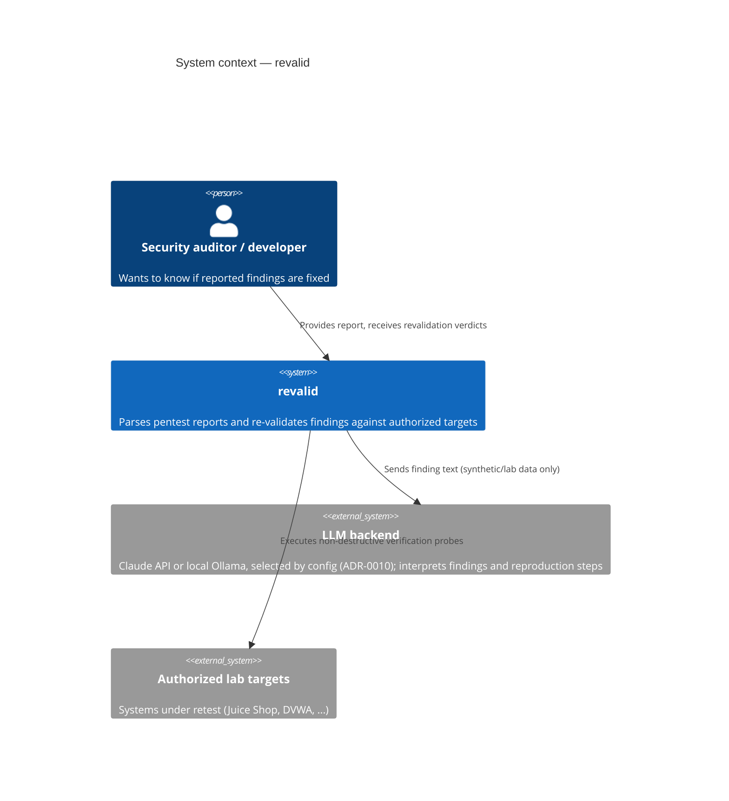
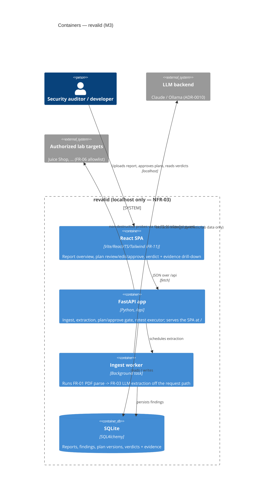
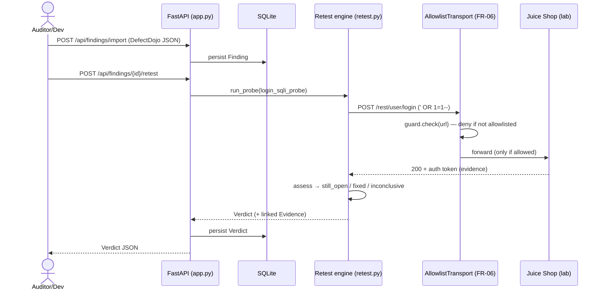

# Architecture — C4 model

> Authored diagrams: these do NOT auto-sync with code. Any PR changing a flow or boundary
> depicted here must update this page (checked by the `doc-curator` agent).

## Level 1 — System context



## Level 2 — Containers

The whole tool runs from one `uvicorn` process bound to `127.0.0.1` (NFR-03):
FastAPI serves the React SPA at `/` and the JSON API under `/api` (ADR-0013).



## Level 3 — Walking-skeleton retest flow (M1)

The deterministic slice shipped in M1 (FR-02 → FR-07 → FR-09): a finding is
retested by one verification-only probe, executed **only** through the FR-06
allowlist guard, producing an evidence-backed verdict.



## Level 3 — FR-11 UI ingest → verdict flow (M3)

The full flow operated from the React SPA alone (FR-11 acceptance): a PDF report
is uploaded, extracted into findings by a background worker the UI polls, then a
plan is generated, approved (FR-05 gate), and executed, yielding verdicts with
evidence — every step a UI action over `/api` (ADR-0013).

```mermaid
sequenceDiagram
    actor U as Auditor (browser)
    participant SPA as React SPA
    participant API as FastAPI (/api)
    participant W as Ingest worker (background)
    participant DB as SQLite
    participant LLM as LLM backend
    participant RT as Retest executor (FR-06 guard)
    participant Lab as Lab target

    U->>SPA: drop PDF report
    SPA->>API: POST /api/reports (multipart)
    API->>DB: insert report (extracting)
    API-->>SPA: 202 report
    API->>W: schedule extraction
    W->>LLM: FR-01 parse → FR-03 extract
    W->>DB: insert findings (report_id); report → ready
    loop poll until ready / failed
        SPA->>API: GET /api/reports/{id}
        API-->>SPA: {status, ...}
    end
    U->>SPA: review finding → Generate plan
    SPA->>API: POST /api/findings/{id}/plan
    U->>SPA: Approve
    SPA->>API: POST /api/findings/{id}/plan/approve
    U->>SPA: Run retest
    SPA->>API: POST /api/findings/{id}/retest
    API->>RT: execute_approved_plan (FR-05 chokepoint)
    RT->>Lab: non-destructive probe (allowlisted)
    Lab-->>RT: response (evidence)
    RT->>DB: persist verdicts (plan_version)
    API-->>SPA: [verdicts + evidence]
    SPA-->>U: verdicts, evidence drill-down, plan history
```
