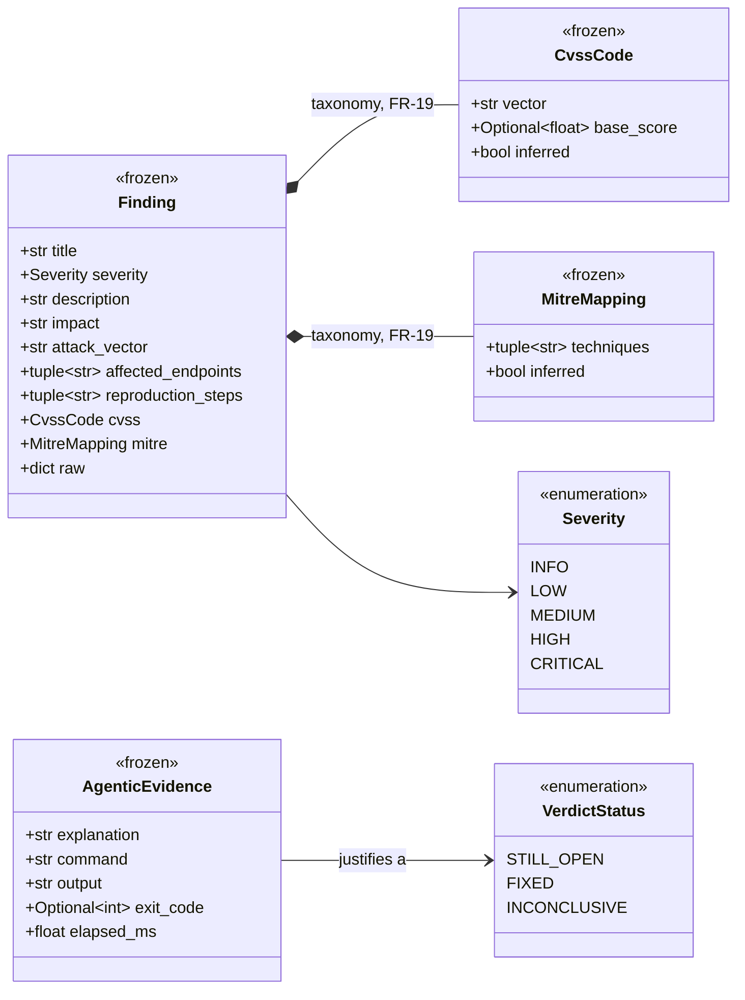
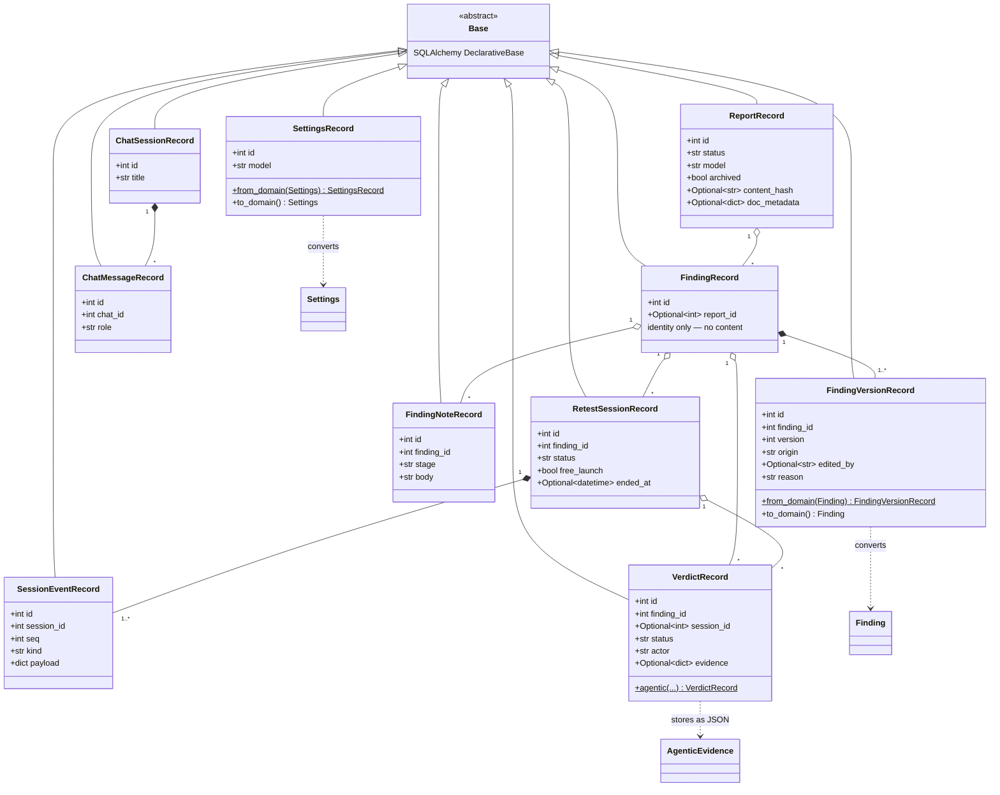
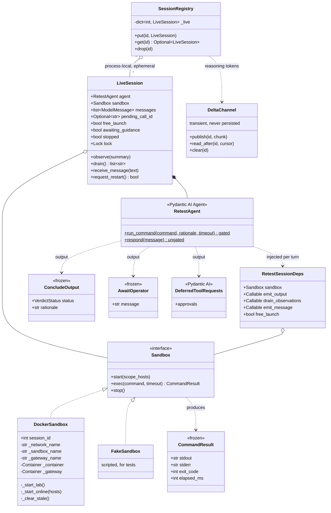
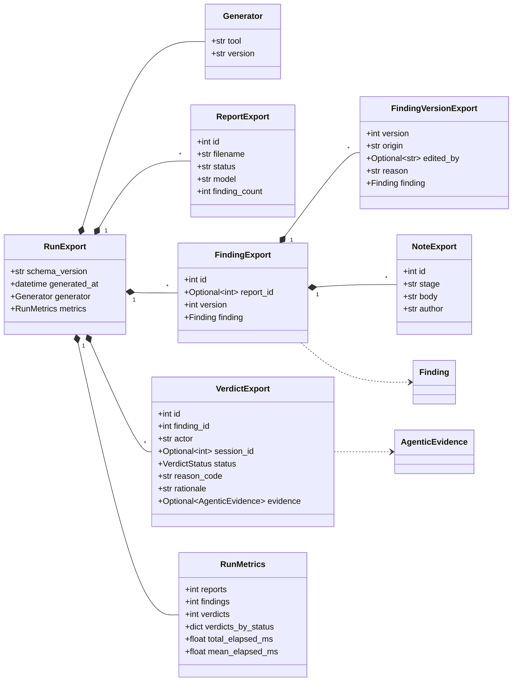

# Architecture — class model

> Authored page: these are **curated** class diagrams, drawn at the altitude the
> design is argued at. They do NOT auto-sync with code — a PR that changes one of
> the structures shown here must update it in the same PR (checked by the
> `doc-curator` agent).
>
> The exhaustive, machine-generated counterpart is
> [UML (generated)](../reference/uml.md): `pyreverse` emits every class in every
> module, so nothing can hide from it. That completeness is also its limit — 101
> boxes joined by 31 relations show *what exists*, not *what matters*. The four
> diagrams below select the structures that carry a design decision, and each one
> is paired with the decision it encodes.

## The core vocabulary

`domain.py` is the typed core: frozen Pydantic value objects plus the enums that
name every state in the system. It imports nothing from the other layers, which
is the invariant that lets persistence, the agent, the export and the SPA all
speak one vocabulary without depending on each other.

Two properties are worth reading off the diagram. First, **provenance travels
with the value**: `CvssCode` and `MitreMapping` each carry an `inferred` flag, so
a score the model estimated is never mistaken for one the report stated (FR-19,
ADR-0037). Second, **evidence is tool-agnostic**: `AgenticEvidence` is an
explanation plus a real command's captured output, not a structured HTTP
request/response — because the agent runs arbitrary tooling, and pinning the
evidence shape to HTTP would have pinned the retest to HTTP (ADR-0031).

<!-- thesis-fig: class-domain -->

`domain.py` also owns the lifecycle enums — `ReportStatus`, `RetestSessionStatus`,
`SessionEventKind`, `FindingStage`, `FindingOrigin` — and the `Settings` value
object. They are left out of the figure because a list of literals says nothing:
the transitions between them are the design, and those are drawn as state
machines on the [data model](data-model.md) page.

## Persistence: the domain seam

`db.py` is the only module that touches SQLite. Every row class descends from the
SQLAlchemy `Base`, and the classes that carry domain content own the **conversion**
themselves: finding versions and settings round-trip in both directions
(`from_domain`/`to_domain`), and a verdict is built from domain values by its
`agentic` constructor and stores its evidence as JSON. That is the seam — nothing
above `db.py` handles a `Mapped` column, and nothing below it handles a frozen
domain object.

<!-- thesis-fig: class-persistence -->

The **identity/content split** on `FindingRecord` is the structural claim of
FR-16 (ADR-0024). A finding is a bare identity row; everything a human reads
lives in an append-only `FindingVersionRecord`. Because verdicts and sessions
reference the *identity*, correcting a finding can never orphan the work already
done against it — a property that would be impossible if the content and the
foreign-key target were the same row.

The composition diamonds are deliberate: a finding version and a session event
have no meaning apart from their parent, whereas a verdict or a note is
aggregated (it outlives, and is queried independently of, the session that
produced it).

## The agentic retest session

This is the collaboration the whole system exists to run, and the one place where
a **structural** guarantee replaces a policy. `retest_session.py` never asks the
agent to behave: `run_command` is declared to Pydantic AI with
`requires_approval=True`, so the agent's run *cannot resolve* the call — it
suspends and returns `DeferredToolRequests`. Approval is therefore not a check
performed before executing; it is the only thing that can make execution happen
at all (ADR-0025).

<!-- thesis-fig: class-retest -->

Three decisions are legible here.

**The output union is the turn's contract.** A turn ends in exactly one of three
ways: a gated command (`DeferredToolRequests`), a determination
(`ConcludeOutput`), or a hand-back to the operator (`AwaitOperator`). There is no
fourth path and no way to fall off the end, so the orchestrator's state machine
is total by construction (ADR-0039, ADR-0042).

**`Sandbox` is a protocol, not a base class.** `DockerSandbox` drives a real
daemon; `FakeSandbox` replays a script. Neither inherits from the other and
neither is registered anywhere — structural typing alone makes them
interchangeable, which is what lets the entire HTTP flow be tested with no Docker
and no network.

`DockerSandbox` is also the one place where a *class* diagram under-describes the
design, and the three name fields are the tell. One object provisions two quite
different topologies — an `--internal` network with the target attached, or an
egress gateway whose network namespace the sandbox joins (ADR-0045) — and the
second one's enforcement lives in a **container**, not an object: nothing in this
diagram holds `NET_ADMIN`. What the fields do capture is why teardown is
reliable: every per-session resource is addressed **by name**, so a freshly
constructed instance can reap containers it never created. The parts worth
testing were pushed out of the class entirely, into pure module-level functions
(`resolve_scope_ips`, `egress_firewall_script`, `is_lab_scope`) — which is what
lets the firewall ruleset be unit-tested while the class that runs it stays
`# pragma: no cover`. The topology itself is drawn on the
[network topology](topology.md) page.

**`LiveSession` is deliberately not persisted, and `DeltaChannel` deliberately
persists nothing.** Live agent state (message history, the sandbox handle, the
pending call id) is process-local: a restart abandons an in-flight session, but
the transcript — the thing a verdict is derived from — survives untouched.
`DeltaChannel` carries the model's reasoning tokens to the console while a turn
runs and drops them when it lands: a half-finished thought is not evidence, and
writing it to the transcript would put text into the audit trail that no verdict
was ever derived from.

## The export document

FR-12's export is one versioned document assembled from the trail, and its class
structure *is* its schema: `export_schema()` is literally
`RunExport.model_json_schema()`, so the published JSON Schema cannot describe a
document the code does not produce (ADR-0016).

<!-- thesis-fig: class-export -->

`SCHEMA_VERSION` is currently **1.5**; it has been bumped five times, each by a
decision recorded in an ADR — 1.1 added FR-16 version history and notes, 1.2
flattened the verdict shape, 1.3 added `AgenticEvidence`, 1.4 dropped the retired
batch `plans` section, and 1.5 added the FR-19 taxonomy fields. `RunMetrics`
carries only neutral facts — counts and timings — never correctness: grading a
run against ground truth is the evaluation harness's job (FR-15), and keeping
that judgement out of the export is what stops the system from marking its own
homework.
