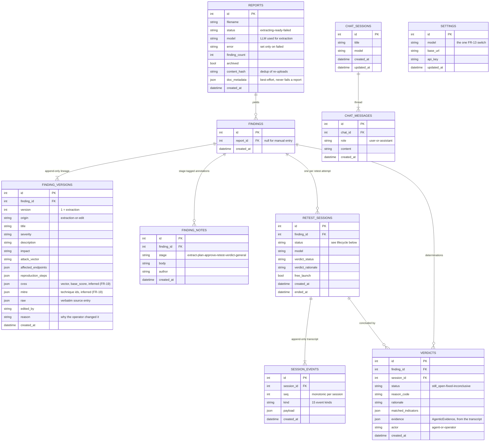
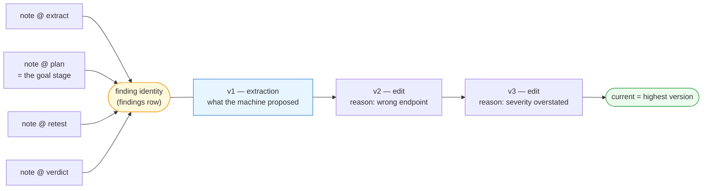
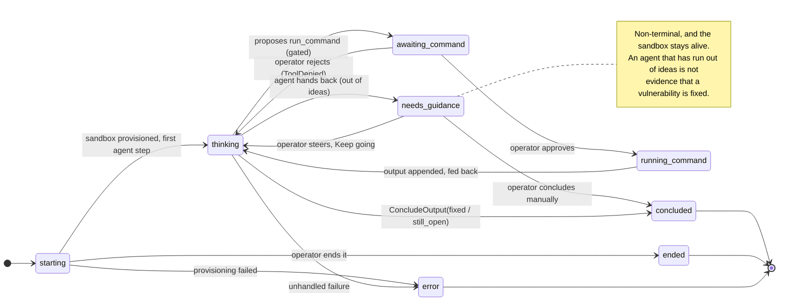
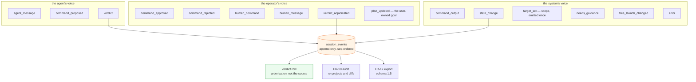
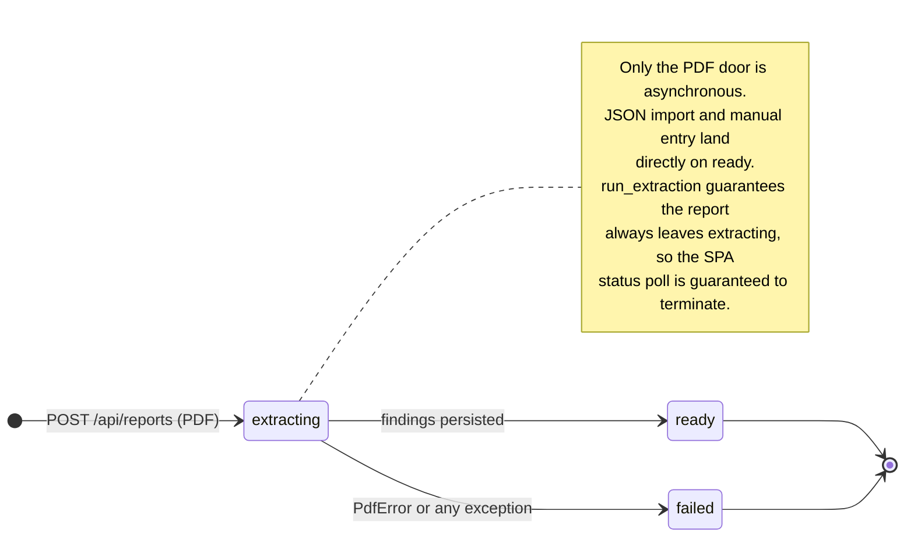

# Architecture — data model

> Authored page: this does NOT auto-sync with code. A PR that adds a table,
> a column or a lifecycle state described here must update it in the same PR
> (checked by the `doc-curator` agent). The generated
> [UML class diagrams](../reference/uml.md) show the Python classes; this page
> shows the **persisted** shape and the lifecycles that move through it.

Durable state is SQLite via SQLAlchemy (`db.py`), created with `create_all` —
there are no migrations, by decision (ADR-0002/0008): a single-user local tool
with a disposable database gets `make reset-db`, not Alembic.

## Entity relationships

Three properties of this schema carry most of the design weight:

- **A finding is an identity, not a row of content.** `findings` holds only the
  identity and its report link; every field a human reads lives in
  `finding_versions`. That is what makes FR-16's lineage possible.
- **`session_events` is the source of truth for a session**, and the verdict row
  is a *derivation* of it. FR-10's audit re-projects the transcript and diffs it
  against `verdicts` — which only means something because the transcript is
  append-only and independently written.
- **`settings` is a single row.** One authoritative model/provider selection,
  seeded once from the environment and thereafter runtime-editable (ADR-0021).

## Finding version lineage (FR-16, ADR-0024)

Findings are versioned, never overwritten. Version 1 is `extraction` — what the
machine proposed. Every operator correction appends an `edit`.

The evaluation depends on this: scoring "did the model get it right" requires
knowing what the model actually said, *after* a human has corrected it.

Notes are tagged with the stage they were written on. The enum keeps the legacy
`plan` and `approve` values from the retired batch path — the **goal** stage
tags its notes `plan` — and `general` marks a note left from the finding
overview rather than a specific stage.

## Retest session lifecycle (FR-17, ADR-0034)

`given_up` exists in the enum but is **retired** — kept only so any legacy row
stays terminal. Nothing writes it.

## Transcript event kinds

Every one of these is a numbered `session_events` row. Together they are the
replayable record NFR-02 relies on.

`verdict_adjudicated` is the operator's override. Once present, the **latest**
one is the authoritative event for audit purposes — not the agent's original
`verdict`.

## Report ingest lifecycle

