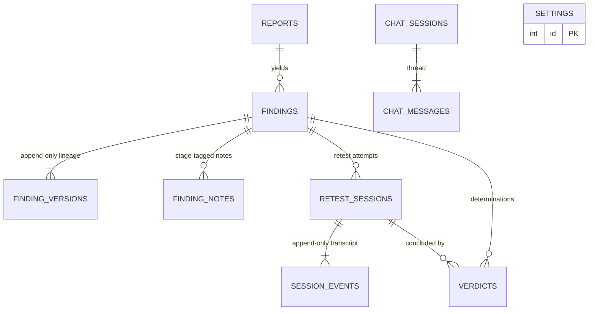
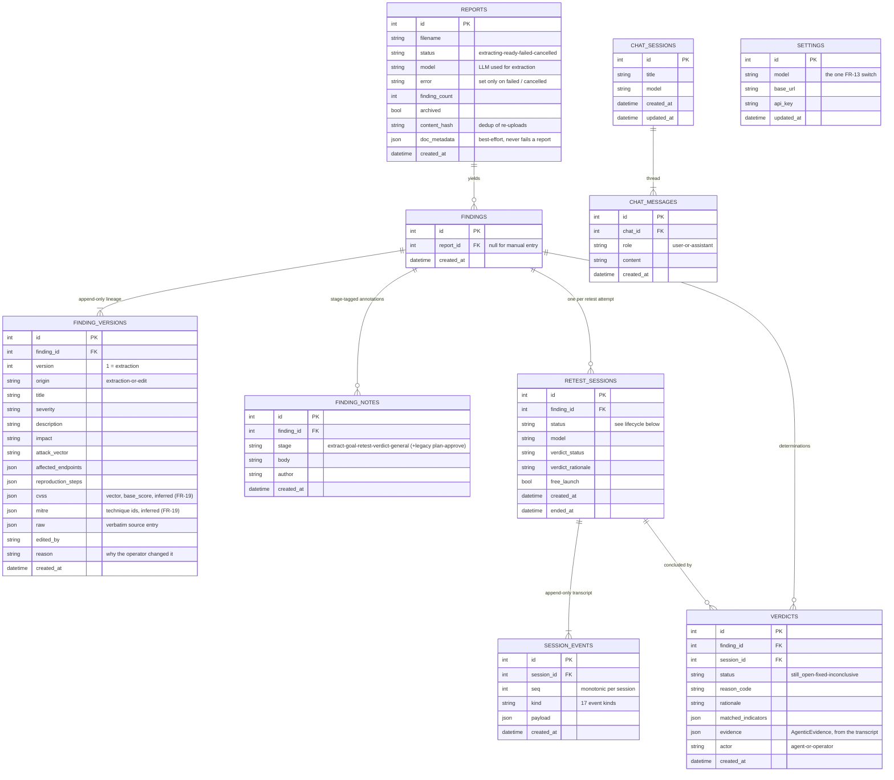
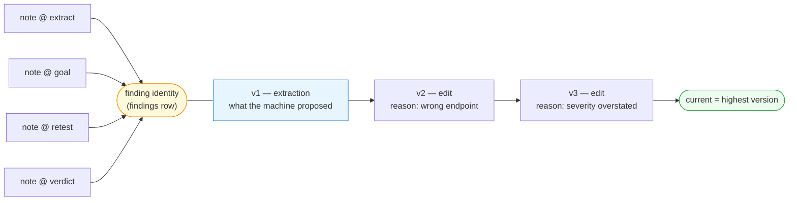
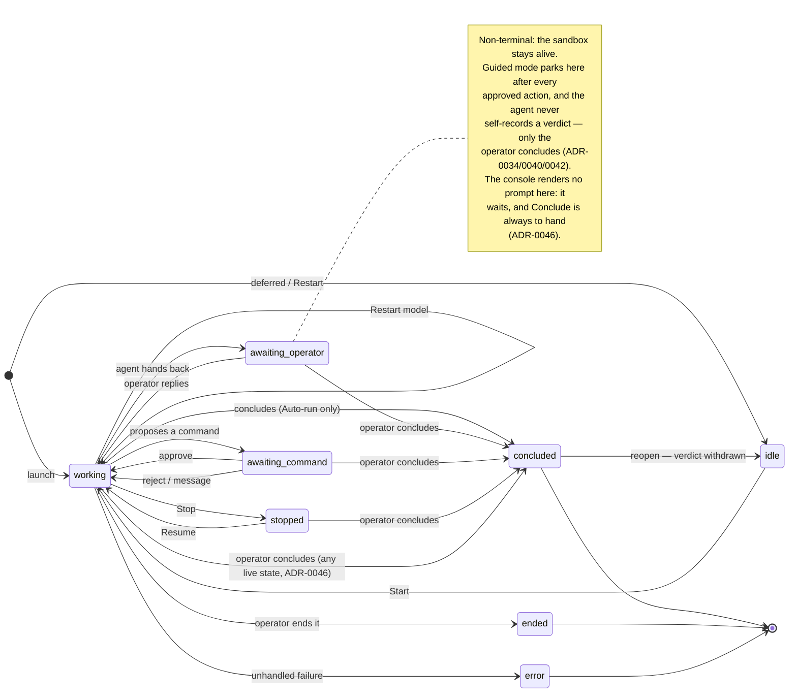
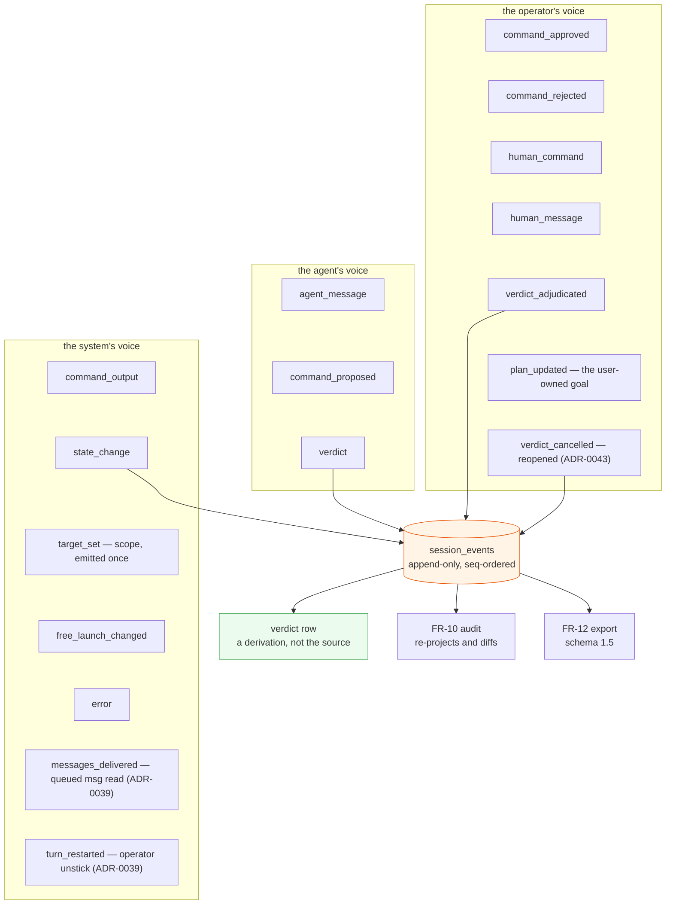
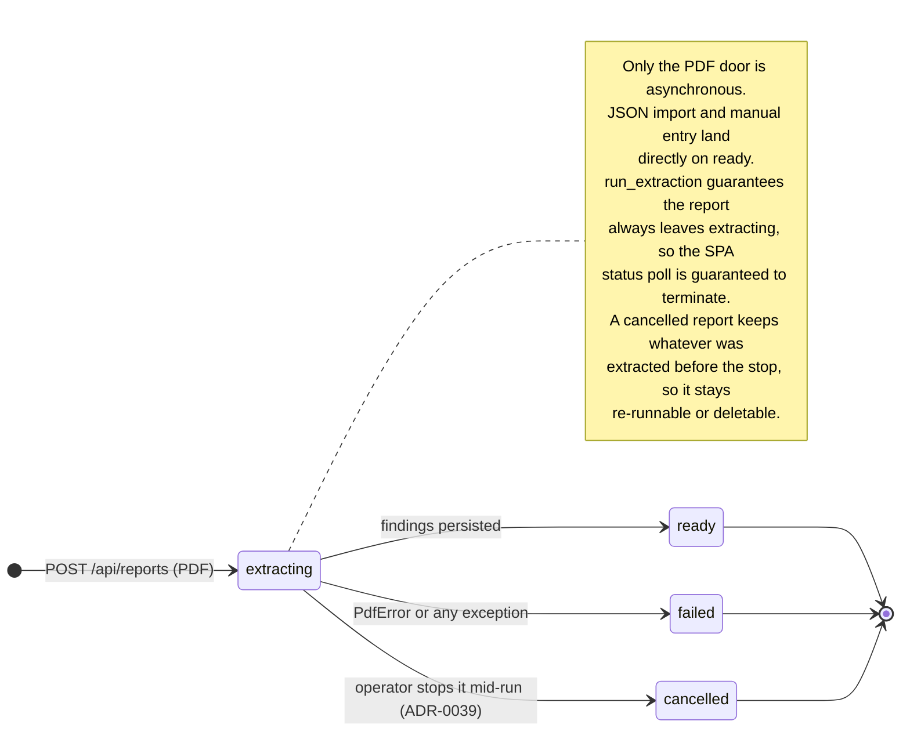

# Architecture — data model

> Authored page: this does NOT auto-sync with code. A PR that adds a table,
> a column or a lifecycle state described here must update it in the same PR
> (checked by the `doc-curator` agent). The generated
> [UML class diagrams](../reference/uml.md) show the Python classes; this page
> shows the **persisted** shape and the lifecycles that move through it.

Durable state is SQLite via SQLAlchemy (`db.py`), created with `create_all` —
there are no migrations, by decision (ADR-0002/0008): a single-user local tool
with a disposable database gets `make reset-db`, not Alembic.

## Entity relationships

Two views of the same schema. The overview below fixes the relationships and
their cardinalities; the detailed diagram after it adds every column. The
overview is what the thesis reproduces — the full attribute listing is a
reference artefact, unreadable at print size.

<!-- thesis-fig: data-model -->

### Full attribute listing

Three properties of this schema carry most of the design weight:

- **A finding is an identity, not a row of content.** `findings` holds only the
  identity and its report link; every field a human reads lives in
  `finding_versions`. That is what makes FR-16's lineage possible.
- **`session_events` is the source of truth for a session**, and the verdict row
  is a *derivation* of it. FR-10's audit re-projects the transcript and diffs it
  against `verdicts` — which only means something because the transcript is
  append-only and independently written.
- **`settings` is a single row.** One authoritative model/provider selection,
  seeded once from the environment and thereafter runtime-editable (ADR-0021).

## Finding version lineage (FR-16, ADR-0024)

Findings are versioned, never overwritten. Version 1 is `extraction` — what the
machine proposed. Every operator correction appends an `edit`.

<!-- thesis-fig: version-lineage -->

The evaluation depends on this: scoring "did the model get it right" requires
knowing what the model actually said, *after* a human has corrected it.

Notes are tagged with the stage they were written on: `extract`, `goal`,
`retest`, `verdict`, or `general` for a note left from the finding overview
rather than any one stage. The enum still *reads* the retired batch path's `plan`
and `approve` values so an older database loads, but nothing writes them — the
goal stage tagged its notes `plan` until issue #113, and those rows are renamed
in place by an idempotent backfill when the engine opens
(`db._backfill_note_stages`).

## Retest session lifecycle (FR-17, ADR-0034/0042)

Five live states, one agent. A turn — the LLM call *and* any command it runs —
happens inside `working`; there is no separate `running_command`, because the
command executes within the working turn (ADR-0042). The old `thinking`,
`starting` and `running_command` states collapsed into `working`, and
`needs_guidance` folded into `awaiting_operator`.

<!-- thesis-fig: session-lifecycle -->

The transitions, in full — the diagram keeps its labels short so it stays legible
when it is scaled into the memoir:

| Transition | What it is |
|---|---|
| `idle → working` | The operator presses **Start**, or sends a message. The sandbox is provisioned at the top of that first turn. |
| `working → awaiting_command` | The agent proposed a `run_command`; the deferred-tool gate suspended the run. |
| `awaiting_command → working` (approve) | The command runs **inside** the next turn — there is no separate `running_command` state. |
| `awaiting_command → working` (reject / message) | A rejection resumes the agent with `ToolDenied`; a message **withdraws** the proposal and re-runs the agent with it (ADR-0042). |
| `working → awaiting_operator` | The agent handed back: a reply, a guided one-action report, a verdict recommendation, or "I'm out of options". |
| `working → working` | **Restart model** — the operator aborts a wedged in-flight turn and has it re-run (ADR-0039). |
| `working → concluded` | The agent recorded its own verdict. Reachable **only** under Auto-run. |
| `* → concluded` (operator) | **Conclude** is a permanent control (ADR-0046): the operator records their own verdict from **any** live state, including mid-turn and at the approval gate. No state grants or withholds it. |
| `concluded → idle` | **Reopen** (ADR-0043): the operator withdraws the recorded verdict and keeps testing. The only edge out of a terminal state. |

A verdict the agent authors itself (`working --> concluded`) is reachable **only
under free launch / Auto-run**; in guided mode the agent never self-concludes and
never self-records `inconclusive` — it hands back through `awaiting_operator` and
lets the operator conclude (ADR-0034/0040). `given_up` exists in the enum but is
**retired** — kept only so any legacy row stays terminal. Nothing writes it.

## Transcript event kinds

Every one of these is a numbered `session_events` row. Together they are the
replayable record NFR-02 relies on.

There is no `needs_guidance` event kind (removed in ADR-0042): an agent hand-back
to `awaiting_operator` is recorded like any other turn — an `agent_message`
carrying its words plus a `state_change` — so the transcript needs no special
"stuck" marker.

`verdict_adjudicated` is the operator's override. Once present, the **latest**
one is the authoritative event for audit purposes — not the agent's original
`verdict`.

`verdict_cancelled` is its counterpart for a **reopened** session (ADR-0043): the
operator withdrew the determination rather than replacing it. Note what the pair
of them implies about where truth lives — reopening *deletes* the row in
`verdicts`, because that table is a projection of current determinations, but it
cannot delete anything from `session_events`, because that is the record the
projection was derived from. A verdict can be retracted; the fact that it was
once reached cannot.

## Report ingest lifecycle

