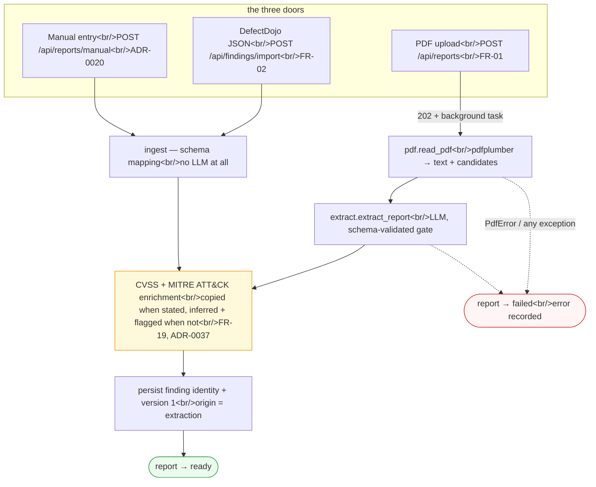
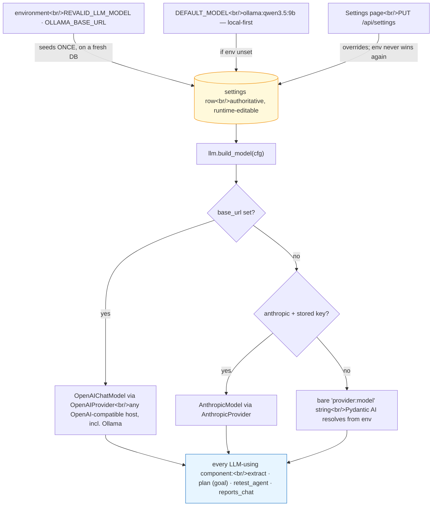
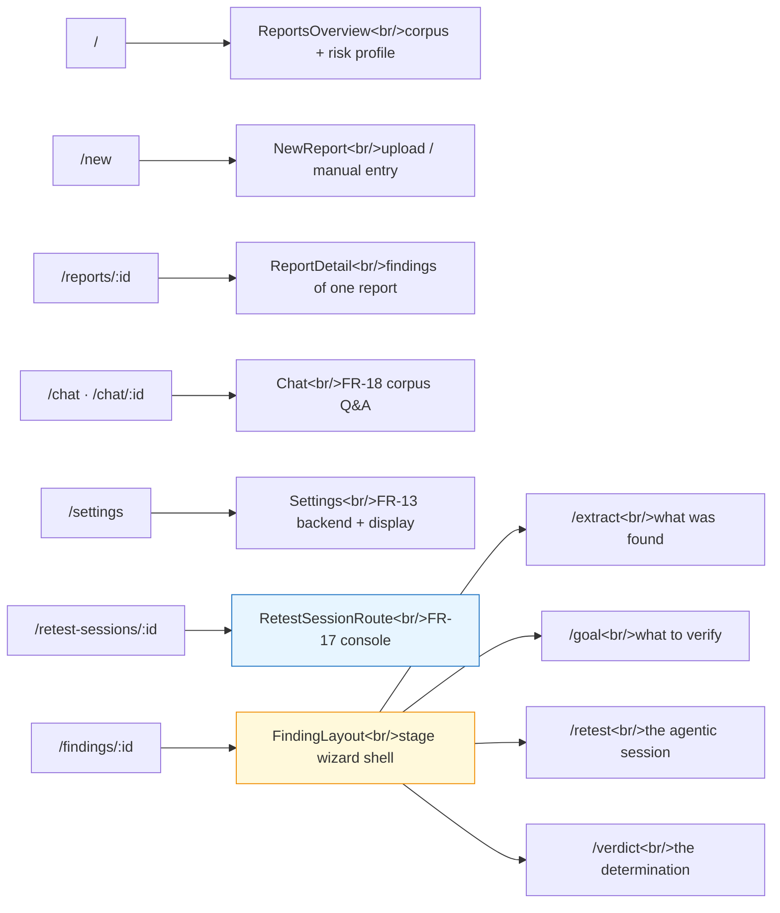
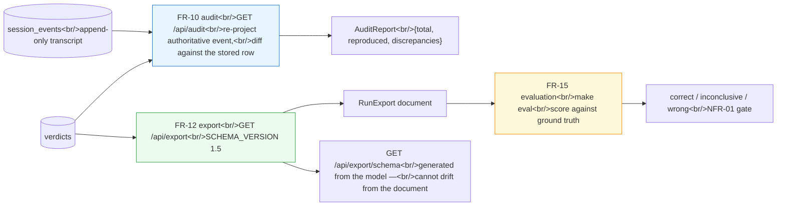

# Architecture — subsystem flows

> Authored page: this does NOT auto-sync with code. A PR that changes one of
> these flows must update the diagram in the same PR (checked by the
> `doc-curator` agent).

The [C4 model](c4.md) covers the retest spine end to end. This page covers the
subsystems around it — how findings get in, how the corpus chat answers, how one
setting picks every model, and how the SPA is laid out.

## Ingest — three doors, one destination

Whatever door a finding comes through, it lands as a `ready` report with
findings attached, so everything downstream is identical. Only the PDF door is
asynchronous.



`run_extraction` guarantees the report always leaves `extracting` — to `ready`
with findings persisted, or to `failed` with the error recorded — so the SPA's
status poll is guaranteed to terminate. Document metadata extraction is
best-effort and can never fail a report.

For development and demos, seed through **manual entry**: it skips the LLM, so
seeding is deterministic, instant and free, and the result is indistinguishable
downstream from an extracted report.

## Reports chat — read-only corpus Q&A (FR-18, ADR-0036)

The chat is deliberately *not* context-stuffed with the corpus. It gets typed,
read-only query tools, so "how many findings mention SQL injection?" is answered
by a `COUNT`, not by an LLM estimating from a truncated prompt.

```mermaid
sequenceDiagram
    actor U as Auditor (browser)
    participant SPA as Chat.tsx
    participant API as FastAPI /api
    participant AG as reports_chat agent&lt;br/&gt;(Pydantic AI)
    participant DB as SQLite

    U->>SPA: "how many findings relate to SQLi?"
    SPA->>API: POST /api/chats/{id}/messages
    API->>DB: load thread → message_history
    API->>AG: run_sync(question, history)

    loop agent decides which tools it needs
        AG->>DB: corpus_overview() — counts by status / severity / latest verdict
        AG->>DB: find_findings(keyword, severity, report) — exact total, rows capped
        AG->>DB: list_reports()
        AG->>DB: get_finding(id) — full detail
    end

    AG-->>API: prose answer
    API->>DB: persist user + assistant turns
    API-->>SPA: whole updated thread
    SPA-->>U: answer

    Note over AG,DB: Every tool is read-only. No sandbox, no retest,&lt;br/&gt;no mutation is reachable from this agent.
```

Only prose turns are stored; the agent re-queries through its tools on every
turn, so an answer can never be stale relative to the database. Threads persist
(`chat_sessions` / `chat_messages`) so a conversation survives a reload.

!!! note "In flight: token-by-token streaming"
    Replies currently arrive in one block. An async SSE variant
    (`POST /api/chats/{id}/messages/stream`) is designed in **ADR-0038** and
    tracked by [#140](https://github.com/SelfishCoconut/revalid/issues/140);
    it is not on `main` yet.

## Model resolution — one switch, every component (FR-13, ADR-0010/0021)

There is exactly one model selection, and extraction, goal drafting, the retest
agent and the corpus chat all resolve through it. That is what makes the
local-versus-cloud comparison in the evaluation a fair one: identical code
paths, different backend.



`GET /api/settings/status` reports reachability and `POST /api/settings/probe`
discovers the models a provider actually offers, so the operator picks from a
live list rather than a hardcoded one.

In tests the model is never real: Pydantic AI's `TestModel`/`FunctionModel`
stand in, and `FakeSandbox` replaces Docker — the whole HTTP flow runs with no
network, no API key and no daemon.

## SPA route map (FR-11, FR-16, FR-17)



The stepper is **navigation only** — clicking a stage never mutates anything
(ADR-0024). Visiting `/findings/:id` bare redirects to the appropriate stage.

## Derivations off the trail

Both are read-only and touch no network.



The evaluation harness is the only part that answers "is the verdict *right*" —
a question no other component in the pipeline can establish about itself.
