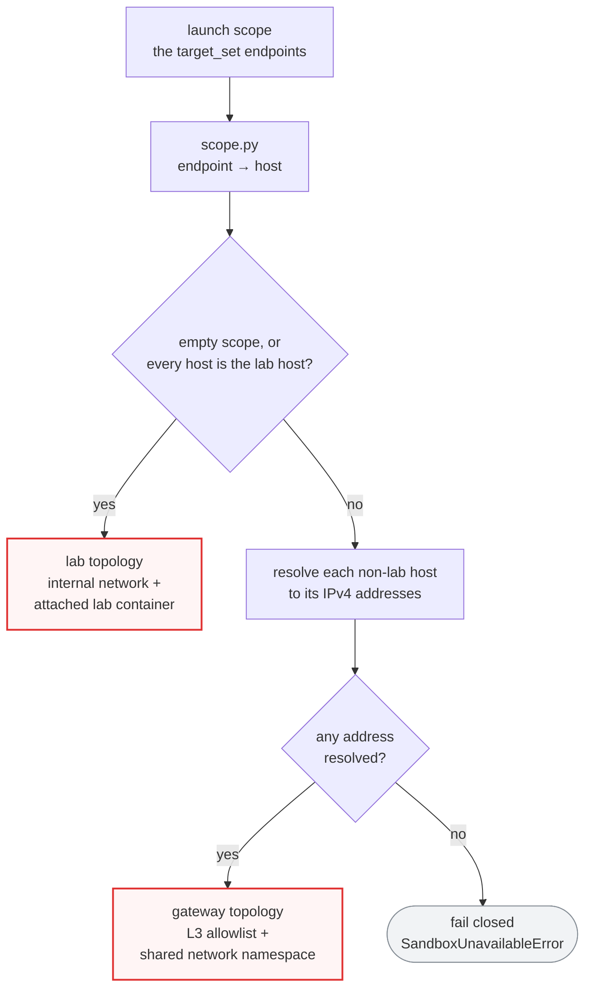
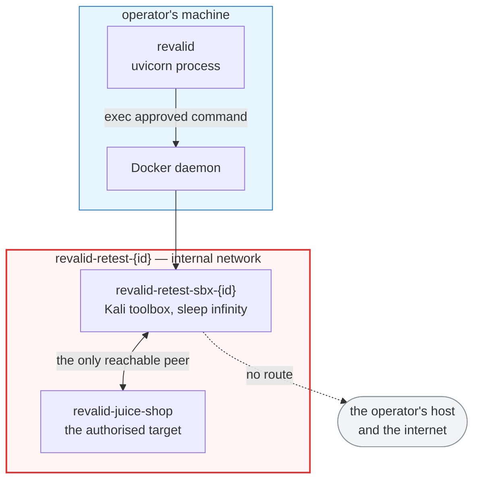
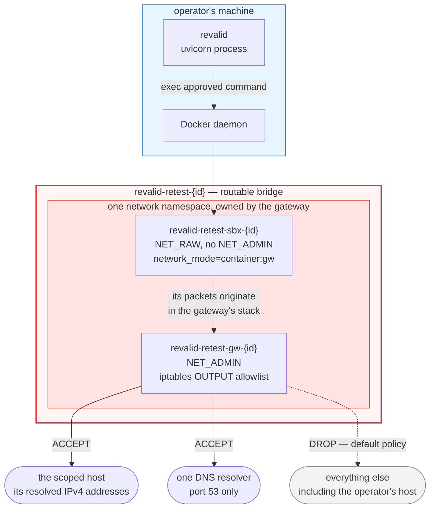
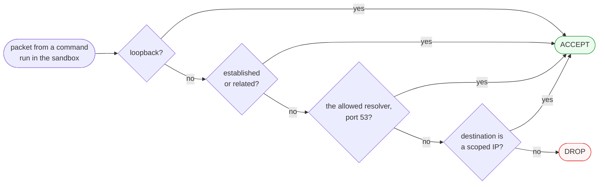

# Architecture — network topology

> Authored page: this does NOT auto-sync with code. A PR that changes how a
> session's network is provisioned, torn down, or filtered must update this page
> in the same PR (checked by the `doc-curator` agent). The code it describes is
> `src/revalid/sandbox.py`; the decisions are [ADR-0025](../adr/0025-agentic-retest-console.md),
> [ADR-0041](../adr/0041-scope-egress-proxy-online-targets.md) (superseded) and
> [ADR-0045](../adr/0045-l3-egress-gateway.md).

FR-06 says the agent may only touch what the operator authorised. In this system
that is not a rule the code checks before running a command — it is the **shape
of the network the command runs in**. The agent cannot reach an unauthorised host
because no path to one exists.

Two consequences follow, and they are the reason this page exists as its own
entry. First, reachability is decided **once**, when the sandbox is provisioned,
from the scope the operator set at launch; the `target_set` event is emitted once
and never again, so changing scope needs a fresh session, not a live edit.
Second, because containment is topology rather than command inspection, *what*
the agent runs is irrelevant to containment — which is what lets the toolbox be a
full Kali image instead of an allowlist of blessed commands.

There are two topologies. Which one a session gets is derived from its scope, and
they are enforced by different mechanisms: **network membership** for a lab
target, an **L3 egress gateway** for an online one.

## Which topology a session gets

`start_and_step` parses the launch scope's endpoints down to their hosts with
`scope.py` (`https://example.com/#/login` → `example.com`) and hands them to
`Sandbox.start(scope_hosts)`. Everything below is decided from that tuple.

An empty scope means the lab: it is the default target and the one the evaluation
runs on. A host that resolves to nothing — an IPv6-only target, a typo, a DNS
failure — never falls back to open egress; provisioning raises and the session
dies. Every failure path in `_start_online` tears down whatever it had already
created before re-raising, so a half-provisioned session can never leave a route
open.

## Lab topology (ADR-0025)

The session gets a Docker bridge network created with `internal=True`. Docker
gives such a network **no gateway address**, so there is no default route out of
it: not to the internet, and not to the operator's own host. The authorised lab
container is then connected to that network, which makes it the sandbox's only
reachable peer. The allowlist *is* the membership list.

Dashed edges are connections that **do not exist**. The lab container is reached
by its container name (`revalid-juice-shop`), resolved by Docker's embedded DNS
on the session network — which is why a finding whose scope says
`http://localhost:3000` does not describe anything the sandbox can reach: inside
the sandbox, `localhost` is the sandbox.

## Gateway topology (ADR-0045)

An online target cannot work by membership — the host is not a container anyone
can attach. It gets a filter instead, and the filter lives **outside** the
sandbox so the agent cannot reach it.

Two containers are provisioned on a per-session bridge network (a routable one
this time, since the point is to leave it). The **gateway** holds `NET_ADMIN` and
installs an `iptables` OUTPUT allowlist, then blocks on `sleep infinity` to keep
its network namespace alive. The **sandbox** is started with
`network_mode=container:<gateway>`, so it has no network stack of its own: it
shares the gateway's. Every packet any tool in the sandbox emits originates in
the gateway's namespace and is filtered by the gateway's rules.

The two containers run the **same image** — the gateway needs `iptables`, so
`lab/sandbox/Dockerfile` installs it rather than pulling a second image for the
role.

| | gateway | sandbox |
|---|---|---|
| Name | `revalid-retest-gw-{id}` | `revalid-retest-sbx-{id}` |
| Owns the network namespace | yes | no — joins the gateway's |
| Capabilities added | `NET_ADMIN` | `NET_RAW` (SYN scans, raw sockets) |
| Can edit the firewall | yes | **no** — `iptables -F` returns `Operation not permitted` |
| Runs agent commands | never | every approved command |
| Entrypoint | the firewall script, then `sleep infinity` | `sleep infinity` |

That split is the whole design. Giving the sandbox itself `NET_ADMIN` would have
been simpler and would have worked — right up until an approved command ran
`iptables -F` and widened its own scope. Here the capability lives in a container
the agent has no way to address, and the sandbox's own bounding set excludes it,
so the rules are not *policy the agent is asked to respect*; they are a property
of the stack its packets are already inside.

## The OUTPUT chain

`egress_firewall_script` builds the ruleset as a shell script the gateway runs as
its entrypoint. It is default-drop, and only numeric IPs are ever interpolated
into it — never a hostname — so there is no shell-injection surface.

| Order | Rule | Why |
|---|---|---|
| policy | `-P OUTPUT DROP` | default-deny: anything not named below is dropped |
| 1 | `-o lo -j ACCEPT` | loopback, so in-container tooling works |
| 2 | `-m conntrack --ctstate ESTABLISHED,RELATED -j ACCEPT` | return traffic of an allowed flow |
| 3 | `-d <resolver> -p udp --dport 53 -j ACCEPT` | name resolution for tools with their own resolver |
| 4 | `-d <resolver> -p tcp --dport 53 -j ACCEPT` | the same over TCP (truncated answers) |
| 5…n | `-d <scope ip> -j ACCEPT` | one per resolved scope IP, **any protocol** |
| last | `ip6tables -P OUTPUT DROP` | close IPv6 entirely (best-effort) |

Rule 5 carries the point of the whole rework: it names no port and no protocol,
so ICMP, UDP, TCP and raw sockets all reach the scoped host. The superseded
ADR-0041 proxy was L7 and carried HTTP(S) only, which left `nmap`, `sqlmap` and
every raw-socket probe with no route to an online target at all — an egress
mechanism that defeated the toolbox it was meant to serve.

IPv6 never reaches this chain: scope hosts are resolved with `AF_INET` only, so
the allowlist is IPv4 by construction, and `ip6tables` is set to drop. Feeding a
v6 address to the v4-only `iptables` would make the script fail and cost the
sandbox all egress, so the two halves are kept deliberately separate.

## Name resolution

The scoped host is resolved **on the host, before anything starts**, and pinned:
`resolve_scope_ips` maps each host to its IPv4 addresses, the first of which is
written into the gateway's `/etc/hosts` via `extra_hosts`. Docker points a
container joining another's network namespace at that container's `/etc/hosts`
and `/etc/resolv.conf`, so the pin and the resolver choice both apply to the
sandbox without being configured on it — indeed they *cannot* be configured on
it, since `network_mode=container:` forbids the `dns`, `extra_hosts` and
`network` options on the joining container.

So glibc-based tools resolve the target with no DNS traffic at all. One resolver
is nonetheless allowed on port 53 because some tools bypass `/etc/hosts` and
resolve for themselves — `nmap` most notably. That resolver is the only name
server reachable, and resolving a name is not the same as reaching it: an
off-scope address that comes back is still dropped by the chain above. The
residual is a small DNS side-channel, accepted under the single-user threat model
(ADR-0008) and recorded in ADR-0045.

## Per-session resources and their lifecycle

Every resource is named after the session id, and **teardown works by name, not
by held references**.

| Resource | Name | Lab | Gateway |
|---|---|---|---|
| Network | `revalid-retest-{id}` | `internal=true` | routable bridge |
| Sandbox container | `revalid-retest-sbx-{id}` | ✓ | ✓ |
| Gateway container | `revalid-retest-gw-{id}` | — | ✓ |
| Attached target | `revalid-juice-shop` | ✓ | — |

Naming them rather than letting Docker assign anonymous ids is what makes three
otherwise awkward cases routine:

- **A crashed prior run.** `start()` is not re-entrant across a crash: a session
  killed before `stop()` leaves its containers and network behind, and because
  the names are fixed, retrying would hit a 409 name conflict forever. `start()`
  therefore reaps the same-named resources first (`_clear_stale`) and proceeds.
- **A session the registry forgot.** `LiveSession` is process-local, so a backend
  restart drops in-flight sessions from memory while their containers keep
  running. A freshly constructed `DockerSandbox` can still reap them, because it
  only needs the session id.
- **Deleting a report.** That takes down the sandbox of *every* session under it
  — the live ones ended cleanly, the rest reaped by id — which closed a real leak
  where an orphaned session outlived its report.

Teardown order matters and is fixed: containers first (one still attached blocks
the network's removal), sandbox before gateway so the namespace owner outlives
its guest, then the lab container is disconnected, then the network is removed.
Every step tolerates "already gone", so a partial failure cannot block the rest.

## Both run modes, one topology

The `revalid` process itself runs either directly on the host from a checkout
(`make run`) or inside the `revalid-app` container with the host Docker socket
mounted (`make deploy`, [ADR-0044](../adr/0044-containerised-deployment.md)). In
the second mode the session network and its containers are created as *siblings*
of the app container rather than children — but they are created by the same
daemon, from the same API calls, so **the topology on this page is identical in
both**. That is precisely why containerising the app did not touch the
containment model. Its cost is stated plainly in ADR-0044: mounting the socket is
root-equivalent on the host, accepted only under the single-operator threat model
(ADR-0008).

## Limits, stated

The containment claim is strong, so its edges are worth naming precisely.

- **The lock confines the agent, not the target.** Code the agent successfully
  executes *on* the lab target runs with that container's connectivity, and the
  lab container stays attached to `lab_default` so the operator can browse it on
  `127.0.0.1:3000`. A confirmed RCE against the target is not contained by the
  sandbox's network.
- **Pinned IPs cannot follow a rotating CDN.** Addresses are resolved once, at
  launch. A target behind a large CDN may later present an address that was never
  allowlisted, and those connections drop. This is the mirror image of the L7
  proxy's HTTP-only limit, and the honest cost of filtering at L3; for a scoped
  retest of one host it is a non-issue.
- **IPv6-only targets are unreachable**, by design, and fail closed at
  provisioning rather than silently.
- **One resolver is reachable in gateway mode**, so a DNS side-channel exists.
  Nothing else does.
- **`internal` blocks routed traffic, not name resolution.** On a host with a
  loopback DNS stub, a lookup inside a lab sandbox can still succeed even though
  nothing is routable; the system test asserting the egress lock passes on a
  failed lookup alone and never probes a bare address, so it proves less than a
  full reachability test would.
- **The operator's own `localhost` is not the sandbox's.** A scope of
  `http://localhost:3000` names the sandbox itself. Hosts are never rewritten
  behind the operator's back — the scope is validated by the person who set it.

## Where this lives in the code

| Concern | Function in `sandbox.py` |
|---|---|
| Mode decision | `is_lab_scope`, `online_scope_hosts` |
| Name → IPv4, pinned | `resolve_scope_ips` |
| The ruleset | `egress_firewall_script` |
| Resource names | `internal_network_name`, `sandbox_container_name`, `gateway_container_name` |
| Provisioning | `DockerSandbox._start_lab`, `DockerSandbox._start_online` |
| Reaping and teardown | `DockerSandbox._clear_stale`, `DockerSandbox.stop`, `_teardown_by_name` |

`DockerSandbox` drives a live daemon, so it carries `# pragma: no cover` and is
exercised by the nightly `system` test. Its *seams* are unit-tested against a
fake Docker client — the firewall script, the entrypoint/capabilities/
`network_mode` wiring, the by-name teardown — because a `# pragma: no cover` on
the provisioning path is exactly how ADR-0041's two fatal bugs shipped with every
gate green.
