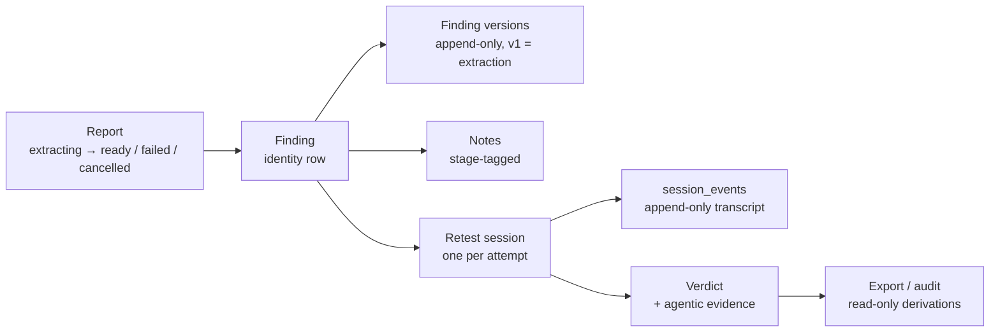
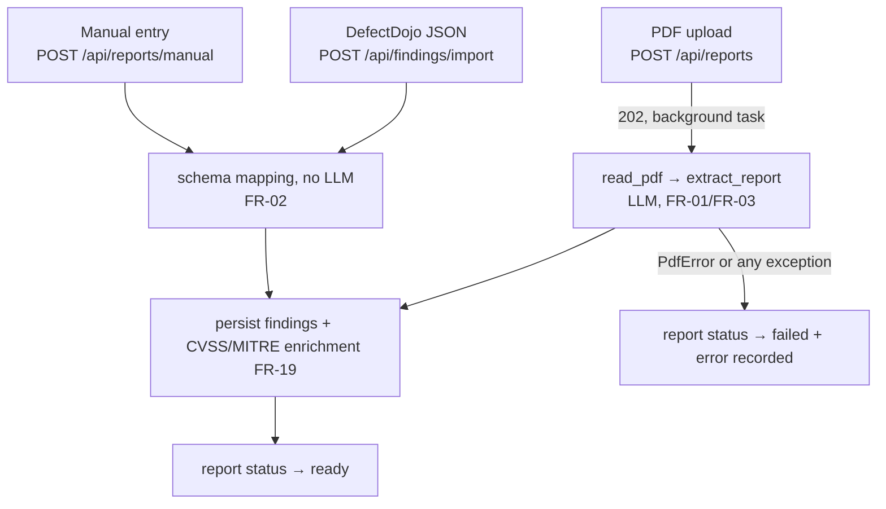
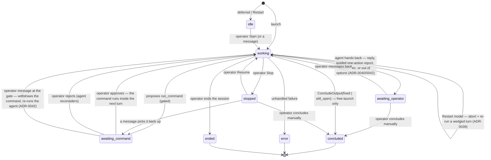
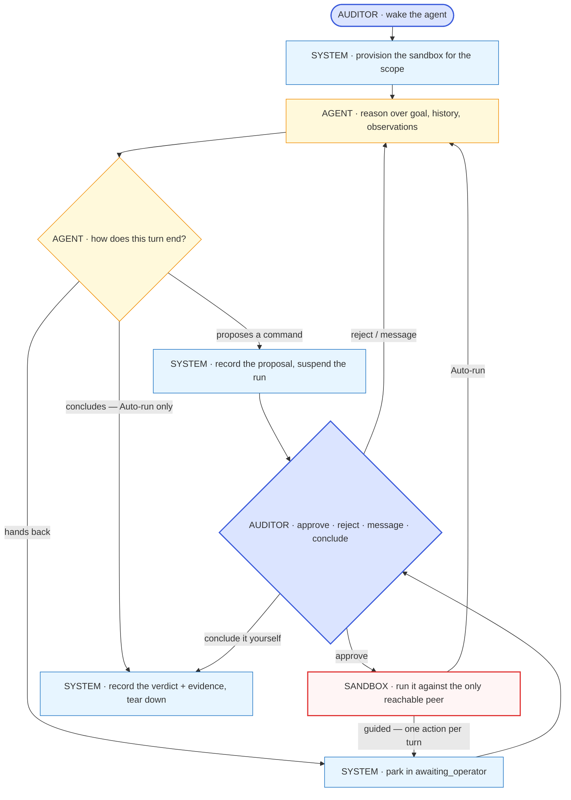

# How revalid works — the program workflow

> Authored page: this does NOT auto-sync with code. A PR that changes a lifecycle,
> a state name or a stage boundary described here must update it in the same PR
> (checked by the `doc-curator` agent).

This page is the narrative counterpart to the [C4 model](c4.md). C4 answers *what
the pieces are*; this page answers *what happens, in what order, and who is in
control at each step*. Read it first if you are new to the codebase; then use the
C4 sequence diagrams for the wire-level detail and the
[API reference](../reference/api.md) for signatures.

## The one-sentence version

A pentest report goes in; each finding it describes is re-verified against an
authorised lab target by an LLM agent that cannot run a single command without a
human saying yes; what comes out is a verdict — `fixed` or `still_open` — backed
by the real output of the command that decided it.

## The runtime picture

Everything runs in **one `uvicorn` process bound to `127.0.0.1`** (NFR-03):
FastAPI serves the compiled React SPA at `/` and the JSON API under `/api`
(ADR-0013). There is no message broker and no second service. Work that outlives
a request — LLM extraction, each turn of a retest agent — is a **FastAPI
background task**, i.e. a sync function Starlette dispatches to its threadpool,
which therefore opens its **own** database session (the request's is already
closed by the time it runs). Durable state is SQLite via SQLAlchemy; live,
non-durable state (the in-flight agent, its message history, the running
sandbox) lives in an in-process `SessionRegistry`.

Three transports carry data to the browser, by need:

| Transport | Used for | Why |
|---|---|---|
| REST (`/api/...`) | every mutation and most reads | plain request/response |
| WebSocket (`/api/retest-sessions/{id}/stream`) | the retest console | the operator must see each transcript event as it happens, plus the model's reasoning tokens while a turn is in flight |
| SSE (`/api/chats/{id}/messages/stream`) | the corpus chat reply | one-way, one-shot token stream — an EventSource-shaped response is all it needs (ADR-0038) |

## The object model, and what owns what



Two properties of this model matter more than the rest:

- **Findings are versioned, never overwritten.** Version 1 is `extraction` — what
  the machine proposed. Every operator correction appends an `edit` version
  (FR-16, ADR-0024). The lineage of "what the model said" versus "what the human
  fixed" survives.
- **A retest session is an append-only transcript.** Every proposal, approval,
  rejection, command output, operator message and verdict is a numbered
  `session_events` row. The verdict is *derived from* the transcript, which is
  what makes the FR-10 audit re-derivation meaningful: it re-projects the
  transcript and diffs it against the stored verdict row.

## Stage 1 — getting findings in

Three doors, all landing in the same place (a `ready` report with findings
attached), so everything downstream is identical:



The PDF path is the only asynchronous one. `run_extraction` guarantees the report
always leaves `extracting` — to `ready` with findings persisted, to `failed` with
the error recorded, or to `cancelled` when the operator stops it mid-run (keeping
whatever was extracted, ADR-0039) — so the SPA's status poll is guaranteed to
terminate. Extraction runs one model call per finding candidate on a cancellable
loop, so a Stop (or a delete) interrupts the in-flight call immediately — not just
between candidates, which never helped when a single call wedged (#206). Document
metadata extraction is best-effort and can never fail the report.

Every finding, whichever door it came through, is enriched with a CVSS code and a
MITRE ATT&CK mapping, inferred when the source report does not state them
(FR-19, ADR-0037).

!!! tip "Seeding data: use manual ingestion"
    For development, demos and walking the flow by hand, seed with **manual
    ingestion** (`POST /api/reports/manual`) rather than a PDF upload. It skips
    the LLM entirely, so seeding is deterministic, instant and free — and the
    resulting report is indistinguishable downstream from an extracted one. It is
    also the intended escape hatch when a model cannot reliably ingest a report
    (e.g. a large report against a small local backend, ADR-0020).

    ```bash
    curl -X POST localhost:8000/api/reports/manual \
      -H 'content-type: application/json' -d '{
        "label": "Seed report",
        "findings": [{
          "title": "Reflected XSS in search",
          "severity": "high",
          "description": "The q parameter is echoed unescaped.",
          "endpoints": ["http://revalid-juice-shop:3000/#/search"],
          "steps_to_reproduce": "1. Open /#/search\n2. Submit <script>alert(1)</script>"
        }]
      }'
    ```

    Only `title` is strictly required per finding; `severity` accepts the usual
    aliases (`info|low|medium|high|critical`). The whole source entry is kept
    verbatim in `Finding.raw`, so nothing you send is lost. The same mapper backs
    `POST /api/findings/import`, so a real DefectDojo export works unchanged.

## Stage 2 — the finding wizard and the goal

The SPA presents each finding as a four-stage wizard —
`/findings/{id}/{extract | goal | retest | verdict}`. The stepper is *navigation
only*: clicking a stage never mutates anything.

At the **goal** stage the operator asks for a draft (`POST
/api/findings/{id}/goal/draft`), which calls the LLM to turn the finding's
reproduction steps into a short list of retest steps. The draft is *not*
persisted — it is a suggestion. The operator edits it, and the goal that
actually governs the session is the one submitted at launch. The goal is
**user-owned** (ADR-0032): the agent reads it and can be re-steered against it,
but does not rewrite it behind the operator's back.

## Stage 3 — the agentic retest session

This is the heart of the system. Launching (`POST
/api/findings/{id}/retest-session`) creates a `working` session row, returns
`202` immediately, and schedules the first agent step as a background task — the
sandbox is provisioned at the top of that first `working` turn (a *deferred*
launch, or a `Restart`, instead lands on `idle` and waits for `Start`).

### Provisioning: the sandbox *is* the allowlist

`start_and_step` calls `sandbox.start(scope_hosts)` before the agent thinks at
all, where `scope_hosts` are the launch scope's endpoints parsed down to their
hosts by `scope.py` (`https://example.com/#/login` → `example.com`). The
production `DockerSandbox`:

1. creates a per-session Docker network named `revalid-retest-{session_id}` with
   `internal=True` — **no route to the host and no route to the internet**;
2. **lab scope** (empty, or every host is the lab): connects the authorised lab
   container (`revalid-juice-shop`) to that network as its only other member;
3. **online scope** (ADR-0041): instead launches a per-session Squid container on
   the network, configured deny-all-by-default with the scoped host(s) as the
   only `dstdomain` allowlist, and points the sandbox's proxy variables at it —
   so the one route out reaches the scoped host and nothing else. Any failure
   while provisioning it **fails closed**: the session dies rather than running
   with open egress;
4. launches a pinned container built from `lab/sandbox/Dockerfile` — a Kali
   base carrying the pentest toolbox (nmap, sqlmap, nikto, hydra, …) — on that
   network, idling on `sleep infinity` so it persists for the whole session.

This is what FR-06 means in the current design: **the allowlist is topology**,
not an HTTP-layer check — network membership on the lab, a closed egress
allowlist online. The agent is not *asked* to stay on target; it is physically
unable to reach anything the operator did not scope. Note that online mode
permits HTTP(S) only — non-HTTP egress has no path out at all. Either way the
scope is fixed when the sandbox is provisioned: changing it needs a fresh session
(the `target_set` event is emitted once and never again).

Two operational details worth knowing: `start()` self-heals a network left
behind by a crashed prior session of the same id (it would otherwise 409
forever), and `stop()` is tolerant at every step of "already gone" so a partial
failure cannot block the rest of the teardown.

Each approved command runs under an **agent-chosen timeout** (issue #150): the
`run_command` tool takes a `timeout_seconds` the model sets to fit the command (a
few seconds for a `curl`, more for a scan), clamped to a hard ceiling so it can
never ask for an unbounded wait. The sandbox enforces it in-container by wrapping
the command with `timeout`, so a hanging or over-long command (an nmap sweep, or
one blocked on stdin) is killed rather than wedging the session — and the model
observes that it timed out and can retry with a narrower scope.

### The loop

The operator owns the session's lifecycle (issue #150): besides approving each
command they can **Start** a deferred session, **Stop** a running one (a
cooperative pause that keeps the sandbox alive), **Resume** it, **Restart** into
a fresh attempt, or **Conclude** it themselves at any live point.



The same loop as an activity, with each step labelled by **who is responsible for
it**. That labelling is the point of the figure: the agent only ever *proposes*,
the sandbox only ever *executes*, and every step that causes something to happen
in the world is the auditor's. Colour repeats the same information — blue for the
auditor, light blue for the orchestrator, amber for the agent, red for the
egress-locked sandbox.

<!-- thesis-fig: retest-activity -->


The gate is not a policy check the code performs after the fact — it is
structural. `run_command` is declared to Pydantic AI as
`@agent.tool(requires_approval=True)`, so a proposal **cannot resolve** into an
execution: the run pauses and hands back a `DeferredToolRequests`. The
orchestrator records a `command_proposed` event, sets the status to
`awaiting_command`, and stops. Only an explicit `POST
.../commands/{cid}/approve` runs anything; a `reject` resumes the agent with a
`ToolDenied(reason)` so it reconsiders. Concurrent decisions on the same command
(a double-clicked Approve) are made safe by a compare-and-swap on the pending
call id under a lock.

Two non-terminal states give the operator lifecycle control: **`idle`** (created
but not started — a Restart lands here so the fresh attempt never auto-runs; the
sandbox is provisioned only on Start) and **`stopped`** (an operator pause that
keeps the sandbox alive so Resume can continue). Stop is *cooperative*: a command
already running finishes and its output is recorded before the session parks. The
agent's own hand-back state is **`awaiting_operator`** (ADR-0039/0040/0042): the
agent lands here whenever it hands control back without concluding — a
conversational reply (a greeting, a small-talk answer), a guided one-action report
("ran X — I'd try Y next"), a verdict *recommendation* for the operator to confirm,
or an honest "I've exhausted my options". That last case folds in the retired
`needs_guidance` state (ADR-0042): there is no longer a separate "needs your
guidance" banner — every hand-back is the same lightweight "your move" prompt. The
sandbox stays alive throughout, and the operator's next message resumes the agent.

The agent has exactly two tools — `run_command` (gated) and `respond` (prose to the
operator, runs nothing) — and three ways a turn can end: a gated command
(`DeferredToolRequests`), a verdict (`ConcludeOutput`), or a hand-back to
`awaiting_operator` (`AwaitOperator`, ADR-0039). The instructions make the
operator's live message the agent's priority and the goal its background context,
so a plain "hi" gets a reply and a wait, not a dash for the goal.

There is **one agent and one chat** (ADR-0042): the earlier parallel read-only Q&A
agent is gone. A question to a `working` agent is queued and answered by that same
agent at the next turn boundary (a `messages_delivered` event marks the hand-off);
a message sent while a command waits at the `awaiting_command` gate withdraws the
proposal and steers the agent — "typing at the permission prompt" — rather than
opening a second conversation.

### What the operator can do mid-session

| Action | Endpoint | Effect |
|---|---|---|
| Approve / reject a command | `.../commands/{cid}/approve\|reject` | the only way anything executes |
| Run their own command | `.../human-command` | executes in the *same* sandbox; the output is buffered and handed to the agent as an observation on its next turn |
| Send a message | `.../message` | steers or questions the *same* agent — queued to a `working` turn and delivered at the next boundary, or, at the `awaiting_command` gate, withdrawing the pending command and re-running the agent (ADR-0042) |
| Change the goal | `.../goal`, `.../goal/regenerate` | the goal stays user-owned |
| Free launch | `.../free-launch` | auto-approves the agent's commands so the loop runs unattended — the one deliberate relaxation of the gate (ADR-0029); the egress lock still holds |
| **Start** | `.../start` | provisions the sandbox and runs the first step of an `idle` (deferred/Restarted) session |
| **Stop / Resume** | `.../stop`, `.../resume` | cooperatively pause a running session (sandbox kept alive) and continue it (issue #150) |
| **Restart model** | `.../restart-model` | aborts a wedged in-flight turn and re-runs it — unstick a frozen model (ADR-0039); keeps the session, sandbox, goal and history (distinct from Restart) |
| **Restart** | new deferred session | ends this attempt and opens a fresh `idle` one (goal + scope carried over) that waits for Start — never auto-runs |
| Keep going / conclude | `.../continue`, `.../conclude` | Keep going resumes an `awaiting_operator` pause; **Conclude writes the operator's own verdict at any live point** (issue #150), not just at a pause |
| End it | `.../end` | terminal; sandbox torn down |

### Concluding — and the honest "I don't know"

The agent's structured output is a `ConcludeOutput(status, rationale)`. Only
`fixed` and `still_open` can become a verdict, and the agent authors one itself
**only under free launch (Auto-run)**: there it drives the loop to a `concluded`
verdict unattended. In **guided mode** the agent never self-concludes — after an
approved command it parks in `awaiting_operator` with its next suggestion, and a
determination is surfaced as a verdict *recommendation* for the operator to
confirm, not self-recorded (ADR-0040). An `inconclusive` result is **never**
written as a verdict in either mode: the session pauses in `awaiting_operator`
with the agent's reason, keeps the sandbox alive, and asks the operator to steer
or to conclude themselves (ADR-0034/0042). A machine that has run out of ideas is
not evidence that a vulnerability is fixed.

When a real determination is reached, `record_verdict` writes a `VerdictRecord`
(actor = agent) plus `AgenticEvidence` assembled **from the transcript** — the
last real `command_output`, not the model's restatement of it — and the sandbox
is torn down. An operator can later override the verdict with
`.../adjudicate`, which appends a `verdict_adjudicated` event; that event then
becomes the authoritative one for audit purposes.

## Stage 4 — derivations off the trail

Both are read-only and touch no network:

- **Audit (FR-10, `GET /api/audit`)** re-projects each session's authoritative
  transcript event (`verdict`, or the latest `verdict_adjudicated`) and diffs it
  against the stored verdict row. A clean run proves every row still equals the
  transcript it came from; a mismatch is reported as a discrepancy.
- **Export (FR-12, `GET /api/export`)** assembles the whole run into one
  `SCHEMA_VERSION`-stamped document, validated against a schema *generated from
  the model* (`GET /api/export/schema`) so the published schema cannot drift.

The FR-15 evaluation harness (`eval.py`) consumes exports to score the system
against ground truth — the answer to "is the verdict *right*", which no part of
the pipeline above can establish about itself.

## The side channel — reports chat

Independent of the retest flow, `POST /api/chats/{id}/messages` runs a
**read-only** agent over the persisted corpus (FR-18, ADR-0036). Its four
tools — corpus overview, list reports, search findings, finding detail — only
read; it has no sandbox, cannot execute anything and cannot mutate a row. The
agent runs inline and the caller awaits the whole answer; threads are persisted
(`chat_sessions` / `chat_messages`) so a conversation survives a reload.

!!! note "Token-by-token streaming"
    The reply streams as it is generated: `POST /api/chats/{id}/messages/stream`
    emits Server-Sent Events (one `event: token` per delta, a terminal
    `event: done`) and the SPA grows the assistant bubble live, handing off to the
    persisted thread on completion. That endpoint has to be **async** — the sync
    `run_stream_sync` binds its anyio portal to the calling thread and dies inside
    a `StreamingResponse` — so it runs `agent.run_stream` on the request's own
    event loop; the blocking endpoint above is kept as the fallback (**ADR-0038**).

## Choosing the LLM backend

One switch, `REVALID_LLM_MODEL`, selects the model for *every* LLM-using
component — extraction, goal drafting, the retest agent, the chat (FR-13,
ADR-0010/ADR-0021). Claude and a local Ollama are both first-class; the same code
paths run against either, which is what makes the local-versus-cloud comparison
in the evaluation possible. Settings are editable at runtime (`/api/settings`,
with `/probe` and `/status` for discovery and reachability).

In tests the model is never real: Pydantic AI's `TestModel`/`FunctionModel`
stand in, and `FakeSandbox` replaces Docker, so the entire HTTP flow is
exercisable with no network and no daemon.

## Module map

| Module | Responsibility |
|---|---|
| `app.py` | FastAPI wiring: routes, dependencies, background tasks |
| `pdf.py`, `extract.py` | PDF text extraction (pdfplumber) → LLM finding extraction |
| `ingest.py` | DefectDojo-style schema mapping (no LLM); backs import *and* manual entry |
| `findings.py` | finding persistence, versions, notes, CVSS/MITRE enrichment |
| `domain.py` | the typed core: `Finding`, statuses, event kinds, evidence, verdicts |
| `retest_session.py` | the orchestrator: lifecycle, transcript, gate, verdicts |
| `retest_agent.py` | the Pydantic AI agent and its two tools |
| `sandbox.py` | `Sandbox` protocol, `DockerSandbox` (egress-locked), `FakeSandbox` |
| `scope.py` | parses a scope endpoint to the host the sandbox is provisioned against (ADR-0041) |
| `deltas.py` | transient, never-persisted channel for the model's reasoning tokens mid-turn |
| `reports_chat.py` | read-only corpus Q&A agent + chat threads |
| `audit.py`, `export.py`, `eval.py` | re-derivation, versioned export, FR-15 scoring |
| `db.py`, `settings.py`, `llm.py` | persistence, runtime settings, model resolution |

## Walking it yourself

```bash
make lab-up                 # the authorised target (Juice Shop) — required for a real retest
make run                    # build the SPA if needed, serve everything on 127.0.0.1:8000
# seed deterministically (see the manual-ingestion tip above), then drive the UI:
# finding → goal → start session → approve each command → verdict
make demo-retest-session    # or: the same loop headless, end to end
make lab-down
```

`make reset-db` drops a stale `revalid.db` if the schema has moved under you.
