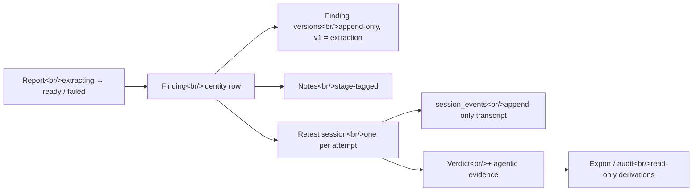
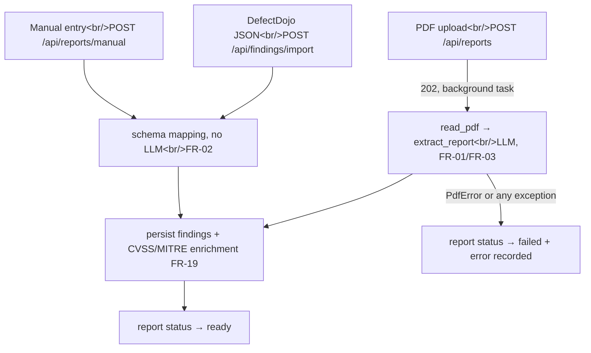
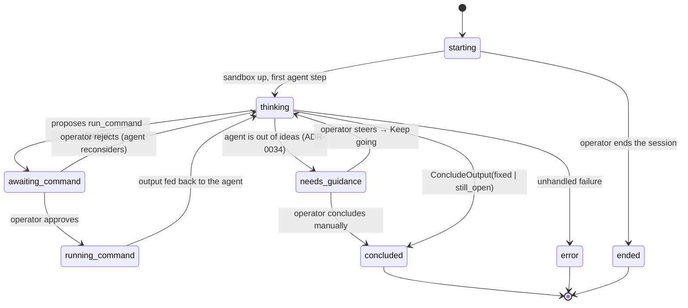

# How revalid works — the program workflow

> Authored page: this does NOT auto-sync with code. A PR that changes a lifecycle,
> a state name or a stage boundary described here must update it in the same PR
> (checked by the `doc-curator` agent).

This page is the narrative counterpart to the [C4 model](c4.md). C4 answers *what
the pieces are*; this page answers *what happens, in what order, and who is in
control at each step*. Read it first if you are new to the codebase; then use the
C4 sequence diagrams for the wire-level detail and the
[API reference](../reference/api.md) for signatures.

## The one-sentence version

A pentest report goes in; each finding it describes is re-verified against an
authorised lab target by an LLM agent that cannot run a single command without a
human saying yes; what comes out is a verdict — `fixed` or `still_open` — backed
by the real output of the command that decided it.

## The runtime picture

Everything runs in **one `uvicorn` process bound to `127.0.0.1`** (NFR-03):
FastAPI serves the compiled React SPA at `/` and the JSON API under `/api`
(ADR-0013). There is no message broker and no second service. Work that outlives
a request — LLM extraction, each turn of a retest agent — is a **FastAPI
background task**, i.e. a sync function Starlette dispatches to its threadpool,
which therefore opens its **own** database session (the request's is already
closed by the time it runs). Durable state is SQLite via SQLAlchemy; live,
non-durable state (the in-flight agent, its message history, the running
sandbox) lives in an in-process `SessionRegistry`.

Three transports carry data to the browser, by need:

| Transport | Used for | Why |
|---|---|---|
| REST (`/api/...`) | every mutation and most reads | plain request/response |
| WebSocket (`/api/retest-sessions/{id}/stream`) | the retest console | the operator must see each transcript event as it happens |

## The object model, and what owns what



Two properties of this model matter more than the rest:

- **Findings are versioned, never overwritten.** Version 1 is `extraction` — what
  the machine proposed. Every operator correction appends an `edit` version
  (FR-16, ADR-0024). The lineage of "what the model said" versus "what the human
  fixed" survives.
- **A retest session is an append-only transcript.** Every proposal, approval,
  rejection, command output, operator message and verdict is a numbered
  `session_events` row. The verdict is *derived from* the transcript, which is
  what makes the FR-10 audit re-derivation meaningful: it re-projects the
  transcript and diffs it against the stored verdict row.

## Stage 1 — getting findings in

Three doors, all landing in the same place (a `ready` report with findings
attached), so everything downstream is identical:



The PDF path is the only asynchronous one. `run_extraction` guarantees the report
always leaves `extracting` — to `ready` with findings persisted, or to `failed`
with the error recorded — so the SPA's status poll is guaranteed to terminate.
Document metadata extraction is best-effort and can never fail the report.

Every finding, whichever door it came through, is enriched with a CVSS code and a
MITRE ATT&CK mapping, inferred when the source report does not state them
(FR-19, ADR-0037).

!!! tip "Seeding data: use manual ingestion"
    For development, demos and walking the flow by hand, seed with **manual
    ingestion** (`POST /api/reports/manual`) rather than a PDF upload. It skips
    the LLM entirely, so seeding is deterministic, instant and free — and the
    resulting report is indistinguishable downstream from an extracted one. It is
    also the intended escape hatch when a model cannot reliably ingest a report
    (e.g. a large report against a small local backend, ADR-0020).

    ```bash
    curl -X POST localhost:8000/api/reports/manual \
      -H 'content-type: application/json' -d '{
        "label": "Seed report",
        "findings": [{
          "title": "Reflected XSS in search",
          "severity": "high",
          "description": "The q parameter is echoed unescaped.",
          "endpoints": ["http://revalid-juice-shop:3000/#/search"],
          "steps_to_reproduce": "1. Open /#/search\n2. Submit <script>alert(1)</script>"
        }]
      }'
    ```

    Only `title` is strictly required per finding; `severity` accepts the usual
    aliases (`info|low|medium|high|critical`). The whole source entry is kept
    verbatim in `Finding.raw`, so nothing you send is lost. The same mapper backs
    `POST /api/findings/import`, so a real DefectDojo export works unchanged.

## Stage 2 — the finding wizard and the goal

The SPA presents each finding as a four-stage wizard —
`/findings/{id}/{extract | goal | retest | verdict}`. The stepper is *navigation
only*: clicking a stage never mutates anything.

At the **goal** stage the operator asks for a draft (`POST
/api/findings/{id}/goal/draft`), which calls the LLM to turn the finding's
reproduction steps into a short list of retest steps. The draft is *not*
persisted — it is a suggestion. The operator edits it, and the goal that
actually governs the session is the one submitted at launch. The goal is
**user-owned** (ADR-0032): the agent reads it and can be re-steered against it,
but does not rewrite it behind the operator's back.

## Stage 3 — the agentic retest session

This is the heart of the system. Launching (`POST
/api/findings/{id}/retest-session`) creates a `starting` session row, returns
`202` immediately, and schedules the first agent step as a background task.

### Provisioning: the sandbox *is* the allowlist

`start_and_step` calls `sandbox.start()` before the agent thinks at all. The
production `DockerSandbox`:

1. creates a per-session Docker network named `revalid-retest-{session_id}` with
   `internal=True` — **no route to the host and no route to the internet**;
2. connects the allowlisted lab container (`revalid-juice-shop`) to it;
3. launches a pinned, minimal container (`curlimages/curl`) on that network,
   idling on `sleep infinity` so it persists for the whole session.

This is what FR-06 means in the current design: **the allowlist is network
membership**, not an HTTP-layer check. The agent is not *asked* to stay on
target — it is physically unable to reach anything the operator did not attach.
Consequently the scope is fixed when the sandbox is provisioned: changing it
needs a fresh session (the `target_set` event is emitted once and never again).

Two operational details worth knowing: `start()` self-heals a network left
behind by a crashed prior session of the same id (it would otherwise 409
forever), and `stop()` is tolerant at every step of "already gone" so a partial
failure cannot block the rest of the teardown.

### The loop



The gate is not a policy check the code performs after the fact — it is
structural. `run_command` is declared to Pydantic AI as
`@agent.tool(requires_approval=True)`, so a proposal **cannot resolve** into an
execution: the run pauses and hands back a `DeferredToolRequests`. The
orchestrator records a `command_proposed` event, sets the status to
`awaiting_command`, and stops. Only an explicit `POST
.../commands/{cid}/approve` runs anything; a `reject` resumes the agent with a
`ToolDenied(reason)` so it reconsiders. Concurrent decisions on the same command
(a double-clicked Approve) are made safe by a compare-and-swap on the pending
call id under a lock.

The agent has exactly two tools: `run_command` (gated) and `respond` (prose to
the operator, runs nothing).

### What the operator can do mid-session

| Action | Endpoint | Effect |
|---|---|---|
| Approve / reject a command | `.../commands/{cid}/approve\|reject` | the only way anything executes |
| Run their own command | `.../human-command` | executes in the *same* sandbox; the output is buffered and handed to the agent as an observation on its next turn |
| Send a message | `.../message` | steers the agent, or asks it a question |
| Change the goal | `.../goal`, `.../goal/regenerate` | the goal stays user-owned |
| Free launch | `.../free-launch` | auto-approves the agent's commands so the loop runs unattended — the one deliberate relaxation of the gate (ADR-0029); the egress lock still holds |
| Keep going / conclude a paused session | `.../continue`, `.../conclude` | the ADR-0034 pause-and-ask exits |
| End it | `.../end` | terminal; sandbox torn down |

### Concluding — and the honest "I don't know"

The agent's structured output is a `ConcludeOutput(status, rationale)`. Only
`fixed` and `still_open` become verdicts. An `inconclusive` result is **not**
written as a verdict: the session pauses in `needs_guidance` with the agent's
reason, keeps the sandbox alive, and asks the operator to steer or to conclude
themselves (ADR-0034). A machine that has run out of ideas is not evidence that
a vulnerability is fixed.

When a real determination is reached, `record_verdict` writes a `VerdictRecord`
(actor = agent) plus `AgenticEvidence` assembled **from the transcript** — the
last real `command_output`, not the model's restatement of it — and the sandbox
is torn down. An operator can later override the verdict with
`.../adjudicate`, which appends a `verdict_adjudicated` event; that event then
becomes the authoritative one for audit purposes.

## Stage 4 — derivations off the trail

Both are read-only and touch no network:

- **Audit (FR-10, `GET /api/audit`)** re-projects each session's authoritative
  transcript event (`verdict`, or the latest `verdict_adjudicated`) and diffs it
  against the stored verdict row. A clean run proves every row still equals the
  transcript it came from; a mismatch is reported as a discrepancy.
- **Export (FR-12, `GET /api/export`)** assembles the whole run into one
  `SCHEMA_VERSION`-stamped document, validated against a schema *generated from
  the model* (`GET /api/export/schema`) so the published schema cannot drift.

The FR-15 evaluation harness (`eval.py`) consumes exports to score the system
against ground truth — the answer to "is the verdict *right*", which no part of
the pipeline above can establish about itself.

## The side channel — reports chat

Independent of the retest flow, `POST /api/chats/{id}/messages` runs a
**read-only** agent over the persisted corpus (FR-18, ADR-0036). Its four
tools — corpus overview, list reports, search findings, finding detail — only
read; it has no sandbox, cannot execute anything and cannot mutate a row. The
agent runs inline and the caller awaits the whole answer; threads are persisted
(`chat_sessions` / `chat_messages`) so a conversation survives a reload.

!!! note "In flight: token-by-token streaming"
    Replies currently arrive in one block. A streaming variant — an async
    `POST /api/chats/{id}/messages/stream` emitting Server-Sent Events — is
    designed in **ADR-0038** and tracked by [#140](https://github.com/SelfishCoconut/revalid/issues/140);
    it is not on `main` yet. The blocking endpoint above is kept as the fallback.

## Choosing the LLM backend

One switch, `REVALID_LLM_MODEL`, selects the model for *every* LLM-using
component — extraction, goal drafting, the retest agent, the chat (FR-13,
ADR-0010/ADR-0021). Claude and a local Ollama are both first-class; the same code
paths run against either, which is what makes the local-versus-cloud comparison
in the evaluation possible. Settings are editable at runtime (`/api/settings`,
with `/probe` and `/status` for discovery and reachability).

In tests the model is never real: Pydantic AI's `TestModel`/`FunctionModel`
stand in, and `FakeSandbox` replaces Docker, so the entire HTTP flow is
exercisable with no network and no daemon.

## Module map

| Module | Responsibility |
|---|---|
| `app.py` | FastAPI wiring: routes, dependencies, background tasks |
| `pdf.py`, `extract.py` | PDF text extraction (pdfplumber) → LLM finding extraction |
| `ingest.py` | DefectDojo-style schema mapping (no LLM); backs import *and* manual entry |
| `findings.py` | finding persistence, versions, notes, CVSS/MITRE enrichment |
| `domain.py` | the typed core: `Finding`, statuses, event kinds, evidence, verdicts |
| `retest_session.py` | the orchestrator: lifecycle, transcript, gate, verdicts |
| `retest_agent.py` | the Pydantic AI agent and its two tools |
| `sandbox.py` | `Sandbox` protocol, `DockerSandbox` (egress-locked), `FakeSandbox` |
| `reports_chat.py` | read-only corpus Q&A agent + chat threads |
| `audit.py`, `export.py`, `eval.py` | re-derivation, versioned export, FR-15 scoring |
| `db.py`, `settings.py`, `llm.py` | persistence, runtime settings, model resolution |

## Walking it yourself

```bash
make lab-up                 # the authorised target (Juice Shop) — required for a real retest
make run                    # build the SPA if needed, serve everything on 127.0.0.1:8000
# seed deterministically (see the manual-ingestion tip above), then drive the UI:
# finding → goal → start session → approve each command → verdict
make demo-retest-session    # or: the same loop headless, end to end
make lab-down
```

`make reset-db` drops a stale `revalid.db` if the schema has moved under you.
