# Use-case model

> Authored page: the behavioural face of the [SRS](srs.md). Each use case names
> the requirement it realises, so the diagram and the FR catalogue are two views
> of one contract. A PR that adds or removes an operator-facing capability must
> update both.

## Actors

There is exactly **one** human actor. `revalid` is a single-user local tool
bound to the loopback interface with no authentication (NFR-03, ADR-0008), so
there are no roles to separate and no privilege boundary to draw between humans.
The interesting boundaries in this system are the ones between the human and the
machine, and between the machine and the target.

| Actor | Kind | Role |
|---|---|---|
| **Auditor** | primary, human | Owns every decision: what to retest, whether a command may run, and what the verdict is. |
| **LLM backend** | secondary, external | Claude or a local Ollama, selected at runtime (FR-13). Extracts findings, drafts goals, reasons in the retest, answers corpus questions. |
| **Authorised target** | secondary, external | The lab container or scoped host the retest is run against. Reachable *only* from inside the sandbox (FR-06). |

The asymmetry is the design. The auditor is the only actor that can *decide*;
the LLM is an actor that can only *propose*; the target is an actor that can only
*respond*.

```mermaid
flowchart TB
    AUD(["👤 Auditor"])
    LLM(["LLM backend"])
    TGT(["Authorised target"])

    subgraph SYS["revalid"]
        direction TB

        subgraph UND["Understand the report"]
            direction LR
            U1(["Ingest a PDF report<br/>FR-01 · FR-03 · FR-19"])
            U2(["Import a structured export<br/>FR-02"])
            U3(["Enter a report manually<br/>FR-02 · ADR-0020"])
            U4(["Correct and annotate<br/>a finding — FR-16"])
        end

        subgraph RET["Revalidate a finding"]
            direction LR
            U5(["Set the retest goal<br/>FR-17 · ADR-0032"])
            U6(["Run a gated<br/>retest session — FR-17"])
            U7(["Approve or reject<br/>a command — AC2"])
            U8(["Run a command<br/>personally — ADR-0026"])
            U9(["Steer the agent<br/>by message — ADR-0028"])
            U10(["Hand over the wheel<br/>Auto-run — ADR-0029"])
            U11(["Conclude or adjudicate<br/>FR-09 · ADR-0030"])
        end

        subgraph OUT["Account for the work"]
            direction LR
            U12(["Re-derive the<br/>audit trail — FR-10"])
            U13(["Export a run<br/>FR-12"])
            U14(["Score against<br/>ground truth — FR-15"])
            U15(["Ask about<br/>the corpus — FR-18"])
            U16(["Choose the LLM<br/>backend — FR-13"])
        end
    end

    AUD --- U1
    AUD --- U2
    AUD --- U3
    AUD --- U4
    AUD --- U5
    AUD --- U6
    AUD --- U11
    AUD --- U12
    AUD --- U13
    AUD --- U14
    AUD --- U15
    AUD --- U16

    U6 -.->|"«include»"| U7
    U6 -.->|"«extend»"| U8
    U6 -.->|"«extend»"| U9
    U6 -.->|"«extend»"| U10
    U6 -.->|"«include»"| U11
    U1 -.->|"«include»"| U4

    U1 --- LLM
    U5 --- LLM
    U6 --- LLM
    U15 --- LLM
    U7 --- TGT
    U8 --- TGT

    classDef actor fill:#dbe4ff,stroke:#3b5bdb,stroke-width:2px
    classDef uc fill:#e7f5ff,stroke:#1971c2
    class AUD,LLM,TGT actor
    class U1,U2,U3,U4,U5,U6,U7,U8,U9,U10,U11,U12,U13,U14,U15,U16 uc
    style SYS fill:none,stroke:#1971c2,stroke-dasharray:6 4
```

<!-- thesis-fig: use-cases -->

## The decisive use case

Everything above exists to make one interaction safe: **run a gated retest
session** (UC-6). It is worth expanding as a scenario, because its exception
paths are where the design's claims actually live.

| | |
|---|---|
| **Use case** | UC-6 — Run a gated retest session |
| **Actor** | Auditor (primary); LLM backend and authorised target (secondary) |
| **Requirement** | FR-17 (AC1–AC4, AC26–AC31) |
| **Precondition** | A finding exists and a retest goal has been set. Docker is available and the sandbox image is built. |
| **Postcondition** | Either a verdict is recorded against the finding with pinned evidence, or the session ends without one — never a verdict the auditor did not authorise. A recorded verdict remains **withdrawable** (ADR-0043). |

**Main success scenario**

1. The auditor opens the console for a finding and wakes the agent.
2. The system provisions an egress-locked sandbox against the finding's scope.
3. The agent reasons and proposes one command with a one-line rationale.
4. The system records the proposal and **suspends** — the run cannot continue.
5. The auditor approves it.
6. The system executes the command in the sandbox and captures its real output.
7. The agent observes the output and reports what it shows.
8. Steps 3–7 repeat under the auditor's direction until they conclude the retest.
9. The system records the verdict with the deciding command's output as evidence.

**Extensions**

| # | Condition | Behaviour |
|---|---|---|
| 4a | The auditor never approves | Nothing runs. The suspension is structural — a deferred tool call, not a policy check — so there is no path from proposal to execution that bypasses step 5. |
| 5a | The auditor rejects with a reason | The agent resumes with the denial and reconsiders. |
| 5b | The auditor types a message instead of deciding | The pending command is **withdrawn** and the agent re-runs with the message — typing at the permission prompt (ADR-0042). |
| 7a | The agent runs out of options | It hands back rather than guessing. `inconclusive` is never written as a verdict by the agent; the sandbox stays alive and the console **waits** — it prompts for nothing — while the auditor steers or concludes in their own time (ADR-0034/0046). |
| 8a | The agent believes it knows the answer | Under the default guided mode it offers a *recommendation*; only the auditor records the verdict (ADR-0040). |
| 8b | The auditor turns on Auto-run | The agent drives itself to a determination, auto-approving its own commands. The egress lock is unaffected — this relaxes the gate, never the containment (ADR-0029). |
| 2a | The scope is an online host | The sandbox is provisioned behind a per-session **L3 egress gateway** (an `iptables` IP-allowlist in a helper container it cannot alter) instead of the lab network, and **fails closed** if that cannot be done (ADR-0045). |
| 9a | The auditor recorded the verdict prematurely | **Reopen** withdraws it from the queryable projection and returns the session to `idle`; the verdict and its cancellation both stay in the transcript, so the audit still sees the full history (ADR-0043). |
| * | The auditor stops, restarts, concludes or ends the session | Available at any live point — **Conclude** is a permanent control, never gated by the agent having handed back (ADR-0039, ADR-0046); a stop keeps the sandbox alive so work can resume. |

Note what the exception table does *not* contain: a path where the system decides
something on the auditor's behalf. That is the requirement FR-17 is really
making, and the reason the approval gate is expressed as a suspended computation
rather than as a permission check.

## Traceability

| Use case | Requirement | Primary decision |
|---|---|---|
| UC-1 Ingest a PDF report | FR-01, FR-03, FR-19 | ADR-0007, ADR-0009, ADR-0037 |
| UC-2 Import a structured export | FR-02 | — |
| UC-3 Enter a report manually | FR-02 | ADR-0020 |
| UC-4 Correct and annotate a finding | FR-16 | ADR-0024 |
| UC-5 Set the retest goal | FR-17 | ADR-0032 |
| UC-6 Run a gated retest session | FR-17 | ADR-0025, ADR-0040, ADR-0042, ADR-0043, ADR-0046 |
| UC-7 Approve or reject a command | FR-17 | ADR-0025 |
| UC-8 Run a command personally | FR-17 | ADR-0026 |
| UC-9 Steer the agent by message | FR-17 | ADR-0028, ADR-0042 |
| UC-10 Hand over the wheel | FR-17 | ADR-0029 |
| UC-11 Conclude or adjudicate | FR-09, FR-17 | ADR-0030, ADR-0031 |
| UC-12 Re-derive the audit trail | FR-10, NFR-02 | ADR-0033 |
| UC-13 Export a run | FR-12 | ADR-0016 |
| UC-14 Score against ground truth | FR-15, NFR-01 | ADR-0017 |
| UC-15 Ask about the corpus | FR-18 | ADR-0036, ADR-0038 |
| UC-16 Choose the LLM backend | FR-13 | ADR-0010, ADR-0021 |
