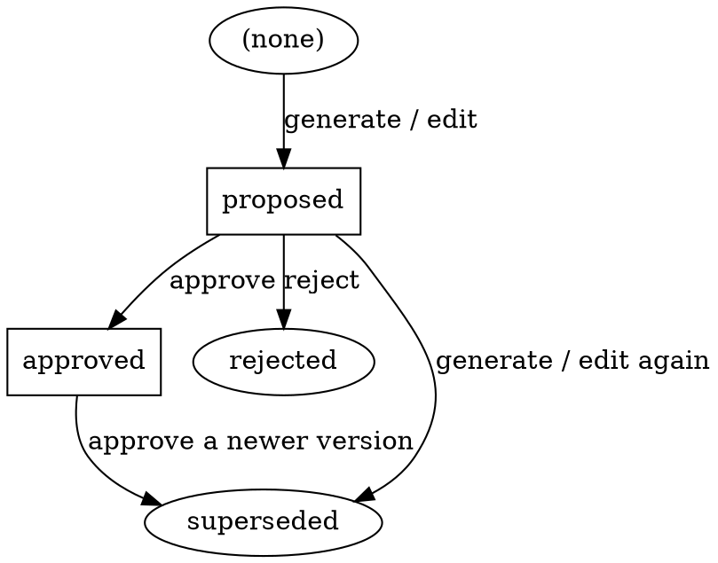
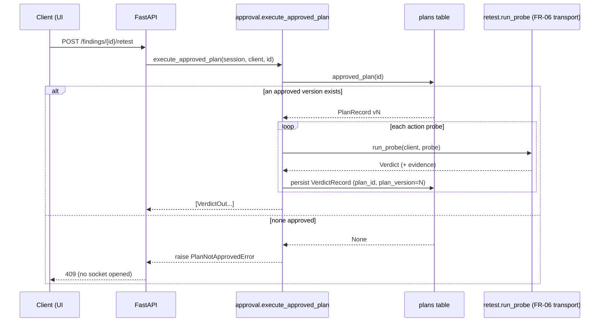

# FR-05 — Human plan review & approval · design spec

- **Date**: 2026-07-14
- **Requirement**: FR-05 (SRS §3) — priority *Must*. Issue **#10**. Milestone **M3**.
- **Related**: FR-04 #9 (plan generation — `plan.py`, ADR-0011); FR-06 #11 (allowlist
  guard — reused here); FR-07/FR-09 (`retest.py` executor + verdicts); FR-10 #15
  (full audit trail — this ships the *minimal* stamp, FR-10 expands it); FR-11 #16
  (the React UI that drives these endpoints). ADR-0002 (stack); ADR-0008 (single-user
  threat model); NFR-02 (re-derivable audit); NFR-03 (localhost, non-destructive).
- **Status**: accepted — Álvaro approved the design (exec-binding, audit-scope,
  edit-scope) on 2026-07-14. Cleared for implementation. ADR-0012 to be filed
  `proposed`.

## 1. Context & problem

FR-04 (`plan.py`) turns a finding into a `RetestPlan` of gated, allowlisted
`Probe`s — but that plan lives **only in memory**: there is no `PlanRecord`, no
plan endpoints, and `RetestPlan.version` is unused. Meanwhile execution
(`POST /findings/{id}/retest`) **ignores plans entirely** — it hardcodes
`login_sqli_probe(lab_base_url())` and runs it. So today there is no approval
concept, and "no plan executes without approval" is not real.

FR-05 closes that gap on the **server side** (the React UI is a separate card,
#16). It must guarantee two invariants from the SRS:

- **AC1** — *Unapproved plans are not executable through any code path* (enforced
  server-side, not only in the UI).
- **AC2** — *Plan edits are versioned; the executed version is recorded in the
  audit trail.*

FR-05 lands *before* the UI exists, so — like FR-06 before the executor — it ships
the **gate and the seam** the UI is forced through; #16 plugs into it.

## 2. Locked decisions

From the design dialogue (2026-07-14):

| # | Decision | Rationale |
|---|---|---|
| D1 | **Execution is rewired through approval.** A single chokepoint refuses to run anything unless the finding has one `approved` plan version, then runs *that version's* probes. The M1 hardcoded SQLi probe becomes a **seeded approved plan** in the demo/system test. | Makes AC1 structural, not a UI convention. There is one door to the network-from-storage, and it checks approval. |
| D2 | **Minimal audit now; FR-10 expands.** Approval is recorded as `status`/`decided_at`/`decided_by` **on the plan-version row**; the executed version is stamped onto the verdict row (`plan_id`/`plan_version`). No `audit_events` table yet. | Satisfies AC2 without pulling M4 (FR-10) scope forward. The version rows *are* the approval history; FR-10 later unifies all event types into one re-derivable trail. |
| D3 | **A new version is created by regeneration *and* by an edit endpoint.** Both re-run the FR-06 gate; the result is a fresh `proposed` row (version = max+1). | AC2 requires edits to be versioned. Building the edit seam now makes the versioning story concrete and testable, and #16's UI calls it directly rather than inventing its own. |
| D4 | **Edited actions are re-gated server-side** through the same FR-06 allowlist gate as model-proposed actions. | Client input is as untrusted as report/model content (ADR-0008 is single-*trusted*-user, but the allowlist is a structural guarantee, not a trust assumption). An off-allowlist edit is dropped, never run. |
| D5 | **Assessment is dispatched by `probe.kind`.** `sqli-login-bypass` keeps its real `assess()`; unknown kinds (e.g. FR-04's `planned-http`) yield an honest `inconclusive`/`no_assessor` verdict. | Generic indicator-matching from `expected_indicator` is FR-08/FR-09 work (the domain doc already calls `expected_indicator` "documentation, not matching logic"). FR-05 must not smuggle it in. |
| D6 | **State machine keeps ≤1 `proposed` and ≤1 `approved` live per finding.** Superseded rows are retained immutably. | The minimal lifecycle that supports approve / reject / edit / regenerate without ambiguity about "which version runs." |

## 3. Data model

One new table, `plans` — **one row per version** (append-only history; a row is
never mutated except to record its own decision or to be marked `superseded`).

| Column | Type | Notes |
|---|---|---|
| `id` | int PK | |
| `finding_id` | int FK → `findings.id` | the finding this plan retests |
| `version` | int | 1-based; unique per `finding_id` |
| `status` | str(16) | `proposed` \| `approved` \| `rejected` \| `superseded` |
| `origin` | str(16) | `generated` \| `edited` — how this version arose |
| `actions` | JSON | list of `Probe` dicts (gated, allowlisted) |
| `rejected_actions` | JSON | FR-04 gate's dropped actions `[{action, reason}]` (audit) |
| `raw` | JSON | generation/edit lineage (model, base_url, counts) — NFR-02 |
| `created_at` | datetime | row creation (server-side default) |
| `decided_at` | datetime \| null | when approved/rejected |
| `decided_by` | str(32) \| null | actor token — `"user"` (single-user); FR-10 formalizes actors |

A `PlanStatus` `StrEnum` (`PROPOSED`/`APPROVED`/`REJECTED`/`SUPERSEDED`) joins
`domain.py` next to `VerdictStatus`. `VerdictRecord` gains **`plan_id`** (FK →
`plans.id`, nullable so the M1 hardcoded path and older rows remain valid) and
**`plan_version`** (int, nullable) — the AC2 "executed version recorded" stamp.

The domain `RetestPlan` (frozen, FR-04 output) is unchanged; persistence maps
`finding_title` ↔ `finding_id` via the finding row. Status/decision metadata are
record-level, surfaced through the API model (§5), not pushed onto the frozen
domain type.

## 4. State machine

Per finding, the live set is at most one `proposed` and at most one `approved`.



Transition rules (all in the service layer, §4.1 of `approval.py`):

- **generate / edit** → insert a new row, `version = max(version for finding)+1`,
  `status=proposed`, `origin` = `generated`/`edited`. Any existing `proposed` row
  for that finding → `superseded`. A prior `approved` row **stays approved** —
  editing does not silently unapprove the runnable version.
- **approve** → the latest `proposed` row → `approved`; a prior `approved` row →
  `superseded`; stamp `decided_at`/`decided_by`. Error (409) if no `proposed` row.
- **reject** → the latest `proposed` row → `rejected`; stamp `decided_at`. Error
  (409) if no `proposed` row.
- **executable** = the single `approved` row for the finding, or nothing.

Invariant, asserted by tests: after any sequence of operations, a finding has ≤1
`proposed` and ≤1 `approved` row.

## 5. Components

### 5.1 `src/revalid/approval.py` (new) — service + chokepoint

Pure functions over a `Session` (no HTTP, no FastAPI import), each independently
testable:

| Unit | Signature | Responsibility |
|---|---|---|
| `save_generated_plan` | `(session, finding_id, result: PlanResult) -> PlanRecord` | Persist an FR-04 `PlanResult` as a new `proposed` version (supersede prior proposed). |
| `edit_plan` | `(session, finding_id, actions, guard, base_url) -> tuple[PlanRecord, list[RejectedAction]]` | Re-gate submitted actions via §5.3, persist survivors as a new `proposed` version, return drops. |
| `approve_plan` | `(session, finding_id) -> PlanRecord` | Approve latest `proposed`; supersede prior approved. Raise `NoProposedPlanError` if none. |
| `reject_plan` | `(session, finding_id) -> PlanRecord` | Reject latest `proposed`. Raise `NoProposedPlanError` if none. |
| `approved_plan` | `(session, finding_id) -> PlanRecord \| None` | The chokepoint query — the sole authority on "what may run." |
| `list_plans` | `(session, finding_id) -> list[PlanRecord]` | All versions, ordered, for `GET`. |
| `execute_approved_plan` | `(session, client, finding_id) -> list[VerdictRecord]` | **The only path** from stored plans to the network. Raises `PlanNotApprovedError` if `approved_plan` is `None`; else runs each action `Probe` via `retest.run_probe`, persists a verdict per probe stamped with `plan_id`/`plan_version`. |

Plus `PlanNotApprovedError` and `NoProposedPlanError` (carry `finding_id`).

**Why one chokepoint = AC1.** `execute_approved_plan` is the single function that
turns a persisted plan into HTTP traffic. The FastAPI retest endpoint and the demo
script both call it; nothing else runs probes from storage. A `proposed`,
`rejected`, or absent plan raises before any socket opens. AC1 is thus an
invariant of the call graph, not a rule the UI must remember.

### 5.2 `src/revalid/plan.py` — extract the reusable gate

Today `_gate(action, guard, base_url) -> Probe | str` is private. Extract:

```python
def gate_actions(
    actions: Iterable[PlannedAction], guard: TargetGuard, base_url: str,
) -> tuple[list[Probe], list[RejectedAction]]:
    ...
```

`generate_plan` is refactored to call it (behaviour unchanged); `edit_plan`
reuses it. This removes duplication (the #1 AI-dev failure mode per CLAUDE.md):
**one** allowlist/method gate serves both generated and edited actions.

### 5.3 `src/revalid/retest.py` — kind-dispatched assessment

`run_probe` currently calls the SQLi-specific `assess(evidence)` unconditionally.
Introduce a small registry:

```python
_ASSESSORS: dict[str, Callable[[Evidence], Verdict]] = {"sqli-login-bypass": assess}
```

`run_probe` looks up `probe.kind`; a miss uses `assess_generic`, which returns an
`inconclusive` verdict with `reason_code="no_assessor"` and the observed status in
`matched_indicators`. No behaviour change for the SQLi probe. Unreachable-target
handling (`_unreachable_verdict`) is unchanged.

### 5.4 `src/revalid/db.py` — `PlanRecord` + verdict stamp

`PlanRecord` with `from_domain`/`to_domain` mirroring the existing record style;
`VerdictRecord.from_domain` gains optional `plan_id`/`plan_version` params
(defaulting to `None` so existing callers/rows are unaffected). Schema is created
by `Base.metadata.create_all` as today (SQLite, no migrations in TFG scope).

## 6. API surface (`app.py`)

A `get_plan_agent` dependency (mirrors `get_probe_client`) yields
`build_plan_agent()` so tests override it with a `TestModel`/`FunctionModel`.
New/changed endpoints:

| Method + path | Behaviour | Errors |
|---|---|---|
| `POST /findings/{id}/plan` | FR-04 generate + persist `proposed`; returns `PlanOut` | 404 no finding |
| `PUT  /findings/{id}/plan` | Edit: body = `list[PlannedAction]`; re-gated; new `proposed` version; returns `PlanOut` (its `rejected_actions` carry the drops) | 404 no finding; 422 *all* actions dropped |
| `POST /findings/{id}/plan/approve` | Approve latest `proposed`; returns `PlanOut` | 404; 409 no proposed |
| `POST /findings/{id}/plan/reject` | Reject latest `proposed`; returns `PlanOut` | 404; 409 no proposed |
| `GET  /findings/{id}/plans` | All versions + decision metadata | 404 no finding |
| `POST /findings/{id}/retest` | **Rewired**: `execute_approved_plan`; returns `list[VerdictOut]`, each stamped `plan_version` | 404; **409 no approved plan** |

`PlanOut` = `RetestPlan` fields + `id`, `finding_id`, `status`, `origin`,
`decided_at`, `decided_by`, `rejected_actions`. The retest endpoint's response type changes from a
single `VerdictOut` to `list[VerdictOut]` — acceptable, as the only consumer today
is our M1 system test (no UI yet), and a plan is inherently multi-action.

### 6.1 Enforcement flow



## 7. Testing (maps to acceptance criteria)

**Unit** (`tests/unit/`, no I/O; LLM via Pydantic AI `TestModel`/`FunctionModel`):
- `test_approval.py` — state-machine transitions: generate→`proposed`;
  approve→`approved` + prior approved `superseded`; reject→`rejected`;
  regenerate/edit→new `proposed` + prior proposed `superseded`; the ≤1-proposed/
  ≤1-approved invariant; `approve`/`reject` with no proposed → `NoProposedPlanError`.
- **AC1** — `execute_approved_plan` on a finding with no plan / `proposed` /
  `rejected` raises `PlanNotApprovedError`; only an `approved` plan runs (probe
  client via `httpx.MockTransport`). Verdicts are stamped with the executed
  `plan_version` (**AC2**).
- Edit re-gating (**D4**) — an edited action targeting an off-allowlist host is
  dropped (`not_allowlisted`); a fully off-allowlist edit → 422 at the endpoint.
- `gate_actions` extraction — `generate_plan` behaviour unchanged (existing
  `test_plan.py` stays green); a direct `gate_actions` truth-check.
- `assess_generic` — unknown kind → `inconclusive` / `no_assessor`.

**Integration** (`tests/integration/`, marker `integration`; FastAPI `TestClient`,
in-memory engine, `get_plan_agent` overridden with a stand-in, `get_probe_client`
over a mock transport):
- Happy path: import finding → `POST …/plan` → `POST …/plan/approve` →
  `POST …/retest` → verdict with `plan_version=1`.
- **AC1 negative**: `POST …/retest` before approval → **409**; assert no probe was
  attempted (mock transport not called).
- Versioning: generate → edit (`PUT`) → `GET …/plans` shows v1 `superseded`, v2
  `proposed`; approve v2 → retest runs v2 (`plan_version=2`) (**AC2**).

**System** (`tests/system/`, marker `system`, dockerized lab): update the existing
M1 test to seed + approve a plan holding the `sqli-login-bypass` probe, then
`POST …/retest` against the live Juice Shop → asserts `still_open`. Keeps the
nightly `system-tests.yml` green **without** needing a live LLM (approval accepts a
hand-built plan; only FR-04 *generation* needs a model).

**Demo**: `scripts/demo/approval_gate.py` + `make demo-approval` — import a finding,
`retest` → **refused (409)**, generate a plan, edit it → v2, approve, `retest` →
verdict. Offline stand-in for the LLM (like `make demo-plan`), so it runs with no
key and no lab (uses a mock target for the probe, or notes the lab requirement).

Quality gates: coverage ≥ 80 % on new modules, `mypy --strict`, `ruff`, xenon ≤ C
(the state-machine functions stay small by construction).

## 8. Out of scope / deferred

- **`audit_events` table + verdict re-derivation** — FR-10 #15 (M4). FR-05 ships
  only the per-version decision fields and the executed-version stamp (D2).
- **Rich per-action edit UX / batch-approve UI** — FR-11 #16. The server exposes
  the versioned edit + approve seam; batch approval is a UI loop over these
  endpoints (no new server concept needed) unless #16 shows otherwise.
- **Generic indicator-matching** (turning `expected_indicator` into a matcher) —
  FR-08/FR-09. FR-05's `assess_generic` is deliberately `inconclusive` (D5).
- **Concurrency / optimistic locking** on approve-vs-edit races — single-user,
  single-process (ADR-0008); not built.
- **Auth / actor identity** — no auth in TFG scope (NFR-03); `decided_by` is the
  fixed `"user"` token, a placeholder FR-10 will formalize.
- **DB migrations** — none in scope; `create_all` on a fresh SQLite file.

## 9. Acceptance-criteria traceability

| Criterion | Satisfied by |
|---|---|
| **AC1** — unapproved plans not executable through any code path (server-side) | §5.1 single `execute_approved_plan` chokepoint raising `PlanNotApprovedError`; §6.1 flow; tests §7 "AC1" unit + integration negative |
| **AC2** — plan edits versioned; executed version in the audit trail | §3 append-only version rows + `VerdictRecord.plan_version` stamp; §4 versioning on edit/regenerate; tests §7 versioning + stamp |
| NFR-02 — re-derivable audit | §3 `raw` lineage + decision fields; full re-derivation is FR-10 |
| NFR-03 — localhost, non-destructive | §5.3 reuses the FR-06 transport + `SAFE_METHODS` gate; no new network path |
