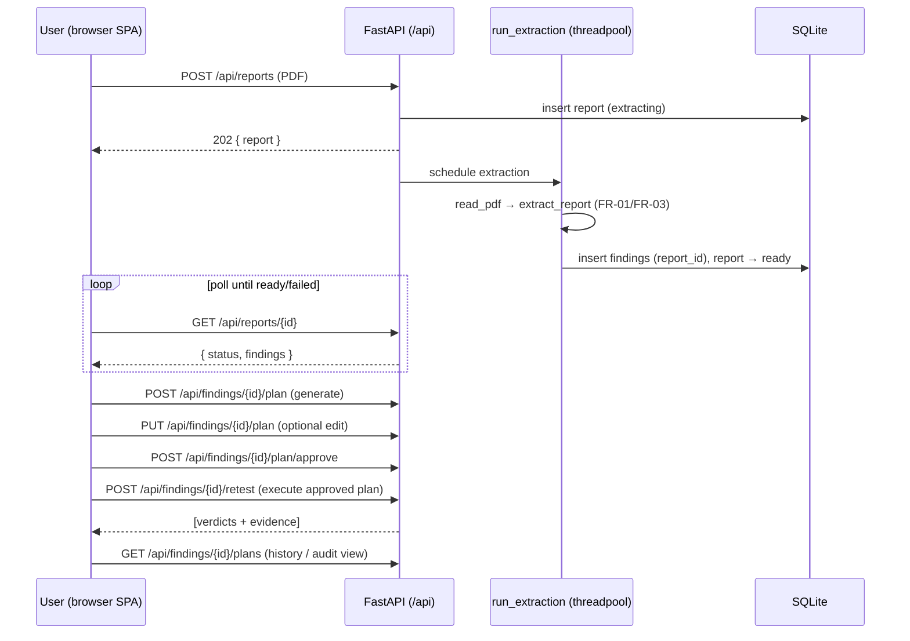

# FR-11 — Results dashboard (React SPA) · design spec

- **Date**: 2026-07-14
- **Requirement**: FR-11 (SRS §2) — priority *Must*. Issue **#16**. Milestone **M3** (last item).
- **Related**: FR-01 #6 (`pdf.py` — wired to HTTP here for the first time); FR-03 #8
  (`extract.py` — the extraction pipeline the ingest job runs); FR-13 #18 (`llm.py` —
  the model the job uses); FR-04 #9 / FR-05 #10 (`plan.py`/`approval.py` — the plan
  lifecycle the UI drives, ADR-0011/0012); FR-07/FR-09 (verdicts + evidence the UI
  drills into); FR-10 #15 (full audit trail — the UI's history view shows the
  *minimal* trail that exists today, FR-10 enriches it); FR-12 #17 (JSON export —
  M4). ADR-0002 (stack: FastAPI + React SPA, SQLite, localhost); ADR-0008
  (single-user threat model); NFR-03 (localhost-only, no auth).
- **Status**: accepted — Álvaro approved the design and both flagged decisions
  (`/api` prefix; react-router + react-query) on 2026-07-14. Cleared for
  implementation. ADR-0013 to be filed `proposed`.

## 1. Context & problem

FR-11 is the human-facing surface of the whole tool: *"the full evaluation flow
(ingest → approve → execute → verdicts with evidence) is operable from the UI
alone."* Everything behind it now exists as HTTP endpoints **except one thing** —
there is no way to get a real pentest **report** into the system over HTTP. The
FR-01/FR-03 pipeline (`read_pdf` → `extract_report`) that turns a PDF into
`Finding`s is **CLI-only** (`make demo-extract`); the sole ingest endpoint today
is `POST /findings/import` (DefectDojo **JSON**). So "operable from the UI alone"
starting from a report requires a new server capability, not just a client.

Two structural facts shape the design:

- **The API lives at the root** (`/findings`, `/verdicts`, `/findings/{id}/…`). A
  browser SPA needs client-side routes (`/reports`, `/findings/5`) that **collide**
  with those paths (`GET /verdicts` is both a wanted SPA route and a real API
  route). Serving the SPA and the API from one origin (ADR-0002: FastAPI serves the
  app on localhost) forces this collision to be resolved.
- **Extraction is slow** — ~30–80 s per report on the local model (roadmap: 8/8
  findings in 78 s on `ollama:qwen3.5:9b`). A blocking upload request would leave
  the UI frozen for over a minute with no feedback.

FR-11 is the last M3 card; finishing it releases `v0.3.0`.

## 2. Locked decisions

From the design dialogue (2026-07-14):

| # | Decision | Rationale |
|---|---|---|
| D1 | **Ingest in the UI is PDF upload**, via a new `POST /api/reports` endpoint that runs FR-01→FR-03 server-side and persists findings. JSON import stays available but is not the UI's headline path. | Matches the real product story ("upload a pentest report → get findings") and is the compelling thesis demo. Finally wires FR-01/FR-03 into the HTTP surface — until now they were reachable only from the CLI. |
| D2 | **Extraction runs as a background job; the UI polls.** `POST /api/reports` returns `202` immediately with a `report` row in `extracting` status; the client polls `GET /api/reports/{id}` until `ready`/`failed`. | A blocking ~30–80 s request has no UX for progress and risks client/proxy timeouts. Polling keeps the UI responsive and the server path simple (no websockets). |
| D3 | **The report *is* the job.** One `reports` row carries both the uploaded-file identity **and** the job status — no separate `jobs` table. Findings gain a nullable `report_id`. | Satisfies FR-11's "report/run overview" (a report is the unit of the overview) with one entity instead of two. JSON-imported findings keep `report_id = NULL`. |
| D4 | **API moves under `/api`; the SPA is served at `/` with a catch-all.** An `APIRouter` carries every existing route unchanged onto the `/api` prefix; built assets in `frontend/dist` are mounted at `/`, with unmatched non-`/api` GETs returning `index.html`. | Resolves the route collision cleanly and conventionally; makes the Vite dev proxy trivial (`/api` → uvicorn) and reads well in the thesis Design chapter. Chosen over a HashRouter (uglier `/#/…` URLs) despite the one-time churn in demo scripts + tests. |
| D5 | **Stack: Vite + React + TypeScript + Tailwind**, deps `react-router-dom` (drill-down routes) and `@tanstack/react-query` (job polling + refetch-after-mutation). Hand-written typed API client (no OpenAPI codegen step). | TS matches the repo's typed-everything culture (`mypy --strict`); react-query's raison d'être is exactly our poll-until-ready + invalidate-on-approve flow; ~10 endpoints don't justify a codegen toolchain. |
| D6 | **Verification: Vitest in CI; the end-to-end acceptance is a manual Playwright demo.** CI gains a `frontend` job (eslint + `tsc --noEmit` + `vite build` + `vitest`). The "operable from the UI alone" flow is a scripted Playwright walkthrough run against the live lab (`make demo-ui` + the PR's How-to-validate), **not** a CI gate. | Keeps CI fast and free of lab+LLM infra; the full flow is inherently a live-lab exercise, matching how the M1 system test is nightly-only. |
| D7 | **History/"audit" drill-down shows what exists today**: a finding's plan-version history (`GET /api/findings/{id}/plans`) and each verdict's evidence. The unified FR-10 trail is not built here. | FR-10 (#15) is M4. FR-05 already ships versioned plan rows + the executed-version stamp; the UI surfaces those. FR-11 must not pull M4 scope forward. |

## 3. Data model

One new table, `reports`, doubling as the ingest-job record; plus one nullable
column on `findings`.

**`reports`** — one row per uploaded PDF:

| Column | Type | Notes |
|---|---|---|
| `id` | int PK | |
| `filename` | str(500) | original upload name (display only) |
| `status` | str(16) | `extracting` \| `ready` \| `failed` (a `ReportStatus` `StrEnum` joins `domain.py`) |
| `model` | str(128) | the `REVALID_LLM_MODEL` used (lineage, NFR-02) |
| `error` | str \| null | failure message when `status = failed` (e.g. `PdfError` text) |
| `finding_count` | int | number of findings persisted (0 until `ready`) |
| `created_at` | datetime | server-side default |

**`findings`** gains `report_id: int | null` (`ForeignKey("reports.id")`, default
`None`). Nullable so the FR-02 JSON-import path and all existing rows stay valid —
they are simply reportless. No migration tooling (TFG scope): `create_all` on the
SQLite file, consistent with every prior table (ADR-0002).

A domain `Report` Pydantic model (frozen, like `Finding`) mirrors the row for the
API view; `ReportRecord.from_domain`/`to_domain` follow the existing record style.

## 4. Backend components

### 4.1 `app.py` — `/api` prefix + SPA serving

- **Refactor onto an `APIRouter(prefix="/api")`.** `_register_core_routes` and
  `_register_plan_and_retest_routes` register their routes on a router rather than
  the app; `create_app` does `app.include_router(api)`. Every path is unchanged
  except for the `/api` prefix — behaviour identical. `/health` moves to
  `/api/health` too (one consistent rule; the frontend build is the liveness a
  browser cares about).
- **Serve the SPA (production/demo path).** When `frontend/dist/index.html` exists,
  mount `StaticFiles` for `frontend/dist/assets` and add a catch-all `GET /{path}`
  that returns `index.html` for any non-`/api` path (client-side routing). When the
  build is absent (pure-backend dev / CI unit tests), the catch-all is simply not
  mounted — the API still works. The app still binds only `127.0.0.1` (NFR-03);
  serving static files opens no new network surface.

### 4.2 `reports` endpoints (new, on the `/api` router)

| Method + path | Behaviour | Errors |
|---|---|---|
| `POST /api/reports` | Body = multipart `file` (the PDF). Read bytes; insert a `reports` row `status=extracting`; schedule the extraction background task; return `202` + `ReportOut`. | `422` empty/oversized/no-file |
| `GET /api/reports` | Overview list, newest first: each report + its `finding_count` and `status`. | — |
| `GET /api/reports/{id}` | One report + the `findings` it produced (the poll target). | `404` |
| `GET /api/findings?report_id={id}` | (Extends the existing list) filter findings by report for the detail view. | — |

**The background task.** A module-level `run_extraction(sessions, report_id, data,
agent)` — a *sync* function, so Starlette runs it in its threadpool and it does not
block the event loop. It opens **its own** `Session` from the app's `sessionmaker`
(never the request session, which closes when the `202` is sent), then:

1. `report = read_pdf(data)` — on `PdfError`, set `status=failed`, `error=str(exc)`,
   return. (Fail-closed, mirroring FR-01.)
2. `result = extract_report(agent, report)` — persist each `result.findings`
   `Finding` as a `FindingRecord` with `report_id`.
3. Set `status=ready`, `finding_count=len(...)`, commit.

Any unexpected exception is caught and recorded as `status=failed` with the message
— a background task must never leave a report stuck in `extracting`.

**Injectable extraction agent.** A `get_extraction_agent` dependency (mirroring the
existing `get_plan_agent`) yields `build_extraction_agent(build_model())`. The
endpoint resolves it and hands it to the background task, so tests override it with
a Pydantic AI `TestModel`/`FunctionModel` — **no network, no real LLM**. Because
Starlette runs background tasks *before* `TestClient` returns the response, the
extraction has completed by the time `client.post("/api/reports", …)` returns, so
`GET /api/reports/{id}` is deterministically `ready` in-test (no polling/sleeping
in tests).

> SQLite across threads: the background task's `Session` is created in the
> threadpool thread and uses its own pooled connection, so it does not share a
> connection across threads. The in-memory test engine already uses
> `StaticPool` + `check_same_thread=False` (`db.create_db_engine`), so the
> threadpool thread reaches the same in-memory DB — the assertion above holds.

### 4.3 `domain.py` / `db.py`

`ReportStatus` `StrEnum` and a frozen `Report` model join `domain.py`. `ReportRecord`
(`from_domain`/`to_domain`) and the `FindingRecord.report_id` column join `db.py`.
`FindingRecord.from_domain` gains an optional `report_id` param (default `None`) so
the JSON-import call site is unchanged.

## 5. Frontend architecture (`frontend/`)

Vite React-TS project. Kept small and boundaried; each unit has one job.

```
frontend/
  src/
    api/client.ts        # typed fetch wrappers + TS types mirroring the Pydantic models
    api/types.ts         # Report, Finding, Plan, Verdict, Evidence, PlannedAction
    hooks/               # react-query hooks: useReports, useReport (polling), useFinding, usePlans, useVerdicts, mutations
    routes/
      ReportsOverview.tsx  # upload dropzone + reports table + verdict rollup
      ReportDetail.tsx     # one report's findings + each finding's latest verdict
      FindingDetail.tsx    # the FR-05 workflow + evidence drilldown + plan history
    components/
      UploadReport.tsx     # file input → POST /api/reports, then poll
      PlanEditor.tsx       # view/edit PlannedActions, approve/reject/regenerate
      VerdictCard.tsx      # status + reason + EvidenceView drilldown
      EvidenceView.tsx     # request/response/timing of one probe
      PlanHistory.tsx      # plan-version list (the "audit" view, D7)
    App.tsx / main.tsx     # QueryClientProvider + BrowserRouter + routes
```

- **Routes** (`react-router-dom`): `/` → ReportsOverview, `/reports/:id` →
  ReportDetail, `/findings/:id` → FindingDetail. Clean URLs for thesis screenshots;
  the server catch-all (§4.1) makes deep links reload-safe.
- **Data layer** (`@tanstack/react-query`): `useReport(id)` polls
  `GET /api/reports/:id` with `refetchInterval` while `status === "extracting"`,
  stopping at `ready`/`failed`. Mutations (upload, generate/edit/approve/reject
  plan, retest) invalidate the relevant queries so the UI refreshes without manual
  refetch wiring.
- **API client**: one `client.ts` with a typed function per endpoint against
  `/api/*` (same-origin in prod; Vite proxies `/api` → `127.0.0.1:8000` in dev).
  TS types are hand-written mirrors of the Pydantic models — the single source of
  drift risk, covered by a component test that exercises the parsed shapes.
- **Styling**: Tailwind utility classes; a clean functional dashboard, not a
  framework look. No component library.

## 6. End-to-end flow (the FR-11 acceptance path)



Every arrow is a UI action — nothing requires the CLI. That *is* the acceptance
criterion.

## 7. Testing

**Backend** — reuse the existing seams (in-memory engine, dependency overrides):

- *Unit* (`tests/unit/`): `ReportRecord` round-trip; `run_extraction` happy path
  (a `FunctionModel` returns findings → rows persisted with `report_id`, status
  `ready`); `run_extraction` on a non-PDF byte string → `status=failed`, `error`
  set, no findings; the `/api` prefix is asserted by the route tests below.
- *Integration* (`tests/integration/`, `TestClient`, `get_extraction_agent`
  overridden with a stand-in): `POST /api/reports` with a fixture PDF →`202`;
  the (already-completed) background job makes `GET /api/reports/{id}` return
  `ready` with the expected findings; then the full **plan → approve → retest**
  chain over `/api/*` yields verdicts — the acceptance path exercised headlessly.
  A negative: retest before approval still `409` (regression guard on the prefix
  move).

**Frontend** (`frontend/`, Vitest + React Testing Library + jsdom, API client
mocked): the upload component transitions dropzone → "extracting" → findings; the
`PlanEditor` renders actions and fires approve/reject; `EvidenceView` shows a
verdict's request/response; a "extracting" report shows a spinner and stops polling
on `ready`.

**Acceptance demo** (not CI): `scripts/demo/ui_walkthrough.py` (Playwright) +
`make demo-ui` — brings up the built SPA against the lab, uploads the real report,
approves a plan, runs the retest, and screenshots verdicts+evidence. This is the
"operable from the UI alone" evidence for the PR's How-to-validate and the thesis.

**Existing suites**: every test and demo script that hits root paths is updated to
`/api/*` (mechanical). Coverage stays ≥ 80 % on `src/`; `mypy --strict`, `ruff`,
xenon ≤ C unchanged. The frontend has its own gates (eslint, `tsc`, vitest).

## 8. CI & tooling

- **`.github/workflows/ci.yml`** gains a `frontend` job: `actions/setup-node`,
  `npm ci` (in `frontend/`), `npm run lint` (eslint), `npm run typecheck`
  (`tsc --noEmit`), `npm run build` (`vite build`), `npm run test` (`vitest run`).
  Independent of the Python jobs; fast (no lab/LLM).
- **`Makefile`**: `build-ui` (`npm --prefix frontend ci && npm --prefix frontend
  run build`); `demo-ui` (build + serve + Playwright walkthrough); `dev-ui`
  (`npm --prefix frontend run dev`, the proxied dev server). The existing
  `serve` target still runs uvicorn and now also serves `dist/` when built.
- **`.gitignore`**: `frontend/node_modules/`, `frontend/dist/`.

## 9. Out of scope / deferred

- **Unified audit trail & re-derivation** — FR-10 #15 (M4). The history view shows
  plan versions + evidence only (D7).
- **JSON run export in the UI** — FR-12 #17 (M4). No export button yet.
- **Auth / multi-user / report deletion** — no auth in TFG scope (NFR-03), single
  user (ADR-0008). Reports are append-only from the UI.
- **Real-time progress (websockets/SSE)** — polling only (D2). No per-finding
  extraction progress bar; a single `extracting` → `ready` transition.
- **Job durability across restarts** — a background task lost to a mid-job server
  restart leaves the report in `extracting` (accepted: single-user, single-process,
  re-upload is trivial). No job queue.
- **OpenAPI-generated TS client** — hand-written types (D5); revisit only if the
  surface grows.
- **Full Playwright E2E in CI** — the walkthrough is manual (D6).

## 10. Acceptance-criteria traceability

| Criterion | Satisfied by |
|---|---|
| **FR-11 AC** — full flow (ingest → approve → execute → verdicts with evidence) operable from the UI alone | §4.2 PDF ingest endpoint + §5 SPA driving §6's all-UI flow; integration test of the `/api` chain (§7); the `make demo-ui` Playwright walkthrough (§7) is the live evidence |
| "report/run overview" (FR-11 description) | §3 `reports` entity + §5 ReportsOverview with status + verdict rollup |
| "drill-down to evidence and audit trail" | §5 EvidenceView + PlanHistory (D7: minimal trail today, FR-10 enriches) |
| "plan-approval workflow (FR-05)" | §5 PlanEditor over the FR-05 endpoints (ADR-0012) |
| "served by FastAPI on localhost only" (NFR-03) | §4.1 StaticFiles at `/`, `127.0.0.1` bind unchanged |
