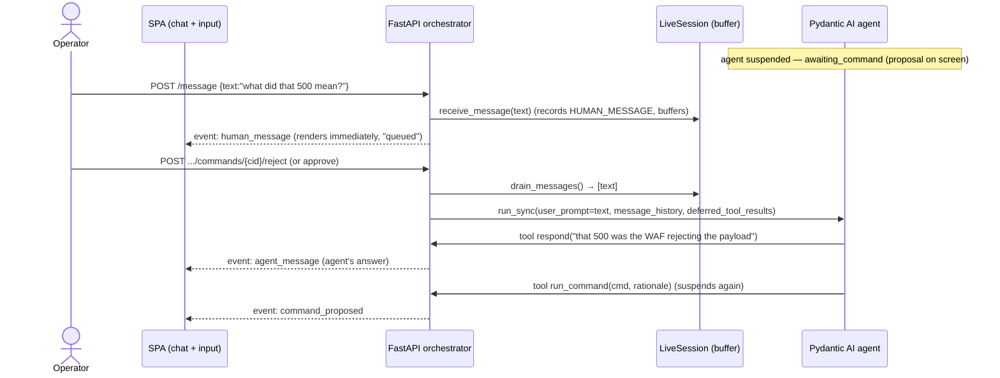

# Agentic Retest Console — Slice 4: chat input / steering & Q&A — design

- **Date**: 2026-07-16
- **Status**: draft (brainstorm output, approved by Álvaro to spec)
- **Owner**: Álvaro Navarro
- **Part of**: milestone **M6**, requirement **FR-17**, epic [#87](https://github.com/SelfishCoconut/revalid/issues/87)
- **Master spec**: [`2026-07-16-agentic-retest-console-design.md`](2026-07-16-agentic-retest-console-design.md) (§3 slice 4)
- **Proposes**: **ADR-0028** (lands `proposed` with the implementation PR)
- **Builds on**: Slice 2 (operator `!` commands, ADR-0026) and Slice 3 (guiding plan, ADR-0027)

---

## 1. Goal / done-when

The operator can **type free-text messages into the center chat** to (a) **steer** the agent
("focus on the login endpoint", "try `--data-urlencode` instead") and (b) **ask it questions**
("what did that 500 mean?"). The agent **reads** the operator's messages, **answers** questions in
prose, and **factors steering** into its next plan/command. Every operator message is part of the
append-only transcript.

This completes the third of FR-17's three steering channels (master spec §2): **chat** (tell it) —
alongside **approve/edit** (vet it, Slice 0/3) and **type a command** (show it, Slice 2).

## 2. The forced constraint — why the design is a *queue*

The agent is **never idle**. At any moment it is in exactly one of:

- **actively working** — `agent.run_sync` is executing on a background thread
  (`starting` / `thinking` / `running_command`); or
- **suspended on a deferred tool call** — awaiting a human decision
  (`awaiting_command` / `awaiting_plan`), which is the common resting state; or
- **terminal** (`concluded` / `given_up` / `ended` / `error`).

Two hard facts about this architecture (the Slice 0 gate) fix the delivery model:

1. Pydantic AI **cannot accept a new user prompt while a tool call is deferred** — the pending call
   must first be resolved with `DeferredToolResults`.
2. A synchronous `run_sync` **cannot be interrupted** mid-flight.

Therefore an operator message can only ever be **buffered and delivered at the next turn boundary**,
which — while commands are gated — is the **next approve/reject**. This is the "queue while the AI
works" model, the same mental model as Claude Code: you type at will, messages queue in order, and
are picked up at the next boundary. **The one place we necessarily differ from Claude Code:** because
we gate *every* command, the resting state is "awaiting your approval", so a message queued there is
delivered when *you* approve/reject (you advance the loop). The fully-autonomous drain — the agent
picking up queued messages while it loops without a gate — is exactly what **Slice 5 (free-launch)**
unlocks; Slice 4 lays the queue that free-launch then drains.

This was an explicit design decision (2026-07-16): **pure queue**, never a silent interrupt — a
message never discards a pending proposal. Redirect = *reject with your message*; augment = *approve
with your message*.

## 3. Delivery mechanism — a first-class user turn

The queued messages are delivered as a **genuine user message**, not folded into a tool-result
string. Pydantic AI's deferred-tool resume accepts a **new `user_prompt` alongside
`deferred_tool_results`** (confirmed against the current docs):

```python
result = agent.run_sync(
    operator_message_text,          # ← the drained queue, as a fresh user turn
    message_history=live.messages,
    deferred_tool_results=results,  # ← the approve/reject decision (Slice 0)
)
```

The resulting message history is `[…, assistant tool-call, tool-return, user: "<operator message>"]`
— the operator's words land as a proper `UserPromptPart` *after* the tool return, so the model
treats them as the operator speaking, and answers reliably (a model responds to a user turn far more
dependably than to prose buried inside a tool result).

**Principled split from Slice 2.** Two operator channels, two framings:

| Channel | What it is | How the agent receives it |
|---|---|---|
| `!<command>` (Slice 2) | an **observed fact** — the operator ran a command | folded into the **tool result** the agent reads (unchanged) |
| chat message (Slice 4) | the **operator's voice** — an instruction or question | a **first-class user turn** (`user_prompt` on the resume) |

Slice 2's observation path is **untouched**. Only chat messages use the new user-turn channel.

### Buffering

`LiveSession` gains a second thread-safe buffer, symmetric with `observations`:

- `human_messages: list[str]` — queued chat messages, appended by the message endpoint's worker,
  drained by the next agent resume. Guarded by the existing `LiveSession.lock`.
- Methods mirror the observation pair: `receive_message(text)` (append under lock),
  `drain_messages()` (atomically return + clear).

On each resume (`_resume_with_decision`), drain `human_messages`; if non-empty, join them (newline-
separated, in order) and pass as the `user_prompt`. When empty, pass no user prompt — today's pure
deferred resume is unchanged. Multiple messages queued between two decisions are delivered together,
in order.

## 4. Q&A — a non-gated `respond` tool

To answer a question *in prose* without proposing a command or concluding, the agent gets one new
tool:

- **`respond(message: str) -> str`**, `requires_approval=False`. It emits an `agent_message`
  transcript event (via a new `emit_message` dep callback) and returns a short "ok". Being a
  **normal (non-deferred) tool**, the run **continues** after it — the agent can `respond`, then
  `set_plan` / `run_command` / `conclude` in the same turn.

No new `output_type`, no new session state, no orchestrator loop change: prose is a **mid-run
side-effect**, and the run still ends where it always did — at the next gated proposal
(`DeferredToolRequests`) or the verdict (`ConcludeOutput`).

This reuses plumbing that already exists and was reserved for exactly this:

- `SessionEventKind.AGENT_MESSAGE` (`domain.py:206`) — already defined.
- Its frontend renderer (`RetestSession.tsx`, the `agent_message` → `AgentTurn` branch) — already
  built.

**Instructions** (`retest_agent.py` `_INSTRUCTIONS`) gain: *"The operator may send you messages.
Always address them: answer questions with `respond`, then continue; fold any steering into your
plan and commands. Use `respond` sparingly — to answer, or for a brief status note — not to narrate
every step."*

## 5. Budget & safety

- **Budget-exempt.** Messages and `respond` run **no command**, so they never count against the
  step budget (`_step_budget_exhausted` counts approved commands only) — consistent with plan
  changes (Slice 3).
- **Gate untouched.** Commands and plan changes stay gated; the egress lock and single-user threat
  model (ADR-0008) are unchanged. `respond` cannot touch the sandbox or the network — it only
  appends a transcript event.
- **Not-live is a no-op.** A message to a session that is terminal or not in the registry is
  silently dropped at the orchestrator (mirrors `submit_human_command`); the frontend disables the
  chat when the session is over.

## 6. API surface

One new endpoint, mirroring `human-command`:

- `POST /api/retest-sessions/{id}/message` `{ "text": "<operator message>" }` → `202`.
  Records a `HUMAN_MESSAGE` event and buffers the text on the live session, both in a background
  task. No-op if the session is not live.

New transcript event kind:

- `SessionEventKind.HUMAN_MESSAGE = "human_message"`.

No change to the approve/reject/end/human-command/stream surface — delivery rides the **existing**
approve/reject resume.

## 7. Frontend

The input box already exists (`RetestSession.tsx`); plain text currently only shows a "later slice"
hint. Slice 4 wires it up:

- **Plain text** (no `!` prefix) → `POST /message` (a new `submitMessage` mutation). `!command`
  behaviour is **unchanged**.
- **Operator messages render as a distinct human-voice turn** in the center chat — visually
  differentiated from the agent's iris-dot `AgentTurn` (e.g. right-aligned / a different marker),
  so the conversation reads as a two-voice chat. `human_message` events map to this turn.
- **Agent prose** (`agent_message`) already renders via `AgentTurn` — no new component needed.
- **Queue UX (Claude-Code-like).** A persistent one-line hint under the input ("Messages are read on
  the agent's next turn — approve or reject a pending step to deliver now"). Sent-but-undelivered
  messages get a distinct **"queued"** treatment so it reads like Claude Code's stacked queue; a
  note on the approval card states that approving/rejecting also delivers queued messages.
- **Audit divergence from Claude Code (deliberate):** there is **no edit/dequeue** — a sent message
  is committed to the append-only transcript immediately (it is evidence, NFR-02). The "queued"
  treatment is display-only.

## 8. Data flow



## 9. Testing

- **Unit** (`tests/unit/`):
  - `respond` tool emits `agent_message` and the run continues to a proposal (FunctionModel scripts
    `respond` → `run_command`).
  - `human_messages` buffer: `receive_message` / `drain_messages` are atomic; drained text is passed
    as `user_prompt` on the next resume (assert the resume call args).
  - a message to a not-live session is a no-op.
  - budget: a `respond` turn does not consume a step.
- **Integration** (`tests/integration/`, marker `integration`): over the real REST + WS surface —
  `POST /message` records + streams a `HUMAN_MESSAGE`; on the next approve/reject the agent
  (TestModel/FunctionModel) reads it and emits an `agent_message` that streams to the client.
- **Frontend** (vitest): plain text posts a message (not a command); a `human_message` event renders
  as a human turn; `!command` still runs; the queue hint shows; the chat disables when the session is
  over.
- **Coverage:** `src/` ≥ 80%; new logic modules aim for 100% of non-live lines.

## 10. Documentation & process

- **ADR-0028** (`proposed`, lands with the PR): chat steering delivered as a first-class user-prompt
  injection on the gate turn; a non-gated `respond` tool for Q&A; the observed-fact vs operator-voice
  channel split; the pure-queue (never-interrupt) semantics and the deliberate no-dequeue audit
  divergence from Claude Code.
- **SRS FR-17**: fill in Slice 4 acceptance criteria.
- **Roadmap** + **epic #87**: Slice 4 note.
- **Issue-first**: open the Slice 4 GitHub issue (label `req:FR-17`, milestone M6) before code; the
  PR body carries `Closes #<n>`.

## 11. Known limitations (stated plainly)

1. **Conclude race.** A message sent in the brief window while the agent is finalizing a `conclude`
   may never be *read* by the agent — it is still recorded in the transcript. Inherent to async
   steering; acceptable for a single-user local tool (the verdict is human-overridable, Slice 6).
2. **Mid-pause questions.** A question asked while a command is pending is answered upon *resolving*
   that command (approve → the answer comes with the next step; reject → the answer comes in the
   re-plan). There is no "answer without touching the pending command" — inherent to the pure-queue
   gate.
3. **`respond` loop.** A pathological `respond`-only turn is not bounded by `max_steps` (that counts
   commands). Mitigated by the instruction and Pydantic AI's per-run request limits; the plan may add
   a per-run `respond` cap as a hard backstop if wanted.

## 12. Non-goals (Slice 4)

- Free-launch / ungated auto-run and the autonomous queue drain — **Slice 5**.
- Editing or dequeuing a sent message (append-only transcript, §7).
- Verdict adjudication / FR-09/10/12 integration and retiring the batch path — **Slice 6**.
